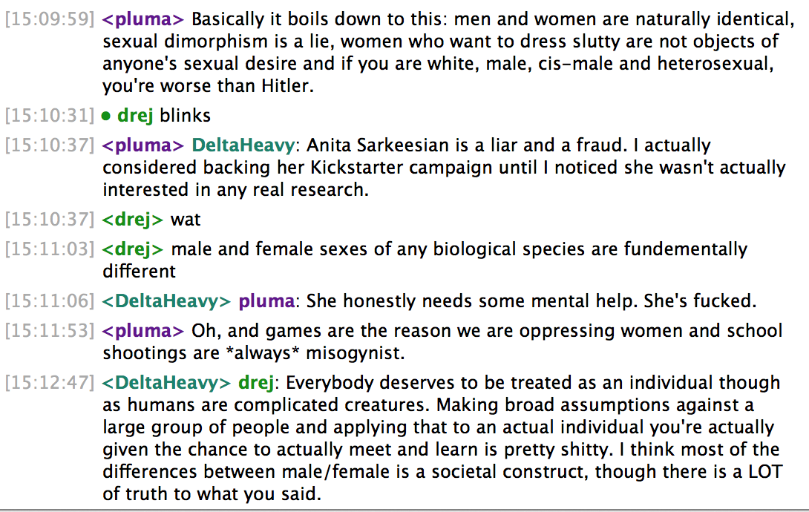

This week, I joined a chat forum called the IRC (Internet Relay Chat), and it started out as a great experience. This was a place I could go to answer people's questions, ask questions, and laugh. I've noticed people can be pretty vicious at times, but I wasn't prepared for this:

And you know, it got me thinking, about how I always used to say "I'm not a feminist" as though it were a bad thing, but I'm realizing two things now: A) how detrimental that mindset is, and B) why I kept saying it.

Let me start with a little story.

## At 21, I Was Already Harassed Out of a Company

It started when working on a project with one of my coworkers for the first time (let's call him "Dan" for the purposes of this story). So, Dan had been doing all of the development for this project and the deadline had already passed when he got sick and sayed home. The managers put me on the project. Unfortunately,  Dan didn't use any kind of versioning system and his source code was thus completely inaccessible. Even with several different forms of attempted contact via different managers, he was unreachable.

I was pushed onto the project and it left me scrambling to start everything from the top on an already-overdue deadline. Needless to say, it was an unpleasant experience, and afterward, I told Dan that his behavior was unprofessional.

Ever since then, Dan began ignoring me at work instead of being friendly like we used to be.

When several members of the company and I went to a conference together, I had this talk with another coworker, who agreed that he saw a visible difference in Dan's behavior toward me. So at least I had confirmation that wasn't solely in my head, but the other coworker advised me to just ignore it. So I did.

<blockquote class="left">I still can't understand why a grown man would spend so much work time harassing me on the internet when I never did anything to him nor engaged in his actions.</blockquote>

A few weeks later, I started a meetup group called Sassy DC. Dan  began getting angry with me on Twitter, which I had assumed was because I was hosting the events at a different space (he was in charge of events at the company's space). When my co-organizer  and I began getting annoyed with his behavior, we decided to unfollow him.

Immediately, he added me to multiple Twitter lists entitled "I Will Follow You" and began favoriting every tweet. I'm not exaggerating. Every tweet. He began sub-tweeting&ast; about how I don't know anything/am not an 'expert', and did this from three different accounts on two social media forums. So I blocked him from SassyDC.

<small>&ast;"Subtweeting" is a term which refers to Tweeting about a person, usually negatively, without tagging their Twitter handle</small>

When I left the company, he began doing this to my personal Twitter account much more frequently, so I unfollowed and blocked him on that account too. I never once responded to him, or made anything of it. I kept ignoring it as my friends had advised, but he kept "hatefaving&ast;" my tweets and then bragging about it on the internet.

<small>&ast; a "hatefave" is something this coworker coined as a way to iritate somebody online by favoriting their tweets</small>

I tried not to pay attention, and move on, but then Dan messaged me on Facebook telling me I needed to change my Facebook and Linkedin, which I hadn't updated to reflect my new company yet. That was the last straw. Why was he checking up on my accounts and messaging me that they needed updating? He was only a designer at the company.

The following is a real email I sent to the CEO of the company, names redacted:

>Hi [CEO],

>You know I'm not one to get involved in this DC tech drama, so I've been avoiding this and pushing it away for a while now, but I've recently been pushed a little too far. [DAN] has been harassing me on the internet (via 'hatefaves'&ast;, subtweets, Facebook posts) for about 4 months now. <mark>I left [COMPANY] because of it, but it hasn't stopped. I've blocked him on all social media sources that I can, and he is still persistent.</mark>

>I never mentioned anything publicly or anywhere on the internet because I respect you and I respect [COMPANY] and I really loved working there. <mark>I've also never instigated, nor have I ever responded,</mark> but he continues to harass me online. I don't understand why he goes out of his way to irritate me online -- I've never done anything to him, but I just wanted to let you know WHY I left now. I know he respects and listens to you, so <mark>I was wondering if you could just ask him to stop.</mark> Like really, stop.

>Thank you,
I hope you're doing well!
And I'm really sorry it came down to me needing to send this. <mark>I really don't mean any harm :(</mark>

>-Una

Now, reading this email, I realize that **I'm apologizing for getting upset about being harassed online**. In retrospect, I had nothing to be sorry for. I did nothing wrong.

In response to the email, it was clear that despite my silence, others noticed his behavior too. The response I got from the CEO was:

>wow - I wish that I had known that there was a problem while you were here :( <mark>I'll admit that I've seen him harassing a lot of people over the past year</mark>, and <mark>I've noticed that you are recently the target on a couple of occasions</mark>, but I thought that you guys got along while you were here... My assumption was that he started being more obnoxious toward you after you left because of the association with [NEW BOSS].

You may be wondering what happened to the coworker. Well, this:

><mark>I talked to [DAN]</mark> about an hour ago. We went to the conference room and <mark>I told him that it just makes him look like an idiot</mark>. And normally that'd be ok, but <mark>he's making [THE COMPANY] look stupid too.</mark> He agreed. He said that he would apologize to you and initiate a "no more online interactions" thing with you.

So, what was the repercussion for "harassing a lot of people over the past year"? **Nothing. He still works there.** I got a forced one-sentance apology, and promise that he wouldn't go out of his way to interact with me online anymore so that the "company wouldn't look bad."

## Why I Let it Be Okay

When I joined the company I worked at afterward, I wasn't being harassed, so that was better, but there was definitely an air of unintentional sexism. I didn't really notice until later, being used to it already in the tech world. In fact, I felt *guilty* for my *presence* since I convinced myself that the guys couldn't *"really be themselves around me."* And I hated that. I just wanted equality, and it's a really fine line in the startup world where everybody's friends.

I loved the guys I worked with! They're really smart, kind, and  had accepted me as one of them. I didn't want to jeopardize that fine line. I wanted them to feel comfortable around me. I wanted to just be "one of the guys."

When Julie-Ann Horvath went public about [leaving Github](#LINK!!), and I was asked about it, I took a neutral position. As they joked about it, I wanted to inject my opinion, but would do so cautiously, starting every *potential conflict* statement with "well I'm not a feminist or anything but..." or "don't get me wrong &mdash; I'm not a feminist."

## What!? How Could I Still Say "I'm Not a Feminist?"

Because I wanted to belong. They had accepted me as one of the guys. I didn't want to jeopardize that. I still don't as I write this post. I didn't want to be treated as different, and I knew they didn't mean to say anything with an ill-will.

It's the same reason I didn't say anything out loud about why I left the first job, unless I knew someone intimately enough to tell the truth around them. I would never call myself a feminist because to me it meant actively protesting these men I called my friends and coworkers. Instead, I defended them &mdash; I made excuses for why it was okay, even against my best female friends.

But it's not like that. **This isn't a game of he-said, she-said**. It's something we're doing together, and it's actually pretty sad that it took me up until a few weeks ago to be okay with calling myself a "feminist." You can call yourself whatever you want, but:

<a class="twitter-share quote">Actively defending yourself against feminism makes it a derogatory term.</a>

## It Isn't Just A Tech Problem

It's great that the inequality issue has become a very large topic in the tech world, but that's because this is the little microcosm we have in which we can work to cause change. A lot of women who work in tech tend to be more assertive than the norm &mdash; we did have to get here somehow after all &mdash; and  are accustomed to dealing with a mostly-male environment.

I find the worst offenders at the gym &mdash; men making comments and staring at women while they work out. It's uncomfortable. [This](http://www.vox.com/xpress/2014/10/28/7084995/a-woman-walked-around-new-york-city-for-10-hours-and-filmed-every) happens to every woman you know. Literally. Every. Woman. You. Know. It is not a unique situation or video at all. And if you read the comments, you'll see how many men are defending the other men in the video. Because it's become normalized by society, but would you want your daughter dealing with that every time she walked  somewhere?

One of my favorite quotes by [FCKH8's new campaign](http://vimeo.com/109573972) is:

<blockquote class="right">We're glad that the right to vote is here. But equality's next step is walking to the car without fear.</blockquote>

Check out [this link](http://www.robot-hugs.com/harassment/) for better understanding street harassment.

## Some Practical Advice

Now, I'm a very positive person, and believe in actionable insights! It is in no way my intention to bash any company or men in general. So let me share some ideas with you on how to make it better.

### Believe Her

Much too often, when I call out friends (even self-proclaimed feminists) out for saying something sexist, they respond with "No it wasn't. That wasn't sexist." Stop getting defensive, and just believe it. Don't make me feel like there is a right and wrong way to react to something you just said.

### Be More Inclusive

You don't even have to go out of your way that much. Try having wine in addition to beer at your next event. Even better, provide options for people who don't drink!

### Stop Bragging

I know that you're just trying to get off of [this list](http://100percentmen.tumblr.com/), but the fact that you have to brag means that you're doing it for the wrong reasons. Less talking, more doing.

### Stop Being So Defensive

We're not making a judgement on your character. We're just trying to make things better and more equal.
