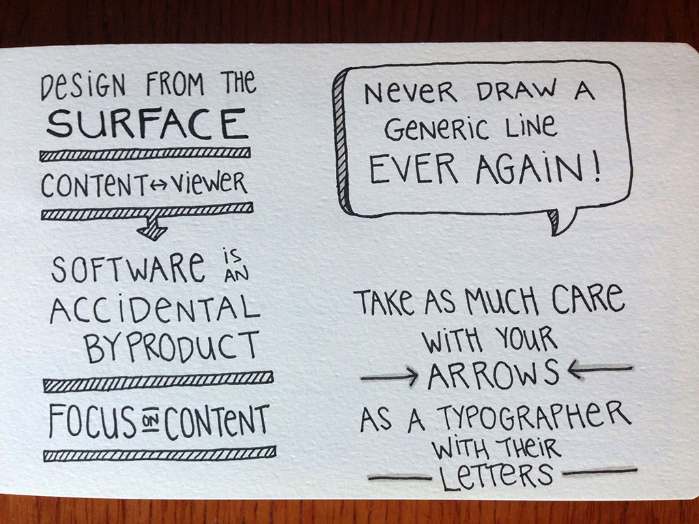
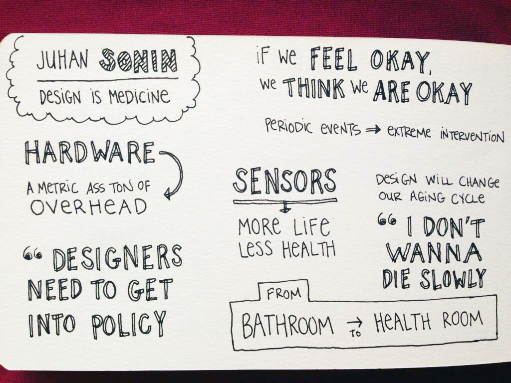
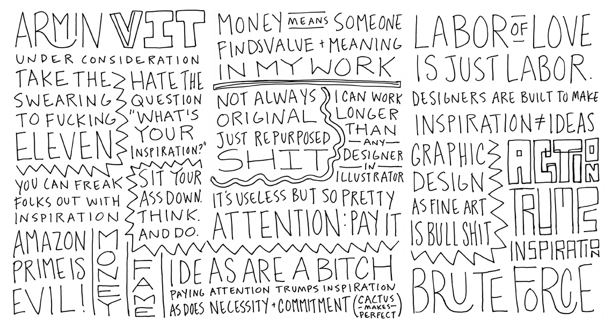
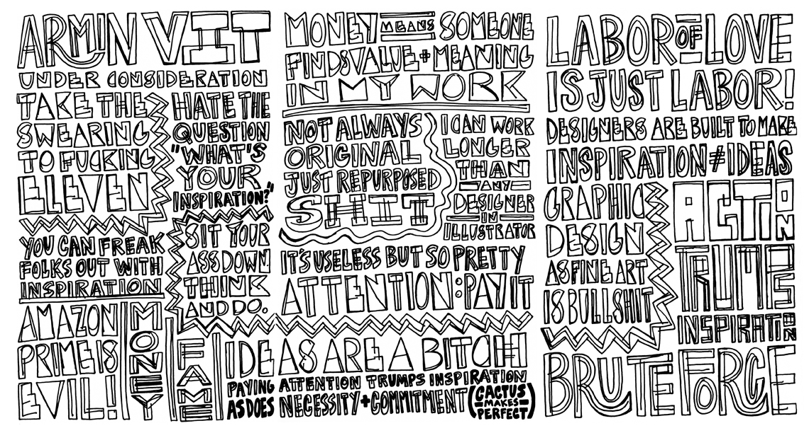
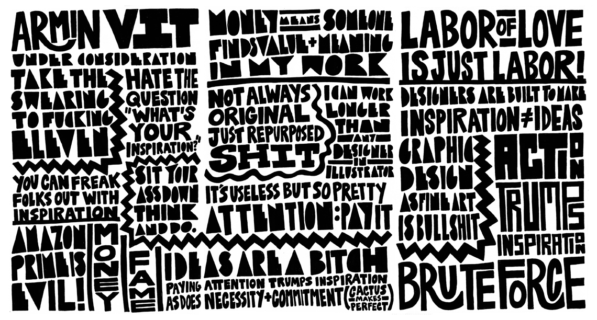

__LAST WEEK?!__ I wrote a post about comprehension and learning, and referenced some data, including this really great [TED Talk](http://www.ted.com/talks/sunni_brown#t-213976) on how studies show that doodling helps with creative thinking and comprehension. As an extension of that, let's talk about sketchnotes. Sketchnotes are essentially a creative form of note-taking, and can take a few different forms. I interviewed some pretty rad ladies about their sketch-noting techniques.

## Jess Eldredge

I mostly sketchnote presentations, though I’ve been recently exploring books as sketchnoting inspiration as well. I usually sketchnote live, at the same time as as I am consuming the content for the first time. I usually keep a small notepad with me to jot down concepts that I can’t capture into my sketchbook fast enough; it also helps me to spell words correctly before capturing them in my sketchnotes. I like to listen for quotable moments—things that get me nodding along, or things that make me laugh.

I keep an eye on the clock and try to plan my page accordingly—I aim to have at least half the page filled up by the halfway point of the talk. If I’m behind, I’ll start writing with larger letters, or look to my notepad to see if there are other concepts I can add.

Before a presentation, I make sure to write down the title and the name of the presenter. I also spend a few moments before the talk looking up the presenter’s Twitter user name, if they have one. I like including this bit of information in the sketchnotes as well; this way I can quickly tweet after the presentation and make sure the presenter is tagged.

My sketchnotes consist mostly of lettering and basic shapes like boxes and clouds—I’m still trying to push myself to incorporate more imagery and iconography into my notes! I really like using arrows, because they make my notes feel like a bit more like a mind-mapping exercise. I also like to put some emphasis into particular words that stand out to me in quotes by drawing them in a different style.

One of my favorite parts of sketchnoting is trying out notebooks and pens! I’m pretty loyal to Moleskine, but I bounce back and forth between the traditional portrait-oriented sketchbook and the reporter-style sketchbook (which I turn sideways so I can draw in “landscape” mode). My latest pen obsession is the Uniball Signo retractable gel pen…it glides perfectly on the page and still gives me a nice bold line. I also like to add a bit of shading to my notes with a Faber Castell Pitt artist pen.

Jess' sketchnotes from Edward Tufte Workshop 2013

<figure>

<figcaption>Jess' sketchnotes from Railsconf 2013</figcaption>
</figure>

Jess' sketchnotes from Edward Tufte Workshop 2013

## Carolyn Sewell on Process

Carolyn Sewell, an incredible typgraphy and ____ has a really unique approach to sketchnoting. She outlines her process in 3 steps:

### Step 1: Skeletal

I take skeletal notes during the actual talk, listening for quotable phrases, writing them as quickly as possible, and making sure to leave plenty of wiggle room.

### Step 2: Bulking

Once home, and usually during an NCIS marathon, I start bulking up the layout...adding structure to the words and symbols.

### Step 3: Filling

 Then I fill in everything (I go through a lot of ink at this point), scan it in and clean up.

