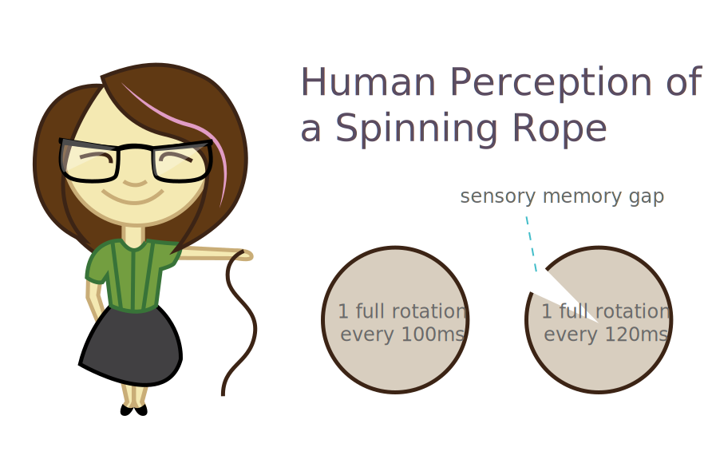
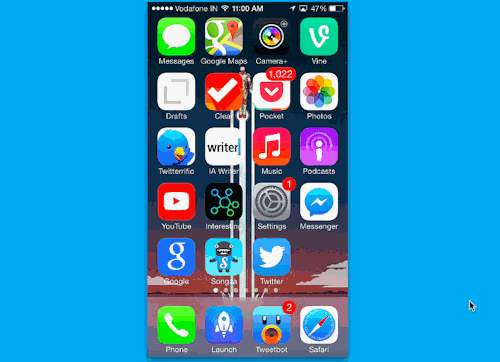
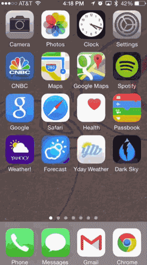
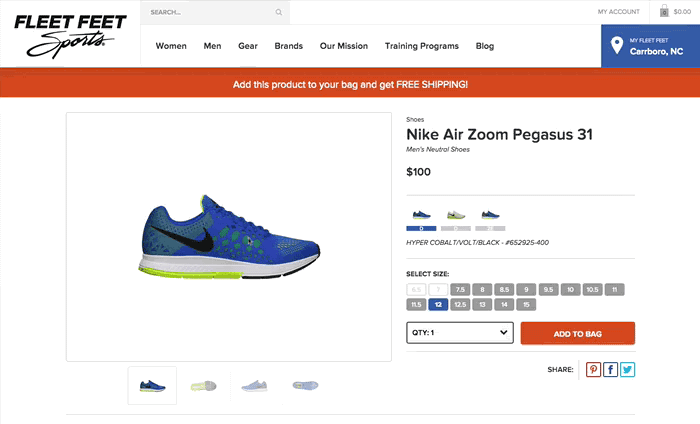

I'm a pretty big fan of delightful interactions and micro-animations in design. They not only enhance a user's experience by bringing joy, but they can also significantly improve a user's experience <em>(which means more users!)</em>.

## Lets Talk About Neuroscience

If you read my earlier post about [learning and comprehension](http://una.github.io/comprehension), you'll recall that memory relies on three distinct processes: <em>sensory memory, short-term memory, and long-term memory.</em>

### Sensory Memory

*Sensory Memory* is our unconscious ability to retain impressions of sensory stimuli (visual, auditory, taste, smell, and physical touch) after the original stimuli has ended. This happens automatically as stimuli is perceived and thus does not require conscious thought. [1](http://education-portal.com/academy/lesson/sensory-memory-definition-examples-types.html)

<blockquote class="right">Sensory memory degrades very quickly, typically in the region of 100 - 500 milliseconds after the perception of an item.</blockquote>

Humans evolved this sensory ability as a means to deal with situations that require quick reactions (i.e. immediately sensing dangerous situations like a fire or poisonous animal). We will react without objectively thinking through the next steps of the situation <em>(a good thing!)</em>. These situations are also why humans are much more sensitive to movement *(read: animation)* than finer details and color in our peripheral vision. We wouldn't want an enemy tribe to sneak up on us.

### Iconic Memory

**Iconic memory** is the visual system within sensory memory and has been described as the cause of this phenomenon: **Persistence of Vision** [2](https://www.princeton.edu/~achaney/tmve/wiki100k/docs/Persistence_of_vision.html), by which an afterimage is thought to persist for approximately 1/25 of a second on the retina. *Try this:* Look at a nearby object for a moment, then close your eyes. You'll see a brief after-image of what you were just looking at. This can also describe why we can see a full circle when looking at a spinning rope. When spun faster than the duration of our sensory memory "bank", the visual after-image will connect. In contrast, when spun slowly, it shows a visual break in the circle.

Yes, this image stolen from a previous blog <a href="http://una.github.io/comprehension">post.</a>

 

If interested, here are some more [examples of Iconic Memory](http://examples.yourdictionary.com/examples-of-iconic-memory.html).

## Using Sensory Memory to Our Advantage as Designers

People are bad at remembering things &mdash; we just are (and this is why performance optimization and speed is so vital to our products). As Tammy Everts puts it, <q>our need for web speed is about neuroscience, not entitlement</q>.[4](http://www.webperformancetoday.com/2012/03/21/neuroscience-page-speed-web-performance/) <a class="twitter-share">This sensory time is short and precious, and we need to take advantage of it to improve experiences.</a><small>Tammy's article is really, really good, by the way. I highly recommend it!</small>

Luckily, with design as our tool, we can do just that. Lets look at animations. [Studies](http://dl.acm.org/citation.cfm?id=1599820) on cognitive load theory show that animated presentations which visually demonstrate a correlation between items significantly improved motivation and concentration levels without additional mental effort. **Without additional mental effort!** Thats so great! Because people do truly have a [limited](http://whole30.com/2014/04/boost-your-willpower/) bank for mental effort.

<a class="twitter-share quote">Animations and transitions that visualize connecting views increase the chances that a user will remain on your site and understand the intended task more easily.</a>

### State Persistence Animation: SPA

Companies have recently started doing this with animations between visual states. I'd like to refer this technique as **State Persistence Animation** AKA **SPA**. <small>(I was going to call it State Persistence Animations and Transitions but SPAT didn't sound right.)</small>

<figure class="right">

<figcaption><a href="http://iosdevtips.co/post/88481653818/twitter-ios-app-bird-zoom-animation">This</a> post descibes how to mimic this style in Swift and where I stole the gif from because #lazy.</figcaption>
</figure>

The twitter bird logo (Larry) was, for a time, used as a means of visual continuity between screen changes. He responds to the point at which our fingers touched the icon and becomes the background for the application loading. This not only clarifies a state change for a user, but makes the app feel as though its loading more quickly, much in the same way that [progressive jpegs](http://calendar.perfplanet.com/2012/progressive-jpegs-a-new-best-practice/) do as they load in layers. In this case, it's a subtle bounce which makes the bird become a little smaller before it takes over the screen. The little things really do make a huge impact.

 
[This](http://www.smashingmagazine.com/2015/01/19/using-motion-for-ux-on-apps-and-websites/) Smashing Magazine article also touches on the phenomenon in its first example. The article speaks to contextual interactions that mimic the real world. In the real world, nothing happens "suddenly." We walk *up* things, and see the world changing around us as we get there.

<a style="max-width: 68%; margin-bottom: 1em;" class="twitter-share quote right">One thing that digital world has removed from us is this context of place</a>

But this can be mitigated as design begins to increasingly mimic the interactions of the natural world. Have you ever thought about why the pattern of pulling a menu in and out of a page has become so popular? In the physical world, *every action has an equal and opposite reaction.* Thus, when we open a drawer, or menu, we expect that the same action will close it.

The Smashing article goes on to explain how CSS Transitions can help with the practice of persistence animations in your apps, and here are two more strong examples of using **SPA** within websites:

Those were grabbed from <a href="http://www.newmediacampaigns.com/blog/examples-of-animation-in-web-design">this post</a>

## SPA = Less Thinking, More Doing

When you use animations to visually demonstrate persistence of state or interaction, it equals gains in usability. The user is doing less thinking about how the two steps are connected, and instead having a more fluid experience with your app or website. <a class="twitter-share">Lessening the cognitive load of a task is key in increasing performance of that task</a>, and motion also has a positive correlation with perceived speed.[5](http://uxmovement.com/buttons/how-to-make-progress-bars-feel-faster-to-users/)

As always, find a balance and don't overdo it. *Happy designing!*
