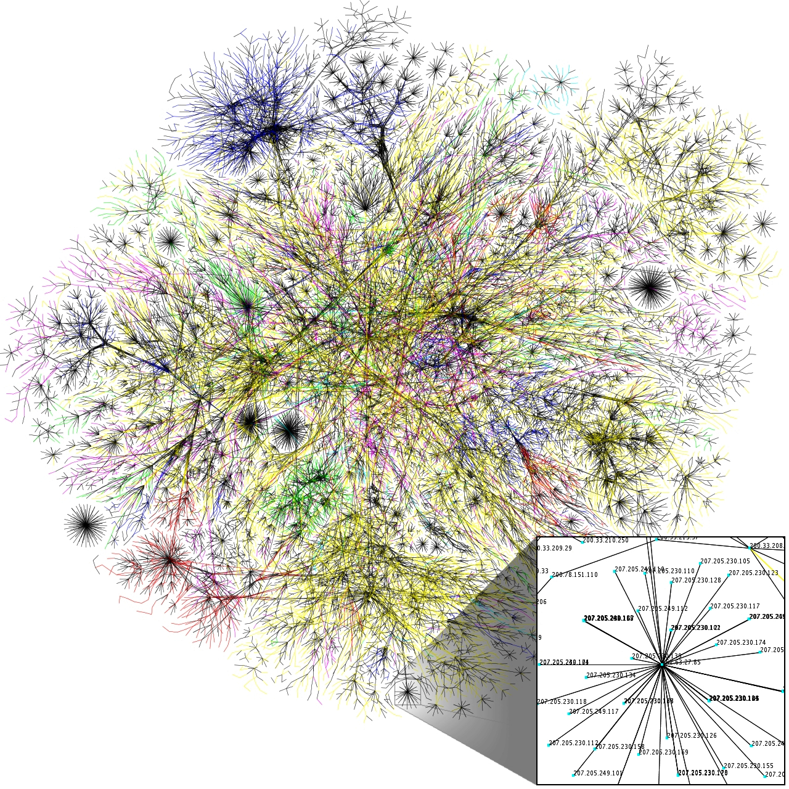

The Internet we know today is built on hacks, and that's a great thing. All of the newest trends that have come out have been based on workarounds of the past. HTTP2, Flexbox, and CSS Filter options are all examples of things that have solved inevitable hacks out of frustration. Let's start by taking a look at where it all began.

## HTML

The World Wide Web was born in 1989, based on one single, simple, yet extremely powerful building block of the Internet: the link. Tim Berners Lee wrote a paper at CERN called "Information Management: A Proposal," in which he outlined an ever-evolving pool of information &mdash; "a universal linked information system" where "generality and portability are more important than fancy graphics techniques and complex extra facilities. <sup>[1](http://www.independent.co.uk/life-style/gadgets-and-tech/news/25-years-of-the-world-wide-web-the-inventor-of-the-web-tim-bernerslee-explains-how-it-all-began-9185040.html)</sup>"

That, in a nutshell, is why the web was created. It was a system of information sharing and linking, leading users to be able to connect between documents and share content. There is beauty in that simplicity of pure content sharing and information transfer.


<div class="caption">An image from the [Opte Project](http://www.opte.org/), which visualizes Internet connections.</div>

But while we wanted those fancy graphics and complex add-ons, unfortunately, all we really had to work with was basic HTML that you couldn't even nest too deeply, and the anchor tag as the manifestation of a link.

<figure class="right">
  
  <figcaption>The <a href="http://www.w3.org/MarkUp/draft-ietf-iiir-html-01.txt">HTML 1.0 Draft Spec</a> (it's super interesting &mdash; highly recommend giving it a read!</figcaption>
</figure>

This link has become the basis of the web. Seriously. If you think about it, <a class="twitter-share">everything is a link: from images to CSS styles to scripts.</a> They are all just links. We never really created a new system, we just continued to link assets regardless of type *into* the page instead of *outside* of it.

<ul>
  <li> Images: <code>&lt;img src="&lt;LINK&gt;"&gt;</code></li>
  <li> Styles: <code>&lt;link href="&lt;LINK&gt;"&gt;</code></li>
  <li> Scripts: <code>&lt;script src="&lt;LINK&gt;"&gt;</code></li>
</ul>

These have become the building blocks of the web today, but at its core, you can pretty much think of this as a hack. And it's just getting worse and worse. The original purpose of the link was pure content connectivity, but here we are, hacking the link to extend it as much as we can and cluttering the web as we go.

<figure class="left">
  
</figure>

In 2014, the average number of HTTP requests per web page was 95.<sup><a href="http://www.sitepoint.com/average-page-weight-increases-15-2014/">2</a></sup> I have no doubt in my mind that it is now reaching triple digits if it hasn't already hit that. In fact, in about 7 months, the average web page size will be same as Doom install image. <sup><a href="http://imgur.com/dBhlzlN">3</a></sup></figcaption> So, **way to go, us!**

### HTTP2

Because this proliferation of links we now inject into each and every web page, we've needed to come up with faster and better mechanisms. Enter **the solution: HTTP2**. The people of the web decided: <a class="twitter-share">"Alright y'all, we've gone too far &mdash; it's time to revise."</a> I am not going to pretend to know everything about this new transfer protocol, but the important thing to know is that is will speed up header requests, and will specifically improve speed of multiple threads of data being served at the same time. For instance, with multithreading, it will be more performant to send multiple script files instead of concatenating all of your scripts into one large file since they won't each be individual blocking requests.

## CSS

We looked at the HTML Tags spec, so naturally, its time to take a step [back](http://www.w3.org/TR/REC-CSS1-961217) in time again and see what happened to the way we visually represent content when web pages transcended being pure content and became hubs of information. They needed what is now the bane of many developers' existence (and our next hack): **layout.**

<figure class="right">
  
  <figcaption>A physical representation of CSS.</figcaption>
</figure>

Remember table-based layouts? By 1998, this was our fancy solution (read: hack) to website presentation! *Why would we lay out a web-page document, with headers and navigation and content elements, as a table?* Because it's all we had. You could create nested layouts and it was great and everyone complained and nothing has changed.

But because this didn't make any semantic sense, we did the next best thing: *floated layouts*. Which were also a mess.

### Flexbox

[Flexbox](https://developer.mozilla.org/en-US/docs/Web/Guide/CSS/Flexible_boxes) is the current solution to the hacks of layout's past. It uses semantic naming based on what we "want" the div to align and justify. It even allows us to order our content visually without messing with its HTML markup (yay for separation of concerns!). Hacking layouts (like with links) got so frustrating that the time came for a refactor. Similarly, there's even better [positioning](http://www.w3.org/TR/css3-positioning/) coming down the pipeline as web builders continue to iterate and refine.


<figure>
  
  <figcaption>Hmm... those can't be CSS layout terms. They sort-of makes <a href="http://blog.teamtreehouse.com/responsive-design-of-the-future-with-flexbox">sense...</a></figcaption>
</figure>

### Getting Graphic

As layouts became increasingly complex, so did graphic rendering on the web, and hacks for visual effects are endless (remember `text-indent: -9999px`?). I'll talk about one example in particular because I'm ridiculously excited about its implications: **backdrop filters.** They allow for image editing (filter effects) directly in the browser and only on the background layer of a div. But before we get into them, lets look at how we hacked them.

One of my favorite CSS effect hacks was sorted out by [Lea Verou](https://vimeo.com/52882799) and shared in her "CSS Secrets" talk. Lea demonstrated how to create a "Live CSS Blur" that allows us to make the image blurred within a div, but clear otherwise, with the content of the div remaining lucid. That sounds confusing, but basically it looks like:

<video autoplay loop muted style="width:100%">
  <source src="../images/posts/web-hack/blur-bg.mp4" type="video/mp4">
  <source src="../images/posts/web-hack/blur-bg.ogg" type="video/ogg">
</video>

And the code for that looks a bit like:

```
body {
  background: url(../img/munich/munich.jpg) 0/cover fixed;
}

.text-container:before {
  content: '';
  position: absolute;
  top: 0; right: 0; bottom: 0; left: 0;
  background: url(../img/munich/munich.jpg) 0/cover fixed;
  filter: blur(15px) brightness(1.5);
  margin: -30px;
}
```

Not the cleanest solution. But now with `backdrop-filter` which just *dropped* a few days [ago](https://www.webkit.org/blog/3632/introducing-backdrop-filters/) (sorry I'm not sorry about that pun), this hack will become reality! It looks a little bit like this and the code is only one line of CSS:

<video autoplay loop muted style="width:100%">
  <source src="../images/posts/web-hack/backdrop-filter.mp4" type="video/mp4">
  <source src="../images/posts/web-hack/backdrop-filter.ogg" type="video/ogg">
</video>
<div class="caption"> We're still a long way to go to <a href="http://caniuse.com/#feat=css-backdrop-filter">adoption</a>, but it's step one!
</div>

## Javascript

Let's talk about Javacript to round out the three pillars of web development in this post. I can't even begin to get into all of the ways that we [hack](http://blog.mdnbar.com/javascript-common-tricks) Javascript and invent faux-patterns to make it work for us. Some of these classic techniques include things like creating fake [classes](http://www.phpied.com/3-ways-to-define-a-javascript-class/) and implementing conventions like <strong style="text-transform:uppercase">capitalizing constants</strong>. But those conventions are just like saying *"don't be an escalefter"* and are really expectations only understood by people who frequent the system (like the non-escalefters who frequent the DC Metro and understand its etiquette). [ES6](https://github.com/lukehoban/es6features) is the solution that will (begin to) save us from these hacks, but that too, isn't completely ideal yet.

Look at some of its most highlighted features: classes, generators, constant variables, block scoping. Hmm.. sounds suspiciously like conventions that we've been trying to hack around all along. (And while ES6 [classes](http://www.2ality.com/2015/02/es6-classes-final.html#constructor_static_methods_prototype_methods) are still a hack on prototypes, the reserved name is there, and the convention is there, so things *are* looking up).

## Conclusion

Basically if you think about it, the Internet is just a hack. It is built on hacks and it will continue to be built on hacks as long as people are building for it. Hacking is all we can really do in the meantime to make it better. We complain on Twitter, go to conferences, have intelligent discussion, figure out a hack to fix it, then submit a proposal to instigate change.

Everything we build is a hack. And these hacks have become the cornerstones of what the Internet is (and is becoming). It's a **great** thing that <a class="twitter-share">we, as a collective and user base of the web are paving the cow-paths of the Internet.</a> We're building together, deciding together, and hacking it together together.

*Hack is not a dirty word*, and messing with the way things are "supposed to be" is vital to the ecosystem of the Internet. Keep on hacking and remember that perfect solutions never spring out of first iterations.

<small style="float: none;">Big thank you to <a href="http://twitter.com/rmurphey">Rebecca</a> for reading over & debating some of the points in this post with me!</small>

<div class="clear"></div>
