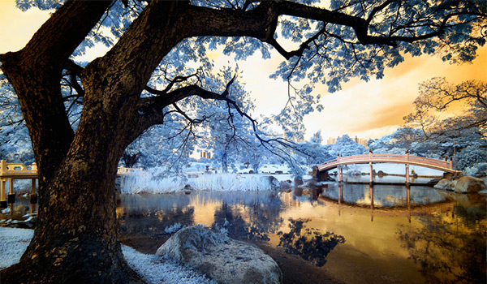

This is the final post in a series which down visual effects using CSS filters and blend modes. Read [Part 1: The Vintage Washout Effect](/vintage-washout), [Part 2: 3d Glasses](/3d-effect), [Part 3: Vignettes](/vignettes), [Part 4: Bokeh Textures](/bokeh), and [Part 5: Lomography](/lomo) for some background on blend modes and filters. Let's end the series with something short and sweet that has a lot of impact for minimal lines of code: a faux infrared photo effect.

## Infrared Photography

Infrared photography captures light in a spectrum beyond what is visible to the human eye (light which lies between the visible spectrum and radio waves <sup><a href="http://photography.tutsplus.com/tutorials/creating-an-infrared-effect-using-photoshop--photo-6056">1</a></sup>). There is a special kind of film you can buy to capture this light and create some really stunning, surreal effects.




<div class="clearfix"></div>

The key to the Infrared effect is actually a little photo hack, and we can fake it pretty easily in CSS. It basically comes down to 4 steps: **Duplicate**, **Invert**, **Color Blend**, and **Play With Hue**.

## Step 1: Duplicate

The first step is to duplicate your base image. This can be done with multiple elements or with pseudo elements. Remember, you can't use pseudo elements on the `` tag so you'll either need to line up two images, or use the `<figure>` tag in this. Either way, you should technically be placing those two `` elements within a `<figure>` anyway. I'm just going to be using a sole `<figure>` for this, however.

```html
<!-- HTML -->
<figure class="creek--infra"></figure>
```

## Step 2: Invert

Now, we will use `filter: invert` on only the top layer, so it will look a little bit like this *(this is a live effect, so you'll only see it in a compatible browser)*:

<style>
  .creek {
    background-image: url('../../images/posts/css-effects/6/creek.jpg');
    height: 200px;
    background-size: cover;
  }

  .creek--inverted {
    background-image: url('../../images/posts/css-effects/6/creek.jpg');
    -webkit-filter: invert();
    filter: invert();
    height: 200px;
    background-size: cover;
  }

  .creek--infra {
    background-image: url('../../images/posts/css-effects/6/creek.jpg');
    height: 400px;
    background-size: cover;
    position: relative;
  }

  .creek--infra:after {
    content: '';
    position: absolute;
    top:0; left:0;
    width: 100%;
    background-image: url('../../images/posts/css-effects/6/creek.jpg');
    -webkit-filter: invert();
      filter: invert(1);
    height: 400px;
    background-size: cover;
    mix-blend-mode: color;
  }

  .creek--infra-2 {
    background-image: url('../../images/posts/css-effects/6/creek.jpg');
    height: 400px;
    background-size: cover;
    position: relative;
  }

  .creek--infra-2:after {
    content: '';
    position: absolute;
    top:0; left:0;
    width: 100%;
    background-image: url('../../images/posts/css-effects/6/creek.jpg');
    -webkit-filter: invert(1) saturate(.75) hue-rotate(60deg);
    filter: invert(1) saturate(.75) hue-rotate(60deg);
    height: 400px;
    background-size: cover;
    mix-blend-mode: color;
  }
</style>

<div class="half--left">
  <figure class="creek"></figure>
  <p class="caption">original image</p>
</div>

<div class="half--right">
  <figure class="creek--inverted"></figure>
  <p class="caption">inverted image</p>
</div>

## Step 3: Color Blend

So now, making sure these two are layered on top of one another, we will use `blend-mode: color` on the top image (the one which is inverted). **This is where the magic happens!** We're colorizing our image with the inverse of itself! How meta!

<figure class="creek--infra"></figure>

The HTML is: `<figure class="creek--infra"></figure>` and the CSS code looks like this:

```
.creek--infra {
  background-image: url('creek.jpg');
  height: 400px;
  background-size: cover;
  position: relative;
}

.creek--infra:after {
  content: '';
  position: absolute;
  top:0; left:0;
  width: 100%;
  background-image: url('creek.jpg');
  -webkit-filter: invert();
    filter: invert(1);
  height: 400px;
  background-size: cover;
  mix-blend-mode: color;
}
```

## Play With Hue

Now, this is a little vivid, so we may want to decrease the saturation a bit by setting `filter: saturate()` to a value less than 1. At the same time, we can use `filter: hue-rotate()` to play with the color.

<figure class="creek--infra-2"></figure>

The only difference in the image this time is that I'm using `filter: invert(1) saturate(.75) hue-rotate(60deg);` instead of only `filter: invert(1)` on the top layer. Pretty cool, right?

## Mixin Time!

To make our lives easier, I made a little mixin to recreate this effect! You just specify **image url** and **degree of hue-rotation** when calling the mixin.

The `@mixin` looks like this:

```
@mixin infrared($img, $deg: -60) {
  position: relative;
  background: url('#{$img}');
  background-size: cover;

  &:after {
    background:  url('#{$img}');
    filter: invert(1) saturate(.75) hue-rotate(#{$deg}deg);
    mix-blend-mode: color;
    background-size: cover;
  }
}
```

And the usage of this `@mixin` would be:

```
.creek-infra {
  @extend infrared('creek.jpg', 60);
}
```

Try out your own images and check out some more examples in this Codepen:

<p data-height="580" data-theme-id="5255" data-slug-hash="ZbeJob" data-default-tab="result" data-user="una" class='codepen'>See the Pen <a href='http://codepen.io/una/pen/ZbeJob/'>Infrared Mixin</a> by Una Kravets (<a href='http://codepen.io/una'>@una</a>) on <a href='http://codepen.io'>CodePen</a>.</p>
<script async src="//assets.codepen.io/assets/embed/ei.js"></script>

**tl;dr: A faux infrared photo filter in CSS is just 4 steps: duplicate, invert, color-blend, and play with hue**

> That's it for the series! I hope you enjoyed it! Please share this and check out my other posts for more CSS image manipulation fun :)


