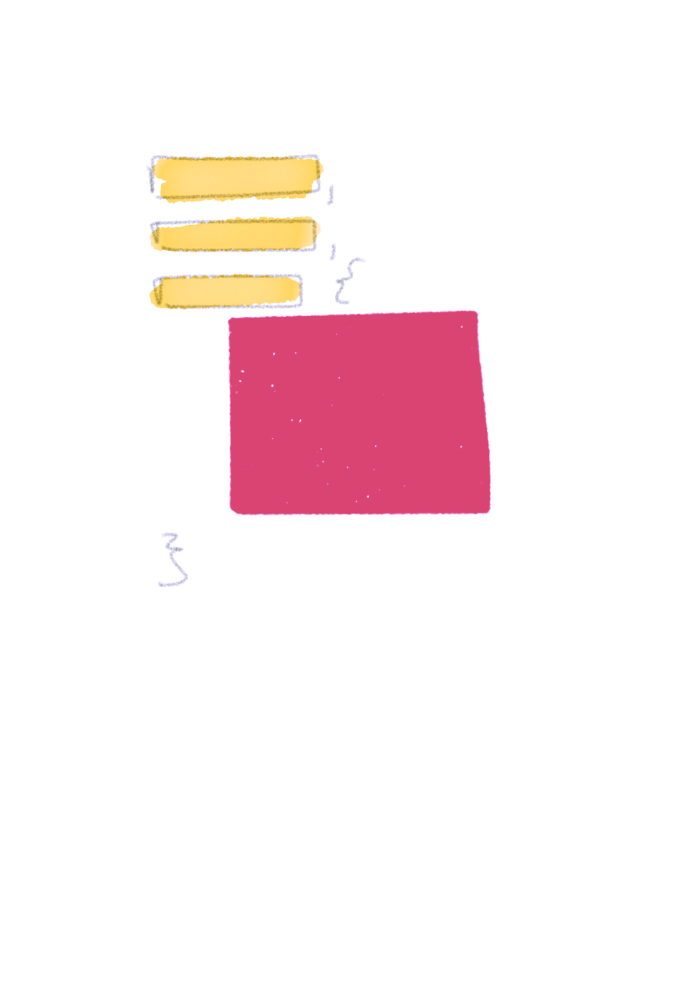

I began writing this blog post a few weeks after releasing a semi-satirical article about my take on the mix of current CSS naming convention/styling trends on Sitepoint called [Atomic OOBEMITSCSS](http://sitepoint.com/atomic-oobemitscss/). That was back in August, but life got in the way. I called it *Atomic OOBEMITSCSS* as a joke, but people started picking up the name and using it in the wild (which was honestly pretty entertaining as questions about it sprung up in-person). Debate over using `@extend` at SassConf this year (and on Twitter lately) reminded me about revisiting this idea.

## Classy CSS, Please.

In the article mentioned above (Atomic OOBEMITSCSS), I explain how I mark up components (via an example using Pinterest) and correlate their styling. I still use that post as a handy manual for people around me who ask about our front-end architecture, which has since been stress-tested on a large-scale pattern library.

<figure class="left">
  
  <figcaption>One of the examples from the Sitepoint article.</figcaption>
</figure>

Consequently, I have found myself needing to explain the system (and Sass itself) to people with traditional computer science backgrounds. Doing so made me realize just how programmatic and class-based the CSS architecture system I described in the article was. So I'd like to take a moment to give it a legitimate name that I can actually get behind, **Classy CSS,** and to also explain it in a way that a traditional programmer may find a bit closer to home.

This post has three goals:

1. To defend `@extend`
2. To introduce **Classy CSS** (much easier to pronounce than Atomic OOBEMITSCSS)
2. To explain a scalable, modular, and class-based approach to CSS

## A Classy Button

I’ll go into a little bit more depth with how it works here, using a button as my example (because the button is the “hello world” of CSS):


We start with a silent placeholder selector with the base code for every single button, using a modified BEM-like syntax. The first part of its naming is going to be the object we're referencing (button or btn) and after a double dash, we have the modifier (base in this case). **Note:** variables are named in the same way &mdash; the type of variable being the base (color in the case of the below example).

```sass
$color--primary: #b29;
$color--secondary: #19d;

%btn--base {
  border: 1px solid currentColor;
  border-radius: 1.5em;
  background: none;
  outline: none;
  transition-duration: .25s;
  cursor: pointer;
  margin: 30px;
  padding: .5em 1em;

  &:hover {
    color: white;
    background: black;
  }
}
```

**This base button is our button class.** We will be building on top of this for every button, as **every button is an instance of that class**. Every button element has the type button, and thus shares some common traits (solid outline, transparent background, etc.). Every button pulls from the same common properties and builds on *top* of them. They do not overwrite, but add onto those properties. They are all buttons++ and inherit from the base button. *(was that enough ways to say the same thing?)*

<figure class="right">

<figcaption>Prototypal inheritance illustration from <a href="https://github.com/getify/You-Dont-Know-JS/blob/master/this%20&%20object%20prototypes/ch5.md">You Don't Know JS: This & Object Prototypes</a></figcaption>
</figure>

```sass
%btn--primary {
  @extend %btn--base;
  color: $color--primary;
  font-size: 1.5em;
}

%btn--secondary {
  @extend %btn--base;
  color: $color--secondary;
  font-size: 1.1em;
}
```

usage here:

```sass
.hero__btn {
  @extend %btn--primary;
  margin: 2em;
}

.sidebar__btn {
  @extend %btn--secondary
}

.global-nav__btn--login {
  @extend %btn--secondary;
  margin-right: 1em;
}
```

If you're writing those in the *classy* way, each **component** (hero, sidebar, global-nav) would have its own partial .scss file where the classes are being instantiated for real use. That could look something like:

_hero.scss

```sass
.hero {

  ...

  &__btn {
    @extend %btn--primary;
  }

  ...

}
```

_sidebar.scss

```sass
.sidebar {

  ...

  &__btn {
    @extend %btn--secondary;
  }

  ...

}
```

_global-nav.scss

```sass
.global-nav {

    ...

    &__btn {
      @extend %btn--secondary;

      &--login {
        @extend .global-nav__btn;
        margin-right: 1em;
        // at this point, you're
        // styling .global-nav__btn--login
    }
  }
}
```

## Well, What About Mixins?

You may be wondering, well why not use a `@mixin` instead? In the way that we're breaking up these classes, the purpose and concept of using `@extend` makes more sense. You can create mixins within the placeholder classes we are extending from to build out styles, and then use `@extend` to instantiate those into classes.

## In Defense of @extend

Using `@extend` allows a smaller output CSS file and cleaner code if you understand what is going on (we're appending styles instead of duplicating them). You can argue that this isn't a concern with gzip compression, but you can't always ensure gzip compression unless you have access to server configuration settings.

To understand and use `@extend` effectively, it's really important to understand exactly what's *"going on"* and the underlying differences between `@mixin` vs. `@extend`. Here is a visual:

<figure class="half--left">
<figcaption>@mixin</figcaption>

</figure>

<figure class="half--right">
<figcaption>@extend</figcaption>

</figure>

<div class="clearfix"></div>

> A `@mixin` is like a **stamp**: it creates a duplicated version of the property block (optionally) with arguments provided. An `@extend` **appends the element** you are extending to the property block. It is your **"yes, and ___"** statement.

This means that we have a smaller output CSS file because we are not reproducing the code block each time we are implementing it. The `@extend` simply allows us to *reference* the properties. Extends are so perfect for this! Their logical purpose makes sense. <strong><a href="" class="twitter-share">#teamExtend</a></strong>

The downside of this is that we have no control over *where* the block of properties lives since we are not invoking a new instance of that code block within the property, simply referencing it to pull styles from (which is why you can't use `@extend` within media queries). But this doesn't matter if we are following principles of *Classy CSS.* You extend silent placeholders into actual, usable classes to instantiate them, and `@mixin`s are reserved for a different purpose. They are used inside of the silent placeholders to build the code which is then extended.

> In the case of *Classy CSS,* **mixins are like constructors** and you only use them within silent placeholder selectors.

For instance, lets make a button mixin to make primary and secondary buttons easier to build out:

```
// the colon after the argument denotes a default value
// creating the constructor function (mixin)

@mixin btn-me($color: hotpink, $size: normal) {
  border: 1px solid $color;
  border-radius: 1.5em;
  background: none;
  outline: none;
  transition-duration: .25s;
  cursor: pointer;
  margin: 30px;
  padding: .5em 1em;

  @if $size == 'small' {
    font-size: .8em;
  } @else {
    font-size: 1.2em;
  }

  &:hover {
    color: white;
    background: $color;
  }
}

// creating placeholder classes to extend from and reference

%btn--primary {
  @include btn-me; // no arguments means it takes defaults
}

%btn--secondary {
  @include btn-me(blue, small)
}

// instantiating the code with semantic naming
// this is the only moment that we are writing
// any code to be compiled
.hero__btn {
  @extend %btn--secondary;
}
```

And the CSS output looks like:

```
.hero__btn {
  border: 1px solid blue;
  border-radius: 1.5em;
  background: none;
  outline: none;
  transition-duration: .25s;
  cursor: pointer;
  margin: 30px;
  padding: .5em 1em;
  font-size: .8em;
}

.hero__btn:hover {
  color: white;
  background: blue;
}
```

## Benefits

This is clearly an opinionated system, and  may seem a bit complex to the uninitiated, but once you get started with it, it really helps with naming and architectural decisions.

Benefits include:

- Ensures code organized in a way that prevents specificity clashing and overrides (see [ITCSS](http://csswizardry.com/2014/10/the-specificity-graph/)) &mdash; which means CSS is streamlines, performant, and a smaller CSS file size is output
- A consistent naming convention ([BEM](http://getbem.com/naming/)) keeps uniformity among teams and provides a reference to reduce confusion
- The system is organized, maintainable, and scalable

> Keep it classy. Keep it Sassy <span style="font-style: normal">💁</span>

Ok.. I'll walk myself out.