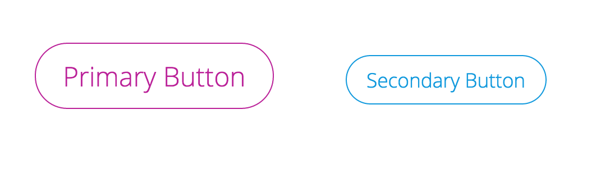
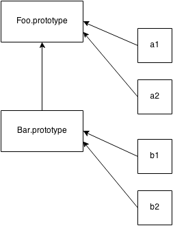

(Before life got in the way this Autumn) I began writing this article in August a few weeks after releasing a semi-satirical article about my take on the mix of current CSS naming convention/styling trends on Sitepoint called [Atomic OOBEMITSCSS](http://sitepoint.com/atomic-oobemitscss/). I called it *Atomic OOBEMITSCSS* as a joke, but people started picking up the name and using it in the wild (which was honestly pretty entertaining as questions about it sprung up in-person).

This post has two goals:

1. To defend `@extend`
2. To explain a scalable, modular, and class-based approach to CSS

## Classy CSS, Please.

In the article mentioned above, I explain how I mark up components (via an example using Pinterest) and correlate their styling with some syntacticly awesome sugar sheets. I now use the post as a handy manual for people around me who ask about our front-end architecture. I've gotten a lot of positive feedback on it as it has been stress-tested over months of building a large-scale pattern library. Consequently, I have found myself needing to explain the system (and Sass itself) to people with traditional computer science backgrounds, and doing so made me realize just how programmatic and class-based the CSS architecture system (*Atomic OOBEMITSCSS*) I described in the article was. So I'd like to take a moment to give it a legitimate name that I can actually get behind, **Classy CSS,** and to also explain it in a way that a programmer may find a bit closer to home.

## A Classy Button

I’ll go into a little bit more depth with how it works here, using a button as my example (because the button is the “hello world” of CSS):



We start with a silent placeholder selector with the button’s base. It is named using a customized BEM-like syntax, so the first part of its naming is going to be the object we’re referencing (button or btn) and after a double dash, we have the modifier (base in this case):

```sass
$color--primary: #b29;
$color--secondary: #19d;

%btn--base {
  border: 1px solid currentColor;
  border-radius: 1.5em;
  background: none;
  outline: none;
  transition-duration: .25s;
  cursor: pointer;
  margin: 30px;
  padding: .5em 1em;

  &:hover {
    color: white;
    background: black;
  }
}
```

This base is our class. We will be building on this for every button, as every button is an instance of that class. Every button element has the type button, and thus shares some common traits (solid outline, transparent background, etc.)

<figure class="right">

<figcaption>Prototypal inheritance illustration from <a href="https://github.com/getify/You-Dont-Know-JS/blob/master/this%20&%20object%20prototypes/ch5.md">You Don't Know JS: This & Object Prototypes</a></figcaption>
</figure>

```sass
%btn--primary {
  @extend %btn--base;
  color: $color--primary;
  font-size: 1.5em;
}

%btn--secondary {
  @extend %btn--base;
  color: $color--secondary;
  font-size: 1.1em;
}
```

usage here:

```sass
.hero__btn {
  @extend %btn--primary;
  margin: 2em;
}

.sidebar__btn {
  @extend %btn--secondary
}

.global-nav__btn--login {
  @extend %btn--secondary;
  margin-right: 1em;
}
```

But really if you're writing those in the *classy* way, each *component* (hero, sidebar, global-nav) would have its own partial .scss file that could look something like:

_hero.scss

```sass
.hero {

  ...

  &__btn {
    @extend %btn--primary;
  }

  ...

}
```

_sidebar.scss

```sass
.sidebar {

  ...

  &__btn {
    @extend %btn--secondary;
  }

  ...

}
```

_global-nav.scss

```sass
.global-nav {

    ...

    &__btn {
      @extend %btn--secondary;

      &--login {
        @extend .global-nav__btn;
        margin-right: 1em;
        // at this point, you're
        // styling .global-nav__btn--login
    }
  }
}
```

## Well, What About Mixins?

When making buttons, some of my coworkers got confused about using `@mixin` vs. an `@extend` and wondered why they shouldn't be using the `@mixin` instead. Well to me, the `@mixin` denotes some sort of argument (yes, I know it doesn't *have* to, but it makes sense to `@extend` styles of classes rather than build them each time). This created a smaller output CSS file and cleaner code if you understand what is going on.

## In Defence of @extend

Okay &mdash; so what exactly *is* "going on?" Before moving on, it's important to understand the underlying differences between `@mixin` vs. `@extend`:

> A `@mixin` is like a **stamp**: it creates a duplicated version of the property block (optionally) with arguments provided.

> An `@extend` **appends the element** you are extending to the property block.

<section class="code--half">
Sass

<pre><code>
// Input for @mixin

@mixin center-block {
  display: block;
  margin-left: auto;
  margin-right: auto;
}

.pitbull {
  @include center-block;
  width: 4500px;
}

.boxer {
  @include center-block;
  width: 3000px;
}

.husky {
  @include center-block;
  width: 3400px;
}

// Input for @extend

%center-block {
  display: block;
  margin-left: auto;
  margin-right: auto;
}

.yorkie {
  @extend %center-block;
  width: 400px;
}

.poodle {
  @extend %center-block;
  width: 550px;
}

.jack-russel {
  @extend %center-block;
  width: 750px;
}

</code></pre>

</section>

<section class="code--half">

CSS Output

<pre><code>
// Output using @mixin:

.pitbull {
  display: block;
  margin-left: auto;
  margin-right: auto;
  width: 4500px; }

.boxer {
  display: block;
  margin-left: auto;
  margin-right: auto;
  width: 3000px; }

.husky {
  display: block;
  margin-left: auto;
  margin-right: auto;
  width: 3400px; }


// Output using @extend:

.yorkie, .poodle, .jack-russel {
  display: block;
  margin-left: auto;
  margin-right: auto; }

.yorkie {
  width: 400px; }

.poodle {
  width: 550px; }

.jack-russel {
  width: 750px; }
</code></pre>
</section>

<div style="clear:both; float: none"></div>

This means that we have a smaller output CSS file because we are not reproducing the code block each time we are implementing it. The `@extend` simply allows us to *reference* the properties. Extends are so perfect for this! Their logical purpose makes sense. <strong><a href="" class="twitter-share">#teamExtend</a></strong>

The downside of this is that we have no control over *where* the block of properties lives since we are not invoking a new instance of that code block within the property, simply referencing it to pull styles from (which is why you can't use `@extend` within media queries). But this doesn't matter if we are following principles of *Classy CSS.* You extend silent placeholders into actual, usable classes to instantiate them, and `@mixin`s are reserved for a different purpose. They are used inside of the silent placeholders to build the code which is then extended.

> In the case of *Classy CSS,* **mixins are like constructors** and you only use them within silent placeholder selectors.

For instance, lets make a button mixin to make primary and secondary buttons easier to build out:

```
// the colon after the argument denotes a default value
// creating the constructor function (mixin)

@mixin btn-me($color: hotpink, $size: normal) {
  border: 1px solid $color;
  border-radius: 1.5em;
  background: none;
  outline: none;
  transition-duration: .25s;
  cursor: pointer;
  margin: 30px;
  padding: .5em 1em;
  @if $size == 'small' {
    font-size: .8em;
  } @else {
    font-size: 1.2em;
  }

  &:hover {
    color: white;
    background: $color;
  }
}

// creating placeholder classes to extend from and reference

%btn--primary {
  @include btn-me; // no arguments means it takes defaults
}

%btn--secondary {
  @include btn-me(blue, small)
}

// instantiating the code with semantic naming
// this is the only moment that we are writing
// any code to be compiled
.hero__btn {
  @extend %btn--secondary;
}
```

And the CSS output looks like:

```
.hero__btn {
  border: 1px solid blue;
  border-radius: 1.5em;
  background: none;
  outline: none;
  transition-duration: .25s;
  cursor: pointer;
  margin: 30px;
  padding: .5em 1em;
  font-size: .8em;
}

.hero__btn:hover {
  color: white;
  background: blue;
}
```

## File Structure

So what does the file architecture look like then? I like to break things up into modular components.

```scss
scss/
├── components/
│   └── buttons/
│       ├── vars
│       │   └── _vars.scss
│       ├── extends
│       │   └── _vars.scss
│       └── _buttons.scss
```

--> MUCH MORE ON FILE STRUCTURE <--

## Benefits

Okay, so that might seem a bit complex to the uninitiated, but once you get started with it, it really makes naming decisions and architectural decisions easy. This is clearly an opinionated system.

Benefits include:

- It ensures code organized in a way that prevents specificity clashing and overrides (see [ITCSS](http://csswizardry.com/2014/10/the-specificity-graph/)) which means that a smaller file size of CSS is output
- Consistent naming ([BEM](http://getbem.com/naming/)) keeps uniformity among teams and implements a system to reduce confusion
- The system is organized, maintainable, and scalable

> Keep it classy. Keep it Sassy <span style="font-style: none">💁</span>

Ok.. I'll walk myself out.