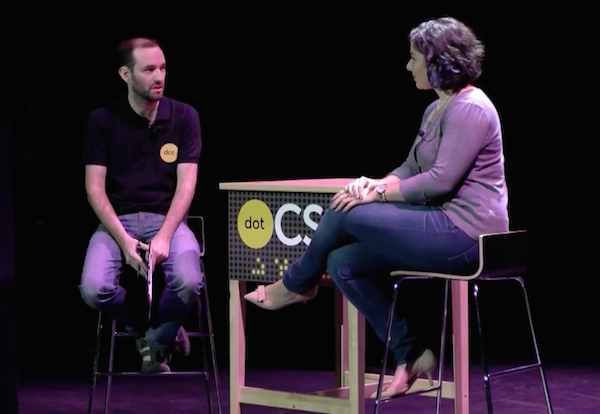

[Last year](http://una.im/2015-resolutions) I started a (now annual) tradition of reviewing my personal goals, and setting new ones. I can't believe how much has happened in the past year. It's definitely been a roller coaster, and I've definitely grown a ton as a person. Thank you all for joining me on this journey.

## 2015 Retrospective

Here are a few projects I've launched over the past year (all source code available on GitHub, where I made **2,396 commits** this year):

- [Sass Director](http://sassdirector.com/): A file generator for Sass partials that uses a single "director script" (aka your `main.scss`)
- [Gulp Starter Environment](https://github.com/una/gulp-starter-env): Created for the designers I worked with the learn gulp and get familiar with using Github.
- [Happy Moments](http://happy-moments.herokuapp.com): A node app that pulls in a single happy moment memory from each day I've had this year.
- [Travels](http://travels.surge.sh/): A web experiment site that uses filters and blend modes, featuring my travel poetry as content.
- [CSSgram](http://una.im/cssgram): A tiny CSS library recreating Instragram filters using just CSS features.
- [Toolsday](http://toolsday.io/): A 20-ish-minute podcast about the latest in tech tools, tips, and tricks (hosted along with my coworker, [Chris](https://twitter.com/chrisdhanaraj))
- [arttheweb.com](http://arttheweb.com/): A collection of my articles, talks, and web experiments based around designing in the browser.

That was all outside of work. At IBM, I worked on two large-scale pattern libraries (one for Watson and one for Bluemix), built prototypes for product iterations, and helped build a Front-End Development community and curriculum.

### Knowledge Sharing

I've given **17 talks/workshops** on Sass, UI interaction, performance optimizations, keyboard ninjary, open source design, goal setting, and CSS filters and blend modes. I've written **30 blog posts** on topics ranging from tech experiments (like [Generative Pixel Art](http://una.im/sass-pixel-art/) via Sass matrices and blend-mode hacks to create [Faux 3d Effects](http://una.im/3d-effect), to quite practical ([5 Uses for Sass Maps](http://www.sitepoint.com/5-great-uses-sass-maps/) and a class-based [CSS architecture](http://una.im/classy-css/) system). I also recorded every post I wrote for my blog.

<blockquote class="left">If you'd like to support my code calligraphy or just send a simple thank you, I made an <a href="#">Amazon wishlist</a> of pens, paper, and audiobooks :)</blockquote>

I also started doing **code calligraphy** as a way to visualize some mnemonic devices and solidify my skills. People on Twitter seemed to really resonate with them, so I want to make more. A lot of people mentioned that they wanted prints, a book, or posters. I've got some ideas, but we'll see how it pans out with time.

### Other Things

I traveled *alot* this year. According to my TripIt data, I traveled a total of **139,872 miles** to **29 cities** in **8 countries**. Where? Australia, England, Belgium, Italy, Switzerland, Germany, and France (and trips around the US too). I love to travel, but short conference trips can be taxing after a while :P

  <figure>
    
  </figure>
  
Interviewing with Sylvain after my dotCSS talk in Paris.

I also started to [read](https://github.com/una/personal-goals/blob/master/ideas-and-misc/book-checklist.md) a lot, too (well, by read I mean listen to audiobooks). I finished **49 books** this year. My favorites were:

- *Ready Player One* by Ernest Cline
- *The Martian* by Andy Weir
- *Outliers* by Malcolm Gladwell
- *Ghost in the Wires* by Kevin Mitnick
- *Ender's Game* by Orson Scott Card

-- images of travels/talks --

### Awards

Apparently people took notice of my work, but didn't know where to categorize my contributions. I was nominated for [Young Designer of the Year](https://thenetawards.com/vote/young-designer/) while also getting on a list of [2015's Top JS Devs to Follow](http://blog.bithound.io/2015-top-js-devs/) and [Female Tech Influencers](http://skillcrush.com/2015/11/04/50-female-tech-influencers-to-follow-on-twitter/) 💪. One day there will be a place for people like us.

### Personal Goals Outline

So how am I doing on those overall goals I laid out last year?

1. Build quickly, ship things, and learn. *(yep!)*
2. Contribute to Open Source *(hell yeah!)*
3. Share knowledge as often as possible *(definitely!)*
4. Appreciate the creative & talented people in my life *(I try)*
5. Use Vim + the keyboard more often *(yes!)*
6. Up my JS Game *(I'm definitely better but should learn way more)*
7. Performance-first advocacy *(yep!)*
8. Foster designer participation in OS projects *(around me, yes &mdash; outside, maybe?)*
9. Participate in conferences & community *(LOL. yes)*
10. Use web components *(nope)*
11. Be kinder *(I don't think so?)*

## 2016 Goals

### Professional Goals

### Personal Goals

First and foremost, after years of hackathons and conferences, I've come to realize that my wardrobe has now come to resemble that of a 20-year-old startup bro. Worse still is that I got comfortable wearing these tshirts and jeans every day ~~to work~~ everywhere. I want to dress better. And actually make time to go shopping :) that might help. Pinterest too.

I also want to get fit again (yes, I failed at this in 2015 &mdash; but I blame all of the travel). I started taking classes like aerials, which were awesome, and I want to continue those while also training for a **half-marathon**. Yes, it's going to suck at first, but hopefully I'll learn to love running again. I need to prioritize my health again.

My last personal goal from 2015 was to be better at keeping in touch with people I think I failed on that too. So

### 2016 Goals Overview

I'm cutting this down to fewer goals than last years.

In conclusion: 2015 was way more about professional development than personal development, and I want so badly to make 2016 more about personal development, but I have so many professional goals and I'm so young. I'm going to try to do it all. Wish me luck.

I'm going to leave you with this lovely holiday song about the state of developer life from your [Toolsday](http://toolsday.io) hosts (me and Chris) :)

<iframe width="100%" height="440" src="https://www.youtube.com/embed/1NV-39LngiM?rel=0" frameborder="0" allowfullscreen></iframe>