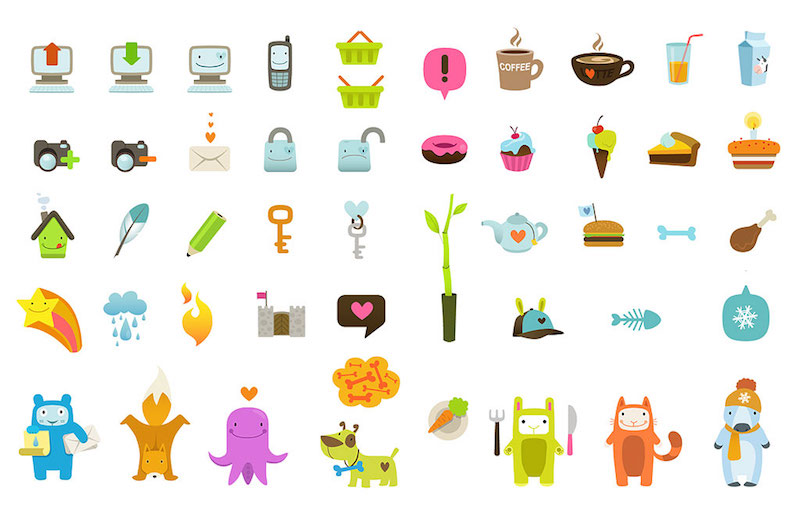
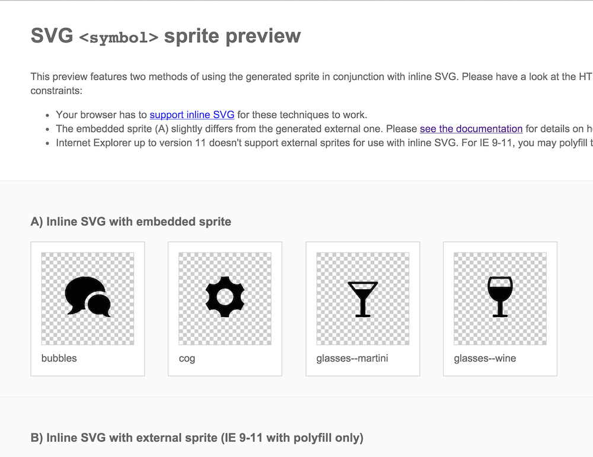

**I made a [boilerplate](https://github.com/una/svg-icon-system-boilerplate) for the system described in this post:**

<small>P.S. Please ignore the awful title of the blog post. I couldn't figure out what to call it.</small>

Icons! We see them all over the web, and they're essential to most pattern libraries and web design systems. I recently needed to implement such a system. It had to be non-prescriptive, scalable, and dynamically editable via CSS. The icons were to be used by multiple teams in many different applications, built with various frameworks and techniques. They needed to have the ability to be restyled, get cached, and be updated quickly and easily as more icons are added. Basically, the icon system needed to be really, really flexible. *Challenge accepted.*

## Why SVG Icons?

There are basically three options we have when it comes to icon systems:

- Font/glyph icons
- CSS-based data URIs
- SVG icons

**SVG icons are superior.** I'm *(not)* sorry &mdash; they are. SVG is scalable, widely-supported, and allows for much more flexibility and dynamic editing. This post isn't going to go in depth on the benefits of SVG icons over the other systems because [so](http://ianfeather.co.uk/ten-reasons-we-switched-from-an-icon-font-to-svg/) [many](http://www.sitepoint.com/icon-fonts-vs-svg-debate/) [others](https://medium.com/@webprolific/why-and-how-i-m-using-svg-over-fonts-for-icons-7241dab890f0) [have](https://css-tricks.com/icon-fonts-vs-svg/).

Font icons and data URI's in CSS content are a [hack](http://una.im/Internet-is-hacks/#💁), while SVG icons represent visualizations in the format we expect without weird workarounds for breaking accessibility due to re-defining native DOM elements.

## SVG Icon Options

Okay, great. We've decided on using SVG icons! But there more than a few ways to implement SVG into the DOM, each with their own pros and cons. I initially outlined the pros and cons of each, but it made this article way too long and out of scope. Some of the methods I considered include:

1. Inline SVG
* Using individual SVG's as ``'s
* [SVG CSS Sprite](https://css-tricks.com/css-sprites/) accessed via `<view>`
* [SVG Symbol Sprite](https://css-tricks.com/svg-use-with-external-reference-take-2) accessed via `<use>`
* [SVG Stacked Sprite](http://simurai.com/blog/2012/04/02/svg-stacks)

Ultimately I went with Method 4: the SVG Symbol Sprite because of the following benefits:

- Eliminate HTTP requests (with this singular asset)
- Create and use a cacheable asset
- Faster page load time because all of the above
- Provide a "Single Source of Truth" to reference and link to
- SVG properties are editable in CSS
- SVG is animatable in CSS or JS

I also decided to use an **"external" SVG sprite**. I put external in quotes because the SVG must still be within the same site as it is used in to avoid security issues and cross-origin errors (the bane of my existence right now). But when it works, it means the SVG does not need to live in the head of the same document on which the icons are being used.

<figure class="half--right" style="margin-top: -1em;">
  
  <figcaption>This is what you get Googling "cute icons"</figcaption>
</figure>

*Note:* if you've got a templating system and don't mind the post-render bloat, there's nothing wrong with inlining the SVG and it even saves you an HTTP request, but I wanted to make this as agnostic as possible. Also, with external sprites, there is a compatibility issue for IE, but we'll get into a polyfill for that later.

## Making it Dynamic

Unfortunately, we can't simply reference an SVG element and be able to edits its paths (i.e. <code>&lt;img src="apple.svg" style="fill:green"&gt;</code> will not let you edit the color of the apple to make it green).

But the `<symbol>` method allows us to reference our SVG's as though they are inlined on the page! The `<symbol>` tag separates out icons, and the `<use>` tag allows access to them. *oOoOoh this is getting good.*

So when we're making our SVG sprite sheet, it doesn't look like an SVG CSS sprite sheet (where you are taking individual SVGs and using `<view>` to determine what portion of the larger image we see:


With `<symbol>`, the icons are more *symbolic* (pun totally intended). If you preview a *symbol-based SVG*, it will look blank, though all the icons exist as individual `<symbols>`'s and are ready for `<use>`-age.

## Making it Systematic

Alright. So this seemed to be the best approach, now how can we build it to be scale-able? Let's make this a system that is easy to use and update.

### Generating the Sprite

The first step is to generate an SVG sprite. Luckily, [Joschi Kuphal](https://twitter.com/jkphl) made an awesome tool called [SVG Sprite](https://github.com/jkphl/svg-sprite) which he also ported into Gulp with [gulp-svg-sprite](https://github.com/jkphl/gulp-svg-sprite). I really like Gulp as a build tool because I think it's the most lucid in terms of what tasks are running.

The SVG Sprite tool is seriously awesome. It provides options for all of the sprite options mentioned above in this post and even some additional niceties such as cache busting and building a reference page for you. The reference page is *fantastic*! These are the options I set inside of my *gulpfile.js* to generate the `<symbol>` sprite I needed:

```js
// SVG Config
var config = {
  mode: {
    symbol: { // symbol mode to build the SVG
      render: {
        css: false, // CSS output option for icon sizing
        scss: false // SCSS output option for icon sizing
      },
      dest: 'sprite', // destination folder
      prefix: '.svg--%s', // BEM-style prefix if styles rendered
      sprite: 'sprite.svg', //generated sprite name
      example: true // Build a sample page, please!
    }
  }
};
```

You can also set an option to render a stylesheet that helps size icons, but I removed those (shown above as set to false) because I like to style the icon individually and let it's default take the size of it's parent. These styles also correlate with the prefix option above.

### Adding Icons

Every individual SVG icon is added into a base folder (I just used *svg/*). Another awesome advantage of SVG Sprite is that it respects a folder system for naming icons. What this means is, if my base folder is *svg/* anything within that folder can be referenced via its name, and anything within a folder gets prepended. Here's what I mean:

```scss
svg/
|-- bubbles.svg //sprite.svg#bubbles
|-- cog.svg     //sprite.svg#cog
|
|__ glasses/
    |-- martini.svg //sprite.svg#glasses--martini
    |__ wine.svg    //sprite.svg#glasses--wine

```

With that naming structure in mind, you can now teach your designers how to add icons to that folder and submit pull requests! *Yay for efficiency!* When new icons are added, they don't affect existing icons, but instead grow the system's icon options.

### Reference Page

The auto-generated reference page helps you keep track of icon options and their name references:




## Usage

In HTML, you need just 2 elements to reference your icons with:

```html
<svg>
  <use xlink:href="sprite.svg#glasses--wine"></use>
</svg>
```

You may then style this SVG in CSS. Make sure to give it a width and height (default is 100% of parent). If you turned on the stylesheet rendering options above, you can include or link to the generated stylesheet. It is best to edit these icons in CSS after adding a class to the `<svg>`. For example:

HTML:

```html
<svg class="icon--wineglass">
  <use xlink:href="sprite.svg#glasses--wine"></use>
</svg>
```

Sass:

```scss
.icon--wineglass {
  fill: red; // additional styling

  &:hover {
    fill: white; // styling on hover
  }
}
```

## Caveats

There are a few things to note if implementing a system like this (particularly about the external SVG). Due to cross-origin reference issues (CORS) the SVG must be located on the same domain as your website. Also, every browser except for IE 9-11 that support inline SVG support external SVG links, though you can polyfill this capability with [SVG4Everybody](https://github.com/jonathantneal/svg4everybody) or [SVGxUse](https://github.com/Keyamoon/svgxuse).

Keep in mind, for performance purposes, since icons are presentational, you can likely *defer* the loading of the polyfill scripts to not disrupt the load time of the rest of your assets.

Another caveat is that, while you can edit the entire SVG, you can't edit specific paths and groups within SVG's when using `<use>`. This is because *the browser treats* `<use>` *like the shadow DOM*. [Chris Coyier](https://twitter.com/chriscoyier) wrote a few [excellent](https://css-tricks.com/svg-sprites-use-better-icon-fonts/) [posts](https://css-tricks.com/svg-use-with-external-reference-take-2/) on CSS Tricks for further reference.

**TL;DR: Here's a [boilerplate](https://github.com/una/svg-icon-system-boilerplate) for a pretty good SVG Icon System.**

<small>Shoutout to <a href="https://twitter.com/mylifeasalllly">Ally Palanzi</a> for proofreading and <a href="https://twitter.com/SaraSoueidan">Sara Soueidan</a> for pointing out you don't need &lt;defs&gt;!</small>