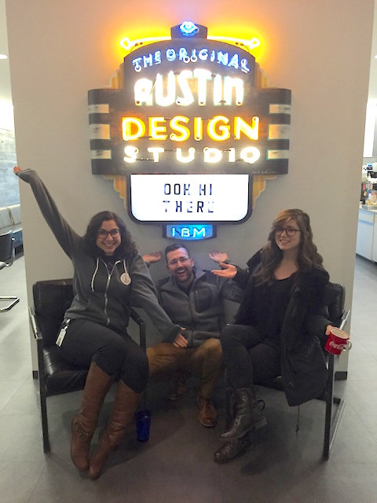
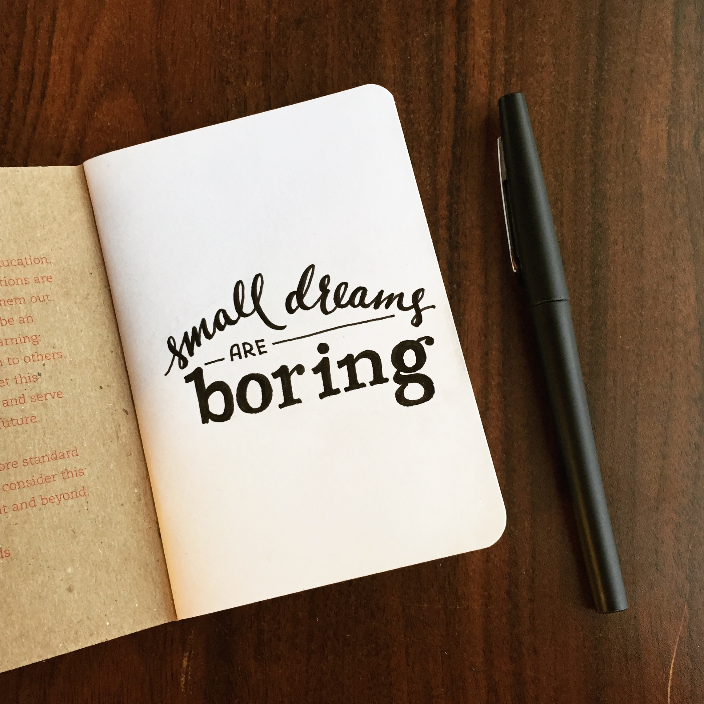

I'm excited to share the news that I'll be joining [Digital Ocean](http://digitalocean.com) as a UI Engineer on the Creative and Community Engineering team! I'm pretty stoked about the opportunity and also to work remotely (I'm keeping Austin my home base but since I won't need to physically be in an office every day, I'll be able to travel more freely!)

I've learned so much over my (almost 2 years!) time at IBM and I've seen the culture of design and especially front-end development really blossom in the space of IBM Design. While I can't go into too many details about the actual work, I want to reflect on some of the broader lessons learned from my time in the studio.

## 1. Enthusiasm is Key

I started my career on Watson, where it was first on the Visioneering, then core team, building prototypes for future Watson visions, and then a component library for people building with the Watson API's (you'll quickly see that working on pattern libraries is a theme here for me :P)

I learned a TON from this team, especially working with [Ryan Brownhill](http://ryanbrownhill.com) and Britany Ponevelle. It was really awesome to be a part of their code journeys, and I learned a ton about building interdisciplinary rapoir and also a lot about motion design from Ryan. He started blogging some of his motion to code discoveries as we worked together -- links here --. Britany coined the term #littlewins that I love to say now as she learned Sass and git. Their enthusiasm while we sorted out a design/dev Github workflow was so awesome and contagious that it spread to other teams, and eventually we got all of the designers around us into this git workflow that we just happened to try out one day out of curiosity on a down week.

> Telling a designer they need to learn to code will make them defensive, getting a designer excited about code with make them curious (link to tweet)

## 2. Relentlessly Reinvent

This is another phrase frequently heard in the studio. Keep building, iterating, and testing until it works. This can feel like endless work, going back to square one every time, but ultimately, after you've exhausted all of the possibilities, you come out with a legitimately solid solution.

This is how design thinking works at its core. You think about your user, build, test, and iterate. You may end up in the same place you started, but with each pass, much more accumulated knowledge helps shape the next decision.

-- image of IBM design thinking globe --

I learned this lesson very well while working for over a year on three different iterations of the Bluemix component library. And after it all, after the opinions and meetings and discussions, I can't express how much love I have for the team. The Bluemix Design Guide been a long time coming, and it's come such a long way! I'm so proud of where it is now, and where it will go!

## 3. Ask for Forgiveness Not Permission

It may surprise you that a company as structured as IBM has been telling all of their new designers and developers to forge ahead and ask for forgiveness later, but that's exactly the mentality that sums up my experience working in the Austin IBM Design studio. I love this sentiment. It's one of the most important lessons I learned, along with the realization that:

You can't wait for things to become good around you, you have to make them good around yourself.

### FED Date

When I first started, there was no front-end community yet. But taking the ideal asking for forgiveness and not permission (and inspired by a company I interned at a few summers ago called [Viget](http://Viget.com)), I started an internal front-end knowledge share to unite the developers in the studio and open their eyes to new skills/ideas. It was a place to practice giving talks, an excuse to play with a new technology, and a space to meet coworkers that you might not work with or see on a daily basis. FED Date was super successful, and we've had over ___ unique talks on topics ranging from D3 to Arduino to Functional Programming with Elm.

-- fed date image --

A funded studio initiative started to bolster internal front-end education a few months later, making the FED community even more awesome! Damon Deaner was brought in to build an education program, making it much more legit now -- but I'll never forget the scrappy FEDs who were just hungry for a community to learn from that built one from scratch together.

### IBM Radio

FED Date was not the only grassroots initiative started within the studio. Among others (including a side projects community and a really beautiful magazine) the IBM Radio was dreamed up by Mirko and Eddie. I ended up working on an app for IBM radio for a hackathon project and that got me involved with its community.

-- Image of tools day --
-- IBM radio cake --

This led to me starting a podcast called [Toolsday](http://toolsday.io) (20ish minutes of tech tools, tips, and tricks on Tuesdays st 2!) with my coworker, Chris Dhanaraj, a really brilliant engineer on Bluemix. We were both just the right amount of nerdy about various topics on the front end development scale to make it work. I ended up singing every intro song because our friend who was going to make us an audio track fell through. But like this lesson says, you have to make things work.

My hope for both me and you is to always stay scrappy, stay hungry, and stay curious.

There's this really strong love for craft within a supportive little community at IBM Design. And while not everyone mentioned above is still there, they exemplify what makes its community so awesome. With each new IBM Design Bootcamp cohort, new ideas are brought into the studio. I'll miss it dearly, and like others, will take the lessons learned there (both technical and non-technical) with me throughout this journey we call the tech life.

Oh and by the way, IBM design is [hiring](http://ibm.com/design/careers) if you're interested in joining that team (and so is [Digital Ocean](#)!)

