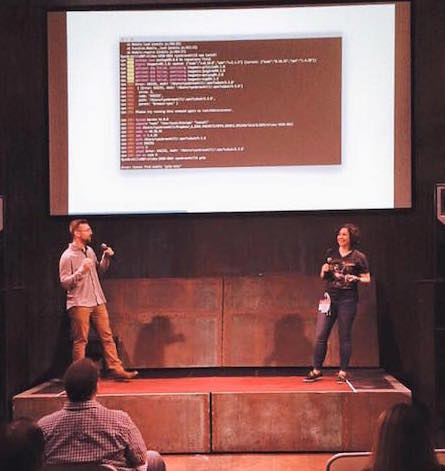
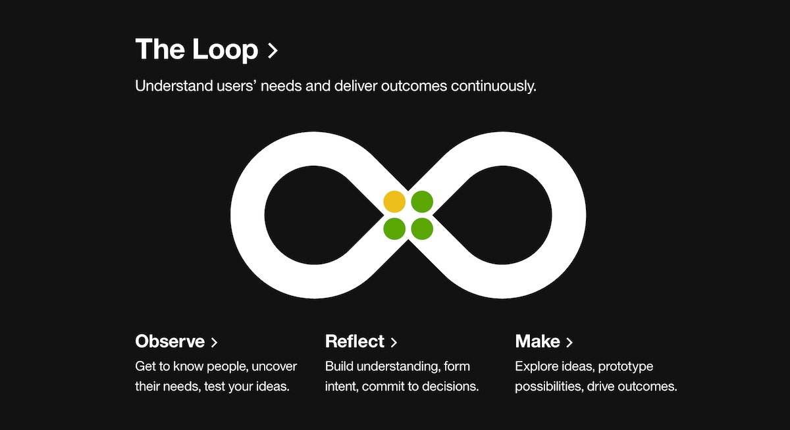
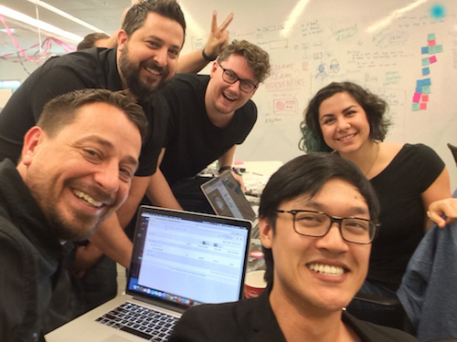
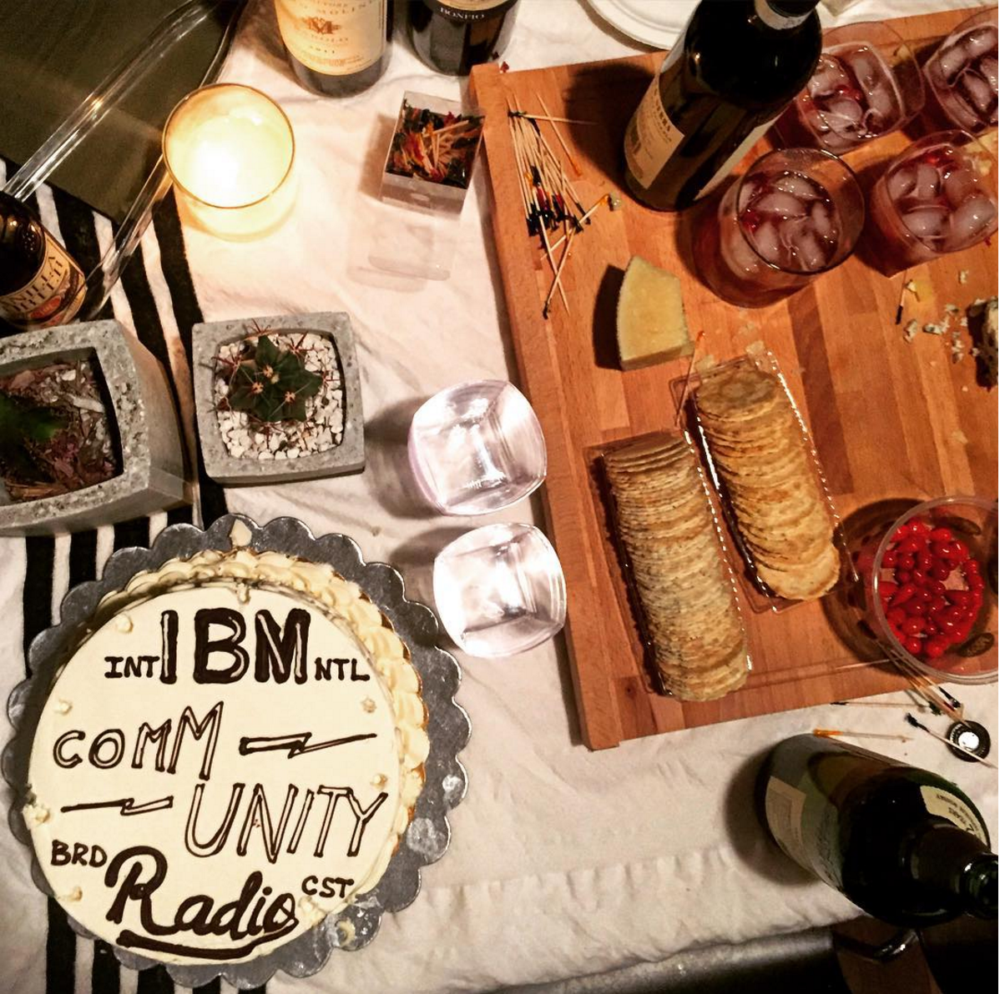
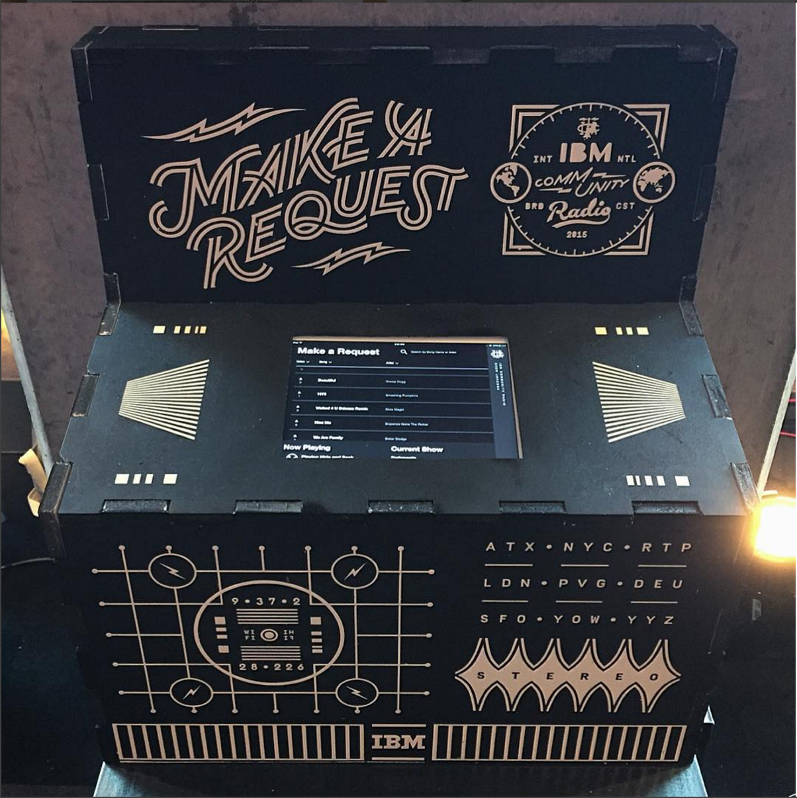
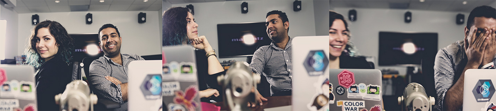

I'm excited to share the news that I'll be joining [Digital Ocean](http://digitalocean.com) as a UI Engineer on the Creative and Community Engineering team next week! I'm pretty stoked about the opportunity to work in a smaller team setting, get my work out there faster, and also work remotely. I'm keeping Austin my home base but since I won't need to physically be in an office every day, I'll be able to travel more freely &mdash; which is really important to me!

I've learned so much over my (almost 2 years!) time at IBM and I've seen the culture of design and especially front-end development really blossom in the new space of IBM Design. While I can't go into too many details about the actual product work, I want to reflect on some of the broader lessons learned from my time in the studio.

## 1. Enthusiasm is Key

<figure class="right">
  
  <figcaption>Ryan and I presenting about our experience and workflow of using GitHub for design.</figcaption>
</figure>

I started my career at IBM on Watson and learned a TON from this team. I loved working closely with [Ryan Brownhill](http://ryanbrownhill.com) and [Britany Ponvelle](https://twitter.com/britanyponvelle). I learned a ton about building interdisciplinary rapport and also a lot about motion design from Ryan. Britany coined the term *#littlewins* that I love to say now all the time as she was learning Sass and git.

Their enthusiasm while we sorted out a design/dev Github workflow was so contagious that it spread to other teams, and eventually all of the designers around us were asking for a demo of our process &mdash; a process which we just happened to try out one week out of mutual respect and curiosity.

<blockquote class="twitter-tweet" data-lang="en">
Telling a designer they need to learn code will make them defensive. Sharing your excitement &amp; joy for code with them will make them curious
&mdash; Una Kravets (@Una) <a href="https://twitter.com/Una/status/575064162616766464">March 9, 2015</a></blockquote>

 

**Enthusiasm is the solution to bridging skill gaps and spreading knowledge.** Be patient and remember that everyone has the best intentions in mind. After all, *everyone on your team wants the product to succeed*. Try to remember that!

## 2. Relentlessly Reinvent

This is another phrase frequently heard in the studio. Keep building, iterating, and testing until it works. This can feel like endless work, going back to square one every time, but ultimately, after you've exhausted all of the possibilities, you come out with a legitimately solid solution.

This is how design thinking works at its core. You think about your user, build, test, and iterate. You may end up in the same place you started, but with each pass, much more accumulated knowledge helps shape the next decision.

<figure>
  
  <figcaption>The <a href="http://www.ibm.com/design/thinking/">Design Thinking</a> loop.</figcaption>
</figure>

I really internalized this lesson while working on four different iterations of component libraries. After all of the efforts, the opinions and meetings and discussions, I can't express how much love and respect I have for the team. The Bluemix Design Guide in particular has been a long time coming, and I'm so proud of where it is now, and excited about where it is going! [Brian Han](https://twitter.com/_brianhan) had exemplary patience throughout this process that I always hope to emulate in any task I need to accomplish in the future.

**<a class="twitter-share">The road to solving design problems is long and winding and worth it.</a>**

## 3. Ask for Forgiveness, Not Permission

 

<blockquote class="left"><a class="twitter-share">You can't wait for things to become good around you &mdash; you have to make things good around yourself.</a></blockquote>

It may surprise you that a company as structured as IBM tells some of its employees to forge ahead, do the thing, and if it doesn't work out, to ask for forgiveness later. But that's exactly the mentality that defined my experience.

### FED Date

When I started at IBM Design, the front-end development culture was in its infancy. A lot of us felt disconnected and weren't really learning. But I quickly learned that **your work culture and environment can be largely up to you**. We wanted to make it better.

Inspired by the above sentiment and by a company I interned at a few summers ago called [Viget](http://Viget.com), I started an internal knowledge share. This was for a few reasons &mdash; to unite the developers in the studio and open their eyes to new skills/ideas, to create a safe space for presentation practice, to give an excuse for experimenting with new technology, and to provide a place to meet and see coworkers that you might not work nearby on a daily basis.

<blockquote class="twitter-tweet" data-lang="en">
^ what used to be 6 ppl has now quadrupled and we&#39;ve had &gt; 35 unique dev presentations among peers. Highly recommend! <a href="http://t.co/qjf9m1VIER">pic.twitter.com/qjf9m1VIER</a>
&mdash; Una Kravets (@Una) <a href="https://twitter.com/Una/status/628319979725824001">August 3, 2015</a></blockquote>

A few months later, a studio-supported education initiative was started, making the front-end community much more legitimate, with [Damon Deaner](https://twitter.com/DamonDeaner) leading the charge.

### IBM Radio

FED Date was far from the only grassroots initiative started within the studio. Among others (like a side projects community and a really beautiful magazine) the IBM Radio was dreamed up by [Mirko Azis](https://twitter.com/miroslavazis) and [Edouard Urcades](https://twitter.com/edouerd). I was lucky enough to (almost randomly) end up getting involved in its community via a hackathon project.

<figure class="left">
  
  <figcaption>The IBM Radio hack team! <a href="https://twitter.com/jeffersonwlam">Jefferson Lam</a>, <a href="https://twitter.com/ATLankford">Adam Lankford</a>, <a href="https://twitter.com/Tay1orJones">Taylor Jones</a>, <a href="https://twitter.com/Dave_Conner">David Conner</a>, and me.</figcaption>
</figure>

This led to me starting a podcast called [Toolsday](http://toolsday.io) (20ish minutes of tech tools, tips, and tricks on Tuesdays st 2!) with my really awesome coworker, [Chris Dhanaraj](https://twitter.com/chrisdhanaraj) to record our nerdy lunchtime talks about technology. I learned a ton from him we knew that recording those conversations would be useful to more people than just ourselves. We didn't have audio, or a plan each week, but we made it work. The people in this studio are really goos at **making things good** around them.

<figure class="half--left">
  
  <figcaption>Mirko's birthday cake with the radio logo.</figcaption>
</figure>

<figure class="half--right">
  
  <figcaption>IBM Radio jukebox for our SXSW event. Designed and built by <a href="https://twitter.com/ThunderNixon">Stephen Nixon</a>, <a href="http://alexhadik.com">Alex Hadik</a>, and me!</figcaption>
</figure>

<figure style="width: 120%; margin-left: -10%">
  
  <figcaption>Toolsday hosts hard at work in the recording studio.</figcaption>
</figure>

> All of that is to say that you have all the power in the world to make your workplace awesome. <a class="twitter-share">Culture comes from community, and communities are built by the people within them.</a>

There's this really strong love for craft as the basis of the community within IBM Design. And while not everyone mentioned above is still there, each designer and developer exemplifies what makes its community so awesome. With every new-hire cohort, new ideas are brought into the studio and it's been really exciting to have been involved in such a massive cultural shift! Stay curious, y'all 💕

Oh and by the way, IBM design is [hiring](https://www.ibm.com/design/careers.shtml) if you're interested.