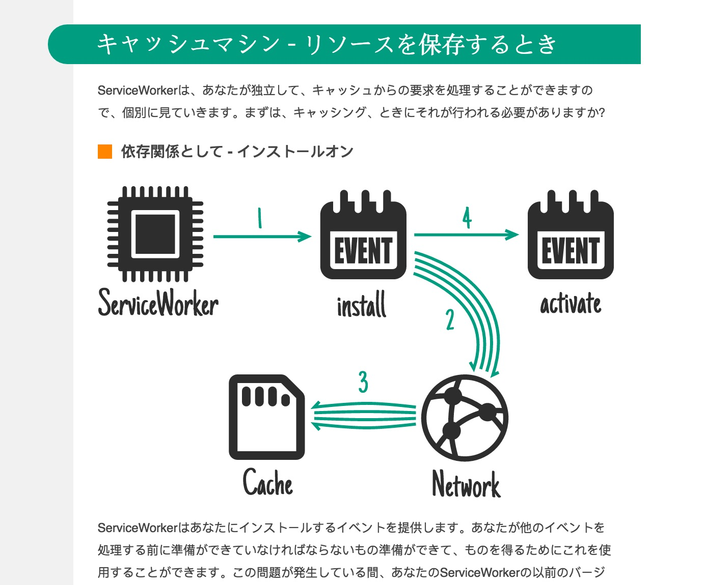

Accessibility is often solely discussed in terms of people with disabilities. It is also quickly dismissed by smaller companies and startups because they argue that they don't have time and resources to consider this group. While there are certainly groups of people that require a unique experience, <a class="twitter-share">improving accessibility overall improves business outcomes overall.</a>

**Accessibility is not just about morals and making the web usable to a small group of citizens. It’s about making the web usable to the masses.** The threat of being sued, or defaulting to the argument of morality should not be the defense you need to ensure that accessibility is taken seriously in your company. Instead, recognize that a large number of your users would have a much better experience with improved accessibility.

And this comes in a variety of forms.

## Markup

<figure class="right" style="max-width: 400px; margin-top: -1em;">
  
  <figcaption style="float:right;">Reading + Listening = better comprehension</figcaption>
</figure>

The most basic a11y (accessibility) win is using proper elements and ARIA roles where necessary. You’ve probably heard that these are good for people who use screen readers. They are! But keep in mind, **people with impaired vision are not the only users using screen readers**. Case in point: I use screen readers online all the time. This is my preferred state of consuming longer content. It helps me focus on the topic at hand. It works for me, I’ve written about it [here](/comprehension/), and I recommend you try it.

When you make your app accessible, it’s easier to use by literally everyone!

## Vocabulary

Chances are if you’re reading this blog you’re building an English-language product. But, there is a 1/4 chance that English was not your first language. I think it’s a little unfair how English-dominated the tech world and Open Source in general is, but that’s another story. Let’s get back to accessibility.

A big part of accessibility is language choice. Writing in a clear, concise tone. And not using complex vocabulary when it’s not necessary.

<figure>
  
  <figcaption>The language breakdown of my blog audience over the past year via Google Analytics.</figcaption>
</figure>

25.4% of the top 10 languages of users who read my blog is not English. While English is the #1 language, the #2 language is Russian, and #3 is Chinese. All of these languages have *very* different alphabets, grammar rules, and vocabulary. A lot of the vocabulary is unique, too. You know how if you speak multiple languages, there are sometimes words that just don’t translate into other languages? And you don’t even realize that until you try to translate it?

Anyway, my point is, over 1/4 of my blog readers don't speak English as a first language. That is *not* a minority at all. It's a very significant number of users.

## Visuals

Continuing on the same thread of internationalization, another pillar of accessibility is providing translatable (read: in-code) text. I felt this struggle *very* clearly one University winter break when I spent half my day closing out of Candy Crush ads for my Grandmother, who doesn’t speak English very well.

There are some great iPad games, which use your language preferences and adapt because they have text written in code. And then there are games like Candy Crush, which are use text as images, and don’t allow for any kind of translation.

 

This is why it's really important to *be careful not to include any text in your visuals (even diagrams)* if you can. And if you do, describe the heck out of it and/or include a visual aid. This is really important. Text-only diagrams are impossible to absorb to someone who does not speak your language.

<aside style="width: 100%">Have you ever tried a translation test on your site or app? It's easy: on Chrome you can right click on the page and select "Translate to English." Once this dialog is open, you have access to a whole slew of language options.</aside>

[Jake Archibald](https://twitter.com/jaffathecake) uses really nice animated SVG diagrams in his [blog posts](https://jakearchibald.com/2014/offline-cookbook/). While they are scalable and use animations to describe points, SVG text does not translate into other languages because the DOM treats SVG a little differently (i.e. why they're accessed with `SVGElement` and not `DOMElement`). This is what happens when translating the page:

 

So even though the diagram text is highlightable, **don't rely on SVG images to be the tools you need for text translation**. After much Googling, I found that the best solution is to use basic DOM elements like paragraph tags absolutely positioned inside of a relatively positioned parent. The New York Times, which does a great job of making beautiful interactive articles shows us how in [this one](http://www.nytimes.com/interactive/2015/07/15/science/space/new-horizons-pluto-flyby-photos.html?version=meter+at+1&module=meter-Links&pgtype=Multimedia&contentId=&mediaId=&referrer=&priority=true&action=click&contentCollection=meter-links-click) that translates beautifully:

## Typography

Don't forget to think about typography when it comes to your text choices. Looking at the Candy Crush image above, remember that **script text may be confusing** to someone who isn't fluent in English and can't recognize it in its multiple forms.

Or take a look at this example:

Aside from the misleading green button (which is the same color and shape as the play button, awesome dark pattern right there), the text is really hard to read. Also, all of the subtitles are in the script font. Again, this increases confusion and decreases ability to use the app. So, consider color contrast and font, please!

## Conclusion

Incorporating accessibility for people with discrete needs is certainly important, but the danger of thinking of accessibility in this way is what allows people to generally ignore accessibility as too low priority due to the number of affected users. The affected user group is likely much larger than you think it is!

<blockquote class="right">"Accessibility is like a blueberry muffin—you can't push the berries in there afterward" — <a href="http://twitter.com/CordeliaDillon">@CordeliaDillon</a></blockquote>

**TL;DR:  Using proper markup, clear vocabulary, legible typography with proper color contrast, and keeping images divorced from text are some basic things you can do to make your websites more accessible to the masses.**
