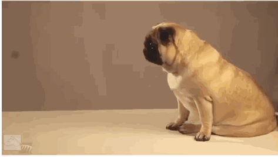
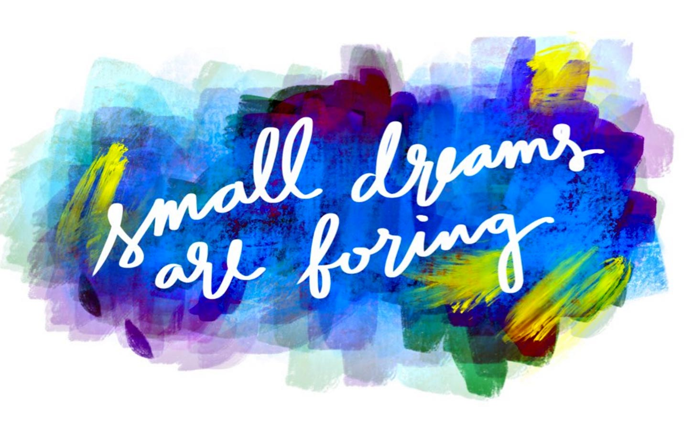
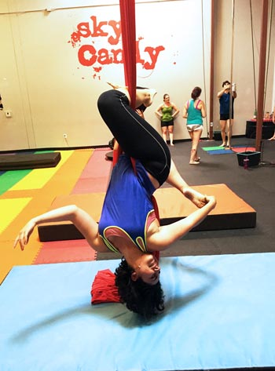

For the past [two](http://una.im/2015-resolutions) [years](http://una.im/2015-review) I've been reviewing my personal goals, setting new ones, and taking a look back on the year. A lot has happened this year for sure. I started a new job, was a digital nomad for a while (traveled a ton), moved cities, started new ventures and met a ton of great people 

Why do I do this year in review? Sure, parts are a little vain, but I do it primarily for myself, and share it for the sake of transparency. I started this 2016 year-in-review kind-of being bummed out that I didn't accomplish as much this year as [last year](http://una.im/2015-review), but as I compiled some things I did, I realized how much I actually *had* done. (Also it's probably a good thing I had a less intense year for my own sanity.)

It feels really good to ennumerate your accomplishments, and it's important to then evaluate your progress and make new goals. That's why I do these posts ☺️

## 2016 in Review

### Code

Here are a few of the projects I either launched or continued to do significant work on (in no particular order). I made **1046** commits this year on:

- [SVG Icon System Boilerplate](https://github.com/una/svg-icon-system-boilerplate): A boilerplate for making an SVG icon system using symbol sprites
- [Diffee](http://diffee.me/): A visual diff checker using CSS blend modes
- [CanIUse Component](https://github.com/una/caniuse-component): Live CanIUse data for your presentations
- [YouMightNotNeedJS.com](http://youmightnotneedjs.com/): A showcase of CSS/HTML-only tricks to build interactive UI elements
- [CSSgram](http://una.im/cssgram): A tiny CSS library recreating Instragram filters using just CSS features
- [Travels](http://travels.surge.sh/): An experimental website featuring my travel poetry that uses filters and blend modes for unique layouts
- [Toolsday](http://toolsday.io/): A 20-ish-minute podcast about the latest in tech tools, tips, and tricks (hosted with [Chris Dhanaraj](https://twitter.com/chrisdhanaraj))
- [VR Pong](http://vr-pong.com): A collaborative WebVR experiment with [Mike _____](#)

-- contribution graph here --

While I didn't *launch* as many projects last year as I did the year before, I did keep a lot of the ones I started toward the end of last year going (CSSgram and Toolsday).

### Knowledge sharing

In addition to speaking with new people the podcast (we had guests this year!) I spoke on a few other podcasts and did some interviews for blogs. These are the highlights:

- The year kicked off with an interview for [SuperYesMore](https://superyesmore.com/cartoon-dolls-c2bbe6bb982658b3e614716715beda25) on how I began coding (there's an adorable baby photo in there)
- I got to guest on one of my favorite podcasts, [The Start](http://thestart.fm/interviews/the-unacorn)&mdash;so excited to do that
- [Sarah Drasner](#) interviewed me for [CSS Tricks](https://css-tricks.com/an-interview-with-una-kravets/) (and we fangirled over each other hard)
- I was on the wonderful [Hack to Start](https://soundcloud.com/hacktostart/hacktostart-episode-121-una-kravets-ui-engineer-digital-ocean?utm_source=soundcloud&utm_campaign=share&utm_medium=twitter) podcast
- I did an [AMA on Hasnode](https://hashnode.com/ama/with-una-kravets-cive3utpm07w8vi53m48rgth8), which was a ton of fun
- [Scott Hanselman](#) interviewed me on [Hanselminutes](http://hanselminutes.com/557/rethinking-front-end-design-and-development-with-una-kravets), a great podcast you should subscribe to
- I was interviewed by [Karen McGrane](#) and [Ethan Marcotte](#) for the [Responsive Web Design podcast](https://responsivewebdesign.com/podcast/digitalocean/). Thanks for having us on!

I also spoke at **9 conferences** (way fewer than last year!), and they were all really great 😊 This year I gave talks in San Francisco, New York, Amsterdam, Buenos Aires, Zurich, Freiburg, Budapest, Perth and Berlin, focusing on [CSS filters/blend modes in UI](https://vimeo.com/181110918) and [image optimization](https://vimeo.com/190871719) for more performant interfaces. I've already got a few conferences lined up for [next year](http://una.im/speaking) and some talk topics I'm excited about :)

-- image from conf stage -- maybe a slideshow of the shoes?

I wrote ___ blog posts 

### Recognition

I was in [Net Magazine](#) **twice** this year! Look how stoked I look:

-- images from netmag --

I also made [Rachel Andrew's](#) list of [Women in CSS](https://rachelandrew.co.uk/archives/2016/10/11/the-amazing-women-of-css), another list of [Programmers to Follow on Facebook](https://www.thebalance.com/programmers-on-twitter-2072010), a list of [60 Web Performance Experts to Follow](https://www.keycdn.com/blog/web-performance-experts/), and [Toolsday](http://toolsday.io) made it on not one, but **two** lists of [15 Web Design Podcasts](https://www.elegantthemes.com/blog/resources/15-web-design-podcasts-to-add-to-your-listening-queue) to [Listen to this Year](https://www.shopify.com/partners/blog/114348998-15-web-design-podcasts-you-need-to-listen-to-in-2016). WEEE!! I also had the opportunity to judge the [10k-Apart](https://a-k-apart.com/) contest (which was super cool!) and 

## This Year's Goals

How did I do on the Goals

> This year was full of adventure for me. I fell in love, explored new cities, and balanced work. There was more balance. But here I am now, back to where I was, in a new city (New York) and ready to re-focus again.

## Next Year's Goals

<!--  

That was all outside of work. At IBM, I worked on two large-scale pattern libraries (one for Watson and one for Bluemix), built prototypes for product iterations, and helped build a Front-End Development community and curriculum for trainings.

### Knowledge Sharing

Last year, I said I wanted to "participate in conferences and community" as one of my goals. With that dream in mind, I went about applying to speak at conferences, hoping to get invited to one. Here's what actually happened:

I gave **17 talks/workshops** on Sass, UI interaction, performance optimizations, keyboard ninjary, open source design, goal setting, and CSS filters and blend modes. I wrote **30 blog posts** on topics ranging from experimental (like [Generative Pixel Art](http://una.im/sass-pixel-art/) via Sass matrices and blend-mode hacks to create [Faux 3d Effects](http://una.im/3d-effect), to quite practical ([5 Uses for Sass Maps](http://www.sitepoint.com/5-great-uses-sass-maps/) and a class-based [CSS architecture](http://una.im/classy-css/) system). I also *recorded audio for every post I wrote on my blog* and the audiobook version of the <a href="http://svgpocketguide.com/book/">SVG Pocket Guide</a>. And finally, I started a **podcast** about developer tools called [Toolsday](http://toolsday.io)!

<blockquote class="left">If you'd like to support my code calligraphy or just send a simple thank you, I made an <a href="http://amzn.com/w/2BOPP6HPWDL9S">Amazon wishlist</a> of pens, paper, and audiobooks :)</blockquote>

I also started doing **code calligraphy** as a way to visualize some mnemonic devices and solidify my skills. People on Twitter seemed to really resonate with them, so I want to make more. A lot of people mentioned that they wanted prints, a book, or posters. I've got some ideas, but we'll see how it pans out with time.

### Other Things

I traveled *a lot* this year. According to my TripIt data, I traveled a total of **139,872 miles** to **29 cities** in **8 countries**. Where? Australia, England, Belgium, Italy, Switzerland, Germany, and France (and many trips around the US too). While short conference trips can be taxing, I do really love to travel. My [Instagram](https://www.instagram.com/unakravets/) is now full of photos from my adventures *and* I got to meet so many awesome people (the best part of conferences)!

  <figure>
    
  </figure>
  
Interviewing with Sylvain after my dotCSS talk in Paris.

I started to read a lot, too (by read, I really mean *listen* to audiobooks). I finished **51 books** [this year](https://github.com/una/personal-goals/blob/master/ideas-and-misc/book-checklist.md). My favorites were:

- *Ready Player One* by Ernest Cline
- *All the Light We Cannot See* by Anthony Doerr
- *The Martian* by Andy Weir
- *Outliers* by Malcolm Gladwell
- *Ghost in the Wires* by Kevin Mitnick
- *Ender's Game* by Orson Scott Card

### Recognition

Apparently people took notice of my work, but didn't know where to categorize my contributions. I was shortlisted for [Young Designer of the Year](https://thenetawards.com/vote/young-designer/) while also getting on a list of [2015's Top JS Devs to Follow](http://blog.bithound.io/2015-top-js-devs/) and [Female Tech Influencers](http://skillcrush.com/2015/11/04/50-female-tech-influencers-to-follow-on-twitter/) 💪. One day there will be a place for people like us.

### Personal Goals Outline

So how am I doing on those overall goals I laid out last year?

1. Build quickly, ship things, and learn. *(yep!)*
2. Contribute to Open Source *(hell yeah!)*
3. Share knowledge as often as possible *(definitely!)*
4. Appreciate the creative & talented people in my life *(I try)*
5. Use Vim + the keyboard more often *(yes!)*
6. Up my JS Game *(I'm definitely better but should learn way more)*
7. Performance-first advocacy *(yep!)*
8. Foster designer participation in OS projects *(around me, yes &mdash; outside, maybe?)*
9. Participate in conferences & community *(LOL. yes)*
10. Use web components *(nope)*
11. Be kinder *( ¯\\_ (ツ) _/¯ )*

 

<figure style="width: 120%; margin-left: -10%;">

<figcaption style="margin-left: 7%;">Some photos from my <a href="http://instagram.com/unakravets">Instagram</a> documenting my travels this year.</figcaption>
</figure>

## 2016: Small Dreams are Boring

<figure>
  
  <figcaption>That's my mantra for the year. To dream big and put in the effort to make things happen.<figcaption>
</figure>

### Professional Goals

There are so many things I want to learn and get better at! First and foremost, **JavaScript.** I feel like I have a general grasp on most web-development concerns (accessibility, performance, progressive enhancement), and I'm pretty darn good at styling (Sass & CSS). So for me, the next step is to really focus on improving my JavaScript skills from just being functional to having a really good base understanding of how to build and work within a web app. <a class="twitter-share">In the current state of the web, Javascript == Power</a>.

<blockquote class="left">I'm going to share as I learn, so get ready to join the JavaScript train, my friends.
</blockquote>

If you follow me for my CSS content, don't worry &mdash; I'm not going to stop writing about other front-end topics, I just also want to understand flux architecture and all the magics of Webpack. I want to understand good API design and improve my knowledge of algorithms and data structures. I think I just need to start building some apps out for this (and I have a few ideas in mind already!)

I also really want to **write a book** on an entirely different topic &mdash; which is about working with images in the browser. It will cover everything from choosing a media format to performance to getting fancy with filters and blend modes. I'm currently in the process of *looking for a publisher* &mdash; so if you know any interested, feel free to forward them my email address (see footer). *(also, feel free to send me email to say hello, because why not?)*

### Personal Goals

<figure class="right">
  
  <figcaption>Look, Mom! I'm upside-down!<figcaption>
</figure>

First and foremost, after years of hackathons and conferences, I've come to realize that my wardrobe has now come to resemble that of a 20-year-old startup bro. Worse still is that I got comfortable wearing these tshirts and jeans every day ~~to work~~ everywhere. I want to **dress better**. And actually make time to go shopping :) that might help. Pinterest too.

I also want to get fit again (yes, I failed at this in 2015 &mdash; but I blame all of the travel). I started taking classes like aerial silks, which were awesome, and I want to continue those while also training for a **half-marathon**. I know it's going to suck at first, but hopefully I'll learn to love running again. I need to prioritize my health.

My last personal goal from 2015 was to be better at **keeping in touch** with people I think I failed on that too. So I'm going to try to better in the future.

### 2016 Goals Overview

I'm cutting this down to fewer and more concise goals than last years. Here they are:

1. **JavaScript.**  
It's so powerful, and I want to get much better at it so I can be a powerful wizard, too!

2. **Write a Book**  
I have a book idea in mind and I really want to make it a reality.

3. **Bridge the Designer/Developer Gap**  
Continue sharing knowledge on front-end topics relevant to both designers and devs.

4. **Build All The Things**  
Build things quickly, ship, learn, and then build them better. Open source it all, too.

5. **Prioritize my Health**  
Run that half marathon &mdash; fitness is mandatory, not optional.

I'll leave you with this lovely holiday song about the state of developer life from your [Toolsday](http://toolsday.io) hosts (Chris Dhanaraj and me) 😃

<iframe width="100%" height="440" src="https://www.youtube.com/embed/1NV-39LngiM?rel=0" frameborder="0" allowfullscreen></iframe>-->