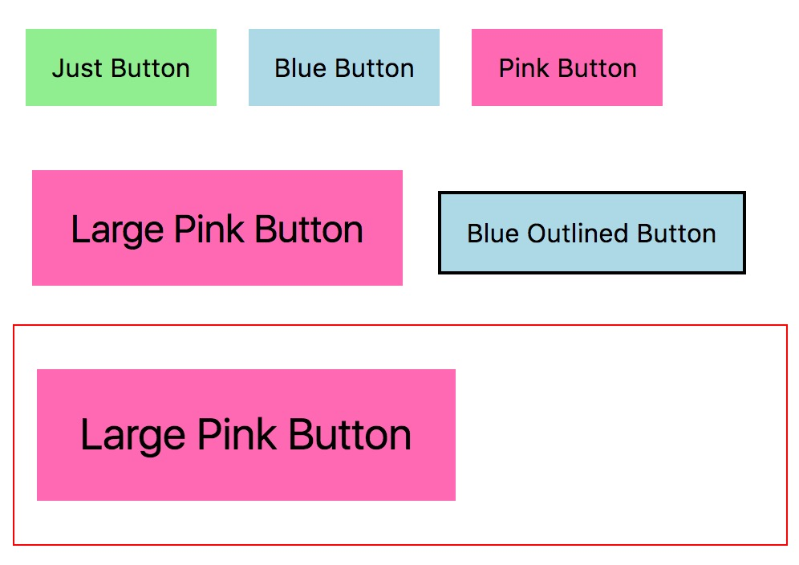

<!--header-bg: ../images/posts/vscode-workspace/bg.jpg
audio: vscode-workspaces
audio-size: 5053071
duration: '03:30'-->

CSS Custom Properties (also popularly called CSS Variables) are [here](http://caniuse.com/#feat=css-variables)! This is really exciting because we finally have *true* variables in CSS! What do I mean by *true* variables? Well, variables that can be updated and altered dynamically in the file. While we had "variables" with pre/post-processors (like Sass and PostCSS), variables got compiled into CSS and didn't have dynamic capabilities to update their content.

The way you set CSS variables is with a pre-pended `--` and the way you access them is via `var(--varName)`. In a very elemental way, you can write the following to use a CSS variable that declares the text color to be red:

```
div {
  --color: red;
  color: var(--color);
}
```

## CSS Variables Are Very Cool

Lets talk for a moment *why* dynamic CSS Variables are so much better than what we've had before.

### Dynamic JavaScript + CSS Love

With CSS variables, we can now more easily update values that we determine through JavaScript. This means we don't have to use inline property styles or update class names. We can simply pass values into our CSS variables instead.

To pass values into the `:root`, one can do the following:

```
document.documentElement.style.setProperty('--varName', 'propValue')
```

So, if I wanted to update the width of a loader bar to represent the percentage of load time, I could do something like this:

```js
calculateLoadProgress() => {
  let loadProgress = 0;

  // codes to update loadProgress here

  return loadProgress;
}

// Set width of progress bar
document.documentElement.style.setProperty('--progressBarWidth', calculateLoadProgress());
```

That's just one example of many! [David Piano](#) is doing some really interesting explorations using React and JS Physics Libraries to identify values which he then passes back into CSS variables. He gave a *great* talk about this at CSS Conf EU recently:

-- video from CSS Conf EU --

### Dynamic Property Fragments

Another note that's really cool about CSS variables is how specific we can get with these sorts of things. While we previously had to use separate border declarations for border properties, we now can use variables to update *any* portion of a property, including shorthand properties like border and properties that accept an unknown argument list like drop-shadow and gradients.

Take this example:

<figure class="left">
  
</figure>

```
.button-gradient {
  background: linear-gradient(var(--gradientAngle), var(--gradientStart),var(--gradientStop));

  --gradientAngle: 60deg;
  --gradientStart: lightpink;
  --gradientStop: lightyellow;
}

.button-gradient:hover {
  --gradientAngle: 0deg;
}
```

We're updating the `--gradientAngle` and not the entire background property. We can also do this with JavaScript. Nice 😎.

### Cleaner Components

CSS variables also allow us to write modular code with modifiers in a cleaner way. A typical example for components are multi-style buttons, so let's stick with those? Take a look at the following example:

<figure>
  
</figure>

Traditionally, with a naming convention like BEM, we would set classes via a pre/post processor, and then make modifier classes to override the base classes:

```scss
// Variables
$primaryColor: lightgreen;
$buttonBgColor: $primaryColor;

// Base Class
.button {
  background: $buttonBgColor;
  // other properties
}

// Modifier Class
.button--blue {
  background: lightblue;
}
```

In the example above, we're writing a property to override a previously stated property, increasing specificity, file weight, and cluttering our codebases. But with CSS Variables, we **no longer need to override entire base style properties!** We update the variable!

It can look something like this:

```scss
// Variables
:root {
  --primaryColor: lightgreen;
  --buttonBgColor: var(--primaryColor);
}

// Base Class
.button {
  background: var(--buttonBgColor);
}

// Modifier Class
.button--blue {
  --buttonBgColor: lightblue;
}
```

## We Can Do Better with Local Scope

Like this example, most current examples of CSS Variables in [docs](https://developer.mozilla.org/en-US/docs/Web/CSS/Using_CSS_variables), [articles](https://developers.google.com/web/updates/2016/02/css-variables-why-should-you-care), and [demos](SELF_NOTE_LINK_TO_DAVIDS_DEMOS), use the `:root` of the CSS file to initiate and access variables. 

This is a great way to set global variables, but they become even more powerful as a component customization tool. CSS variables don't need to be declared only in the `:root`—they can be declared at any point in the CSS file, and live within the scope at which point they are specified.

<figure class="right" style="max-width: 65%">
  
  <aside class="caption" style="width: 100%">CSS Custom Properties are scoped to their containing blocks (<code>{}</code>), just like JavaScript variables instantiated with the *let* keyword.</aside>
</figure>

So we're no longer forced to use globally scoped variables! **<a class="twitter-share">Leveraging CSS Variable scope improves the size, specificity, and semantics of our stylesheets</a>.** That's a lot of alliteration!

CSS Variables, like JavaScript variables instantiated with the `let` keyword take the scope of their containing block (`{}`). So we can leverage this specificity in our component styling declarations.

For example, `--buttonBgColor` isn't something we should put in `:root` as a global variable. A cleaner approach would be to rename that variable to just `--bgColor` and place it within the `<button>` component. This makes it more tightly coupled with its parent component, and makes more semantic sense in its ordering within the CSS file.

My general rule is as follows: <a class="twitter-share">Use local CSS variables until you need a global variable.</a> Then, work your way up the tree. This reduces a massive list of CSS variables from piling up in your `:root` and makes the code much cleaner when building design systems and custom properties.

## Organization & Example Time

With Sass, we can extend this idea use the nested `&` to rewrite this a little bit cleaner and more visually object-oriented. This is where we can see a neat structure emerging, broken up by:

<br>

1. **Default styles (property specification)**
2. **Default values (base variables)**
3. **Variances (updated variables)**

<br>

```
.button {
  // 1. Default Styles
  background: var(--bgColor);
  padding: var(--size);
  line-height: var(--size);
  border: var(--outline);
  font-size: var(--size);
  
  // 2. Default Values
  --bgColor: lightgreen;
  --outline: none;
  --size: 1rem;
  
  // 3. Variances
  &--blue {
    --bgColor: lightblue;
  }
  
  &--pink {
    --bgColor: hotpink;
  }
  
  &--large {
    --size: 1.5rem;
  }
  
  &--outlined {
    --outline: 2px solid currentColor;
  }
}
```

Note: We can and should still leverage `:root` for global variables, like base color styling and sizing resets, but locally scoped variables reduce specificity, thereby reducing size, and also increase semantics.

If we have more complex components, we can still use this technique. To make it even more concise, we can combine this with a CSS preprocessor like Sass. Theming buttons inside of card components using the Sass [trailing ampersand](/2014/03/06/sass-snippets-the-almighty-ampersand) can work like so:

```
.button--large {
  .card & {
    --size: 1.7rem;
  }
}
```

This wold make all large buttons have a slightly bigger `--size` within a card component than they would in any other place. The trailing ampersand allows us to style directly within the element block and outputs to:

```
.card .button--large {
  --size: 1.7rem;
}
```

So just to demonstrate with our example, lets give `.card` a red border and apply it the above code. We can see that the large pink button is even larger within our makeshift card.

<div style="overflow:hidden">
  <div class="half--right">
  <pre><code>&lt;div class="card"&gt;
  &lt;button class="button button--pink button--large"&gt;
    Large Pink Button
  &lt;/button&gt;
&lt;/div&gt;</code></pre>
  </div>

  <div class="half--left">
    <figure>
      
    </figure>
  </div>
</div>

## Is it Ready?

CSS Variables are widely supported in browsers today, though support is lacking in Internet Explorer, and edge is still working on it. However, there are two alternatives if you need to support those browsers and want to get started today.

Current Support is as follows:

<p class="ciu_embed" data-feature="css-variables" data-periods="future_1,current,past_1">
  <a href="http://caniuse.com/#feat=css-variables">Can I Use css-variables?</a> Data on support for the css-variables feature across the major browsers from caniuse.com.
</p>

### `@supports`

Within CSS, we have a way of detecting feature support by using the `@supports` query. (Can we take a minute to note how cool this is, by the way?). `@supports` is an excellent tool when you want to play with some of the more modern CSS properties like [CSS Grid](/css-grid). You can check for variable support and send fallbacks for browsers who don't support it:

```
@supports(--color: red) {
  // code here implementing variables
}
```

Using `@supports` is definitely an option, but may be difficult to wrangle for a functionality like CSS variables (it works really well with Grid though!), so sending a backup value may be a better solution.

### Sending a Backup Value

You can leverage the forgiving style of CSS (pun intended) to send multiple values. First send the value as you normally would, then have a second statement with the variable:

```
div {
  --color: red;
  color: red;
  color: var(--color);
}
```

Another way to send a backup value is within the `var()` declaration itself:

-- SELF NOTE TRY THIS IN EDGE ---

```
div {
  --color: red;
  color: var(--color, red);
}
```

This is redundant for now, but it allow you to slowly ease into using some CSS Variables within an existing codebase, making it easier to refactor once support catches up.

**tl;dr: CSS Variables are super powerful, and scoping them locally makes them an even more powerful tool for clean, modular design systems.**

#### More Resources

- [Demo I Made Sending Using JS to Rewrite CSS Variables Inline](https://codepen.io/una/pen/ZKqMqj)
- [Types of CSS Variables, CSS Tricks](https://css-tricks.com/difference-between-types-of-css-variables/)
- [Using CSS Variables, MDN](https://developer.mozilla.org/en-US/docs/Web/CSS/Using_CSS_variables)
- [Why You Should Care About CSS Variables, Rob Dodson](https://developers.google.com/web/updates/2016/02/css-variables-why-should-you-care)
- [Theming With Custom Properties, Harry Roberts](https://csswizardry.com/2016/10/pragmatic-practical-progressive-theming-with-custom-properties)
- [Time To Start Using CSS Custom Properties, Serg Hospodarets](https://www.smashingmagazine.com/2017/04/start-using-css-custom-properties/)


<!-- Live CSS Vars -->
<script src="//cdn.jsdelivr.net/caniuse-embed/1.1.0/caniuse-embed.min.js"></script>