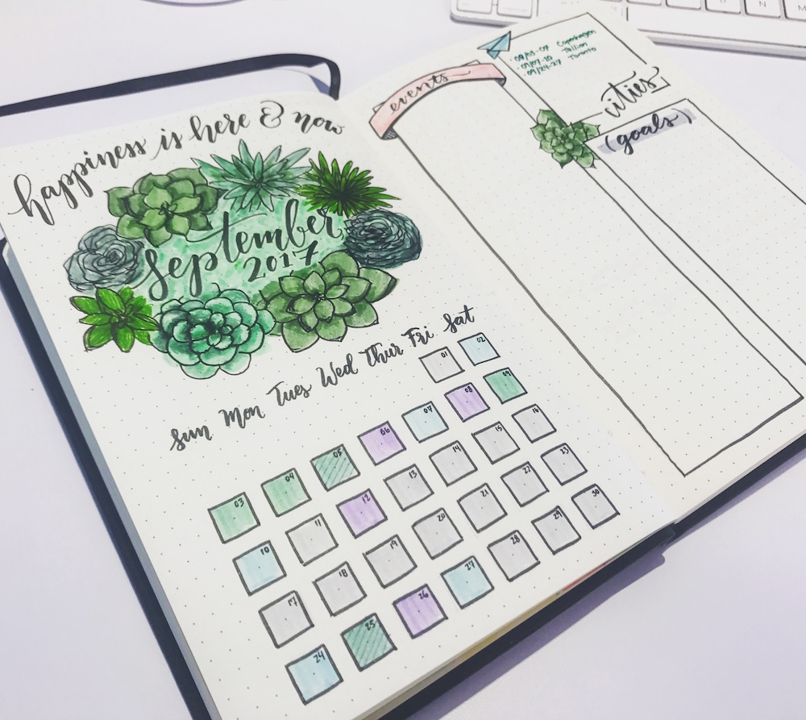
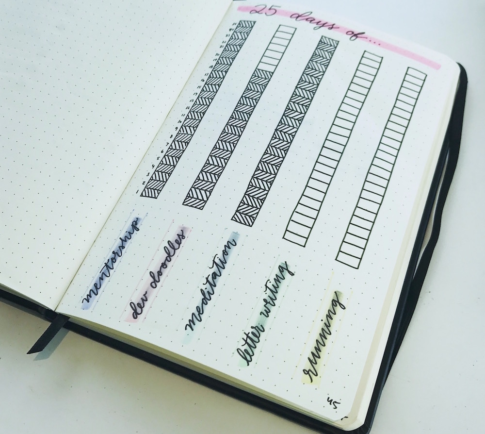
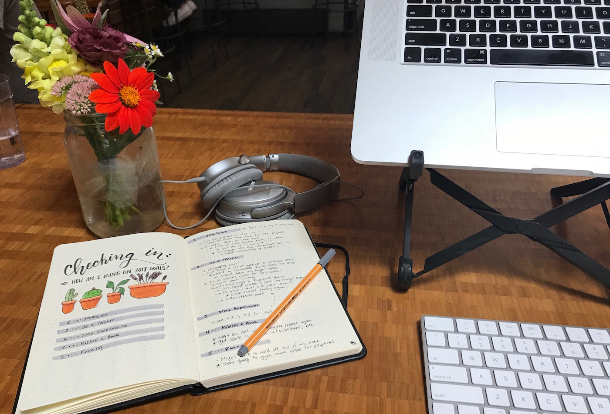
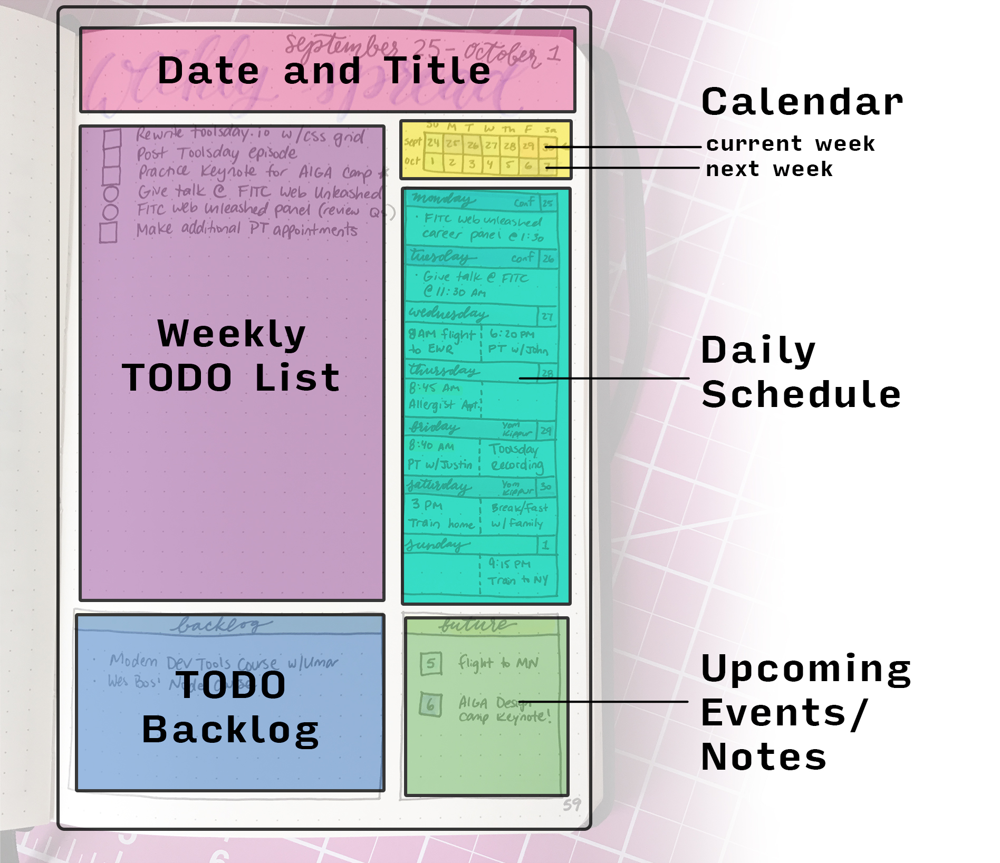

This post was originally written for [The Human in the Machine](https://superyesmore.com/publication/the-human-in-the-machine-a4064599cde2cb3397239e8d72219f48)

As someone who has a **lot** going on, is often (unfortunately) absent-minded, and has 1000 ideas at a time rolling around in my head, productivity is something I need to actively focus on and keep myself accountable to in order to get anything done.

I’m useless without a to-do list, and that's okay. **Productivity takes practice.**

> **For me, it’s all about systems**; specifically systems of to-do lists.

It doesn't matter where your system is, or how you maintain it, but as long as the system works for your schedule and is maintained in a medium you will look over and return to, it's a solid choice. I've had two different types of goal/to-do lists (one digital, and more recently, a physical one), so it just depends on where you want to track your progress. I've found them both to be solid approaches.

<figure>
    
  <figcaption>I've been keeping lists since high school. Here's one from a sememter at university — the only way I'm able to get everything done.</figcaption>
</figure>

## 3 Years of Open Sourced Personal Goals

I wrote about my first attempt at keeping on track a little while ago. I [Open Sourced my Personal Goals](https://una.im/personal-goals-guide) in a [Github repo](https://github.com/una/personal-goals-starter), and have been keeping track with that ever since. This system includes a few key components:

- Overarching Goals: Goals for the year
- Weekly Goals: The focus for the week
- Weekly To-Do: The bulk of the system for my lay in my weekly to-do lists
- Backlog: Things I wanted to get to but didn’t have the time
- Week in Review: Where I looked at what I accomplished, what I didn’t, and set goals/to-do’s for the following week

This system was great because:

- My goals were always available to me (whether it was on my phone or on online, since they were public I could always access them)
- I always had something to reference when I had downtime 
- Other people were able to contribute to my list
- It forced me to reflect on my accomplishments and how to achieve them by breaking things down into small tasks
- Checking things off is so much fun

My open sourced personal goals system lived where I lived: in my browser. And I extended this to by in my terminal too. Soon after beginning the system, I created as series of terminal aliases which helped me review my to-do list, check off items do week-in-review, and more, all in the terminal itself.

> I made this system a habit of mine that I maintained for about 3 years.

I realized that the closer I followed this system (the more I checked in and the more on-top of my reviews I was) the more productive I was. Hands down. But I also saw myself moving away from this system, checking in a little bit less, and writing reviews days late as my life shifted a bit. So I wanted to revamp my organizational system and take it offline just to try something new.

I started bullet journaling along with maintaining the personal goals repo, and found that I really enjoyed my time offline spent organizing the thoughts in my mind onto a journal page. So now, I mostly focus on the bullet journal :)

## Bullet Journaling

Bullet journaling references a specific style of note-taking created by <a href="http://rydercarroll.com/">Ryder Caroll</a>. There's a whole system invented by him that you can learn about <a href="http://bulletjournal.com/">here</a>. My adopted system takes some cues from the original bullet journaling system, but is updated to my preferences.

For example, instead of bullets, I use circles and boxes. I use circles to represent events and boxes to represent tasks. When I accomplish something, I fill in the entire box. When it's partially complete, I fill in half of the box.

It looks (kind of) like this:

- `☐︎` : Task to accomplish
- `◤` : Partially accomplished task
- `◼︎` : Accomplished task
- `◎` : Event/Action to accomplish
- `◉` : Event/Action finished

  
  

Journaling provides a blank page with a lot more freedom than a text document could, and I enjoy decorating it with color and symbols, physically laying out items, and correlating pages. But basically, I've converted my online system into a little notebook

I still do goal check-ins (I think this is really important) and I’ve also maintained week-long “sprints” of TODO lists, which I have found work best for me.

<figure>
    
  <figcaption>Doing a check-in of my yearly goals.</figcaption>
</figure>

So I want to go through one of those spreads with you: the one I find most useful — **the weekly spread**. I use separate journals for work and for my personal/outside-of-my-day-job projects, and spend time on them (it’s worth it and also relaxing) every Sunday night (for my personal to-dos) and an hour Monday mornings for my work to-do list.

<blockquote>Spending time figuring out what you need to accomplish is not time wasted! It’s critical time spent that will reduce wasting time in the future.</blockquote>

### Weekly Spread

For me, I break up the weekly spread into th following sections:

- *Weekly TODO List*: I use circles to denote events and squares to denote tasks. I fill in the squares as I accomplish the tasks (Half-filled squares mean the task is partially finished) and make sure there's room on the left for migration at the end of the week (see next section)
- *Mini Calendar*: This view is color-coded to correspond to the schedule below it. It lets me see the week overview and also know what's coming for the following week (which events color-correspond to the *Future Box*)
- *Future Box*: Events for the following week, or even ones further in advance I should be aware of (this is a great place to put conference dates for talks I still need to be preparing)
- *Backlog Box*: Things you want to do at some point, but haven’t added them to your todo list for this week now — they can move into your weekly list if you accomplish all of your goals for the week, or can just be used for longer-term projects, with parts of them in your weekly list at a time (Though if you see yourself with this usecase often, you may want to add an *Ongoing Box* — see, isn't this sytem fun and flexible? :P)

### Migration

Akin to the "week in review" I would do for my open source personal goals, I do a migration for my bullet journal. I basically go through all of the tasks I didn't get done and decide which ones I want to move over to the following week, put in the backlog, or discard, and use the following key to mark the space just to the left of the box/circle:

- `>` : migrate to the following week
- `-` : remove / don't migrate
- `<` : add to backlog

Then, I go through and write up next week's list :).

It's important to have a set date/time to review and update your system periodically (I use Sunday nights or Monday mornings for this). Consistency is really key here to make this something that actually makes you more productive. If you write a list once and never refer to it, then it's not very useful!

**TLDR: Play with different types of TODO list systems. See what works for you, and stick with it!**

I hope you enjoyed this post. Let me know what you do for productivity below!