

To be honest, this year was pretty hard for me. And it wasn't just the political climate: I had a lot going on that made it difficult to care about side projects and blog posts as much. But I'm really hopeful next year will be better 🙏🏼

<figure class="left">
    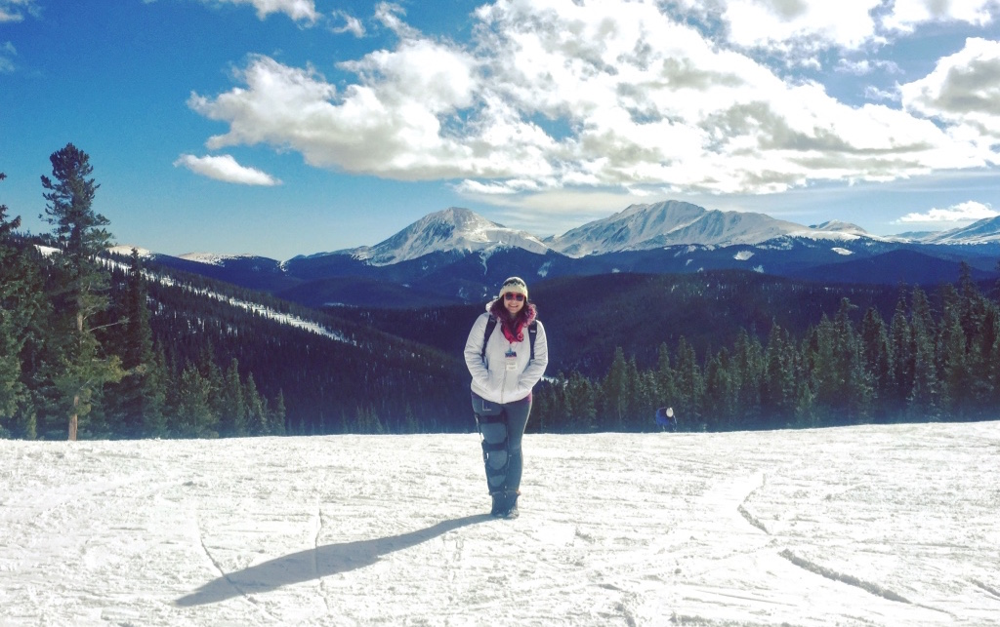
  <figcaption>On top of a mountain the day after I tore my ACL from skiing, when I was still completely in denial 😝</figcaption>
</figure>

A ski trip to Colorado in February was the beginning of a long list of problems that I'm still dealing with today, which have drained a lot of my time and energy. I'll spare you the details in this overview, but you can <button class="more-info-trigger" data-a11y-toggle="more-info">click here to read more about it if you want ️⬇️</button>

  
So far, my insurance has been billed over $105,000 for a 1.5 hour outpatient surgery + 6 months of (ongoing) physical therapy (I'm lucky and have decent insurance so I only have to pay a percentage of that, but it's still not a fun unexpected expense).

  <figure class="right" style="max-width: 300px">
      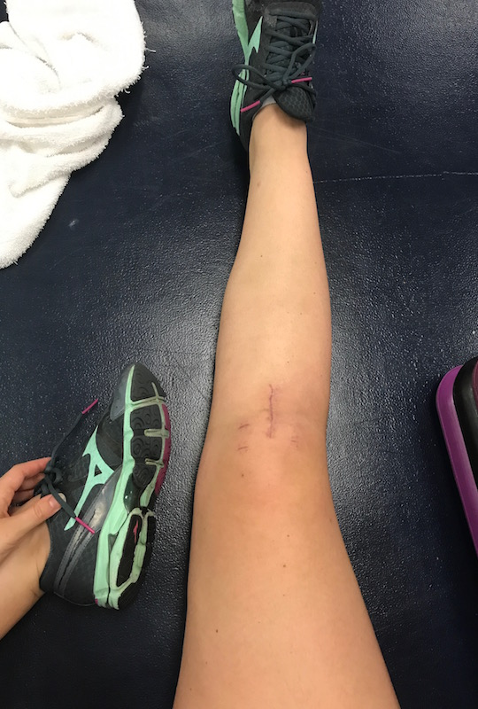
    <figcaption>I have a pretty gnarly scar now, that hasn't faded much yet (this photo was from over 6 months after the surgery).</figcaption>
  </figure>
  
I was told surgery was my only option, but waited until June so that I could do some traveling and speaking before starting an intense recovery process that hasn't gone "as expected," and now had me seeing 6 physical therapists, an acupuncturist, 4 different imaging centers, a pain management doctor, and my orthopedic surgeon regularly. I've tried active release therapy, Graston technique, cupping, laser therapy, ultrasound therapy, stretching, various levels of exercising, resting/icing, acupuncture, and even steroid injections, and none of it is helping this new post-surgical knee pain that never goes away (what I mean by that is: sitting hurts, standing hurts, laying hurts, and exercising, what I usually do to deal with stress, hurts the most).

  
So, this has been my life since June—fighting with my insurance company and dealing with knee pain, spending a lot of time between doctors visits and in physical therapy. The whole ordeal has been draining. I was writing a book for half the year that I just dropped. I haven’t written as many blog posts or attended as many community events or started as many new projects, and stopped contributing to many of the ones I had started in the past. This additional physical, mental, and emotional load on my life is a big part of why I wasn't as productive this year than the last few.

Despite all of that, a lot of good things happened too, and I recognize that I’m really lucky and privileged to be in the position I am in today:

- 🏙 I started to settle into a new city (New York)
- 👰🏻 I was the maid of honor in my best friend's wedding
- 🎵 I was gifted a ukulele from a really good friend after my ski accident, and consequently learned to play it (and started writing music)
- 📈 I started investing in stocks & cryptocurrency, and taking a more careful look at my finances
- 🎓 I got a promotion at [work](http://digitalocean.com) to a Senior UI Engineer on the UX team!
- ✨ I got a new job! I'll be starting in January as the Director of Product Design at [Bustle Digital Group](https://bustle.company/)!
- 📌 I hosted a mentor session at [SXSW](https://sxsw.com) — a nice little Austin reunion
- ✏️ I started [bullet journaling](https://www.instagram.com/unadoestype/) and meditating
- 📚 I read (mostly listened to) **36 Books** this year! I loved so many of them, but if I had to choose only 7, my favorite from a variety of genres were:
    - *Love Star* by Andri Snaer Magnason
    - *The Design of Everyday Things* by Donald A. Norman
    - *Solve for Happy* by Mo Gawdat (get the audiobook!)
    - *Prisoners of Geography* by Tim Marshall
    - *The Time Traveler's Wife* by Audrey Niffenegger
    - *Sapiens* by Yuval Noah Harari
    - *Orbiting the Giant Hairball* by Gordon Mackenzie

  <figure class="half--left wedding-photo">
      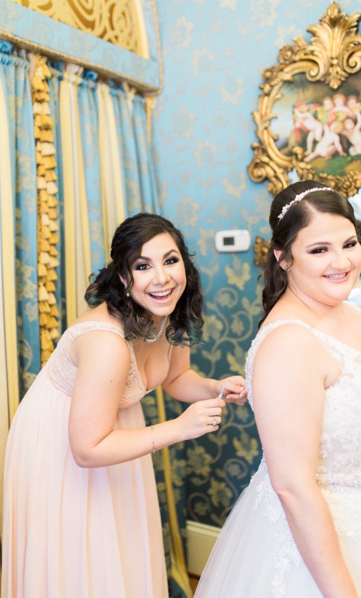
  </figure>
    

      <figure>
        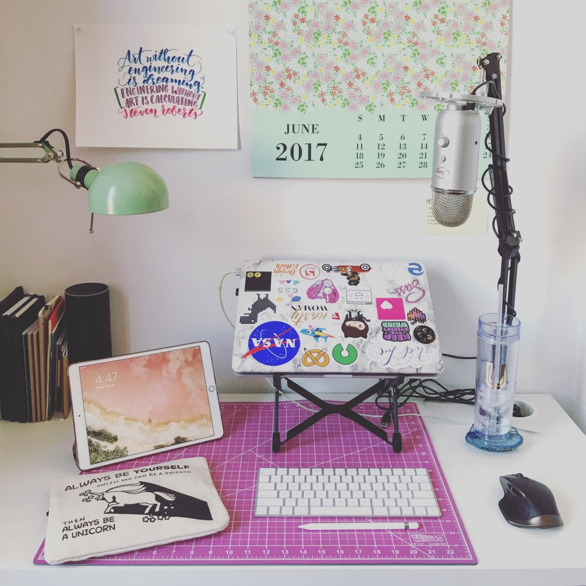
      </figure>
      <figure>
        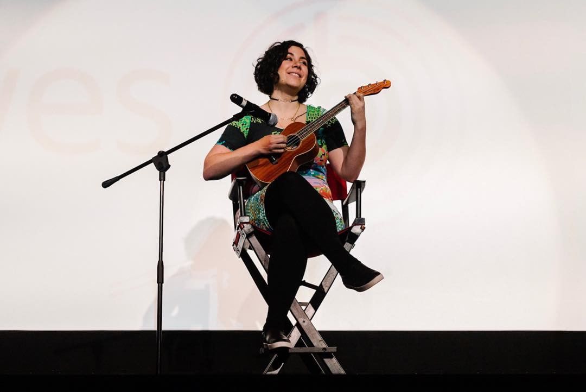
    </figure>
  

With Dev Doodles, I now have 3 Instagram accounts I keep up now:

  

    <a href="https://instagram.com/unakravets">
      <figure>
        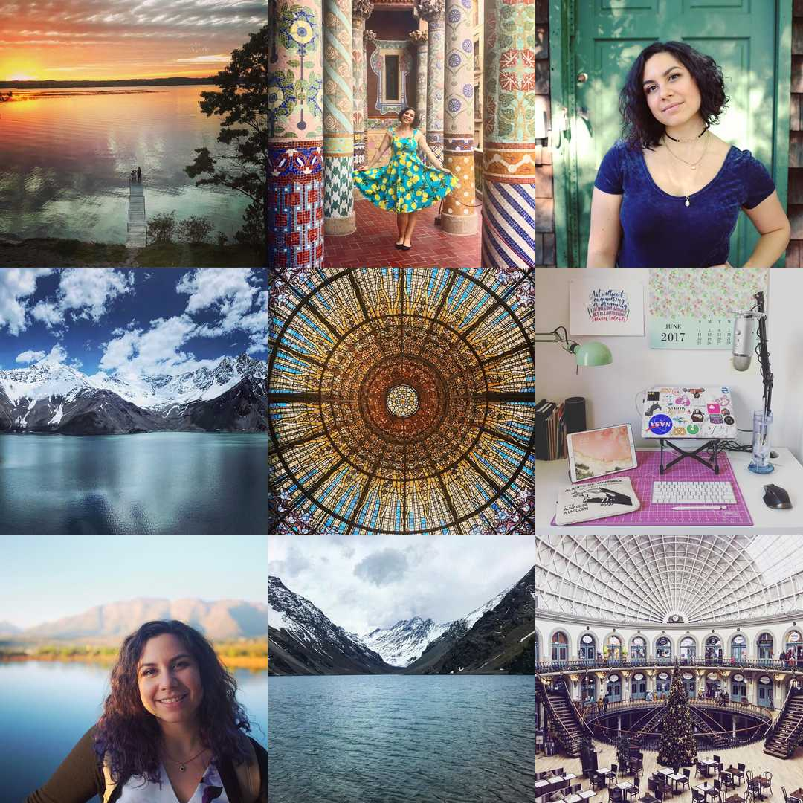
      <figcaption class="center">Travel &amp; Life</figcaption>
      </figure>
    </a>
  

  

    <a href="https://instagram.com/unadoestype">
      <figure>
        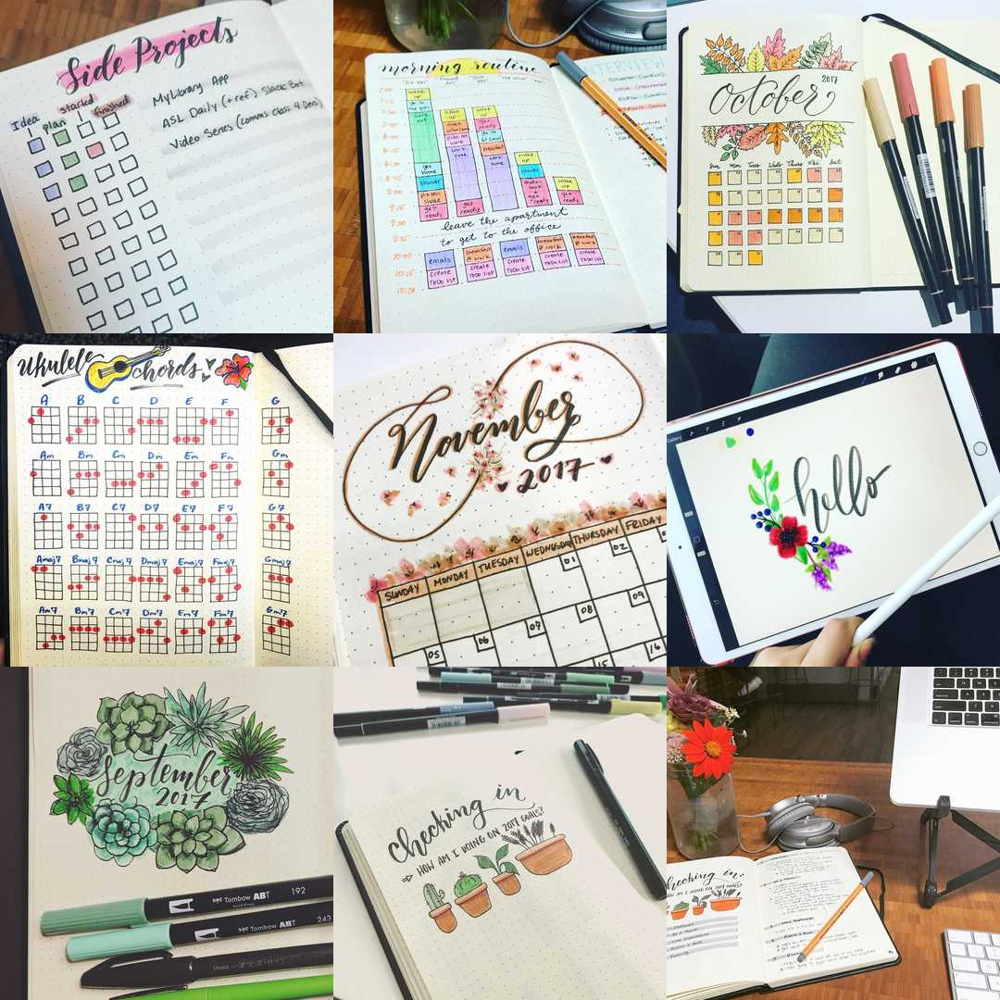
      <figcaption class="center">Lettering &amp; Journaling</figcaption>
      </figure>
    </a>
  

  

    <a href="https://instagram.com/dev_doodles">
      <figure>
        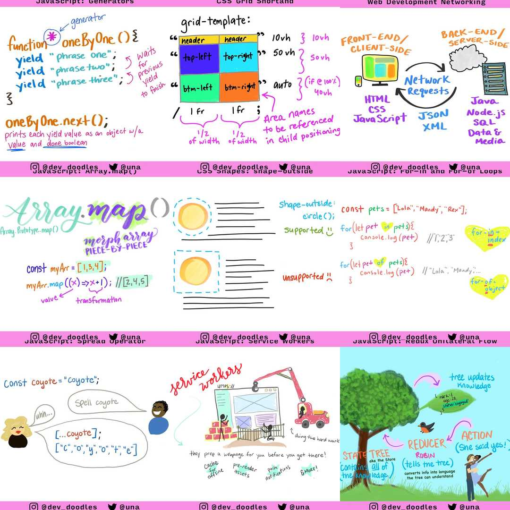
      <figcaption class="center">Dev Doodles</figcaption>
      </figure>
    </a>
  

## Side Projects / Writing / Speaking

I recorded **25 podcast episodes** of [Toolsday](https://toolsday.io) with over **125,000 downloads** this year. *And* have exciting news that Toolsday is joining the [Spec.FM Network](https://spec.fm/) next year! I also wrote **9 blog posts** (including this one), on topics ranging from [service workers](https://una.im/save-offline/) to [CSS grid](https://una.im/css-grid/) to [image micro-optimizations](https://css-tricks.com/contrast-swap-technique-improved-image-performance-css-filters/).

<figure class="right">
  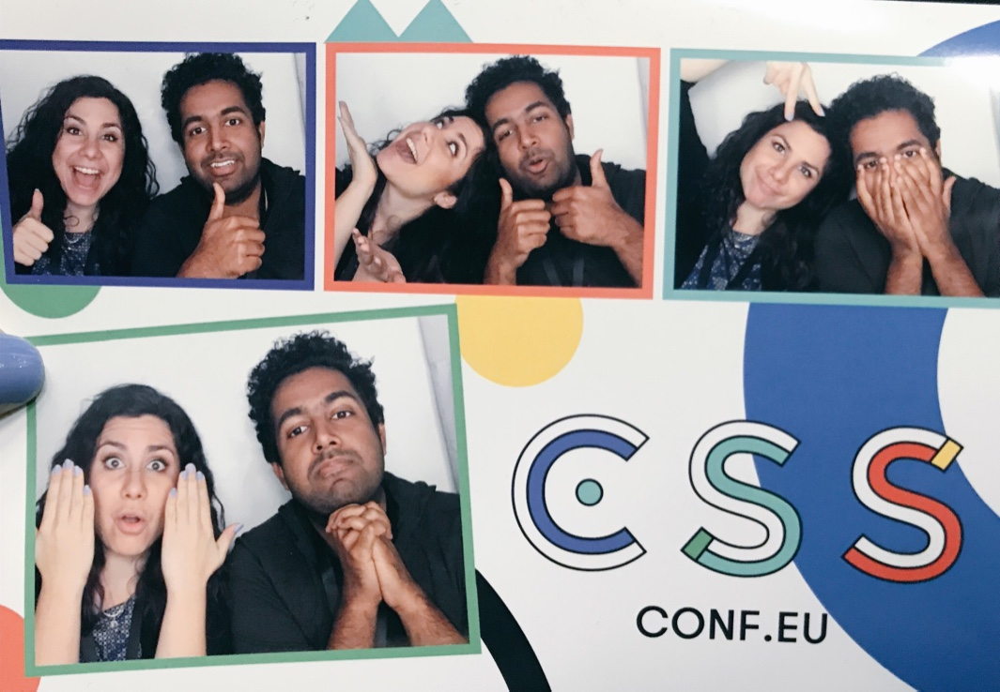
<figcaption>Chris Dhanaraj and I (cohosts of Toolsday) at CSSConf EU.</figcaption>
</figure>

I made **490** contributions this year and built an [ASL Slack Bot](https://github.com/una/asl-bot), converted the [Toolsday](http://www.toolsday.io/) site to CSS grid and played with it on my [Travel Poetry Site](http://travels.surge.sh/jungfrau/). I started keeping my [Dev Doodles](https://www.instagram.com/dev_doodles/) consistent and in a single space, and prepared a script for a video series, as well as wrote over 60,000 words for a book. I also was a technical editor for [Addy Osmani's Essential Image Optimization E-Book](https://images.guide/).

I gave **17 talks** at **15 conferences** and **2 meetups** (and MC-ed 2 conferences — one of which I preformed a song at 😂). My favorite new talks were about the power of CSS, accessibility, image optimization, and design systems. I hope to talk more about these topics next year.

  

    

      <iframe width="560" height="315" src="https://www.youtube.com/embed/WmVH85G59Lk?rel=0" frameborder="0" gesture="media" allow="encrypted-media" allowfullscreen></iframe>
      
I built a CSS Game live on stage at CSS Conf EU.

    

  

  

    

      <iframe width="560" height="315" src="https://www.youtube.com/embed/IRI1H5tyEAo?rel=0" frameborder="0" gesture="media" allow="encrypted-media" allowfullscreen></iframe>
      
The Power of CSS: A talk about CSS-based UI and why that may or may not be a good idea.

    

  

## Travel

I did a ton of traveling this year! And I feel really lucky for all of these opportunities. I visited *South Africa*, *Denmark*, *Estonia*, and *Chile* for the first time, bringing my country count to 34 😄! According to my TripIt data, I traveled **124,318 miles** to **36 cities** and **15 countries**. That's more places, but less distance than last year.

South Africa was a particularly incredible trip. I learned a ton from the people I met there about their web experiences and also got to experience some incredible nature too.

<figure>
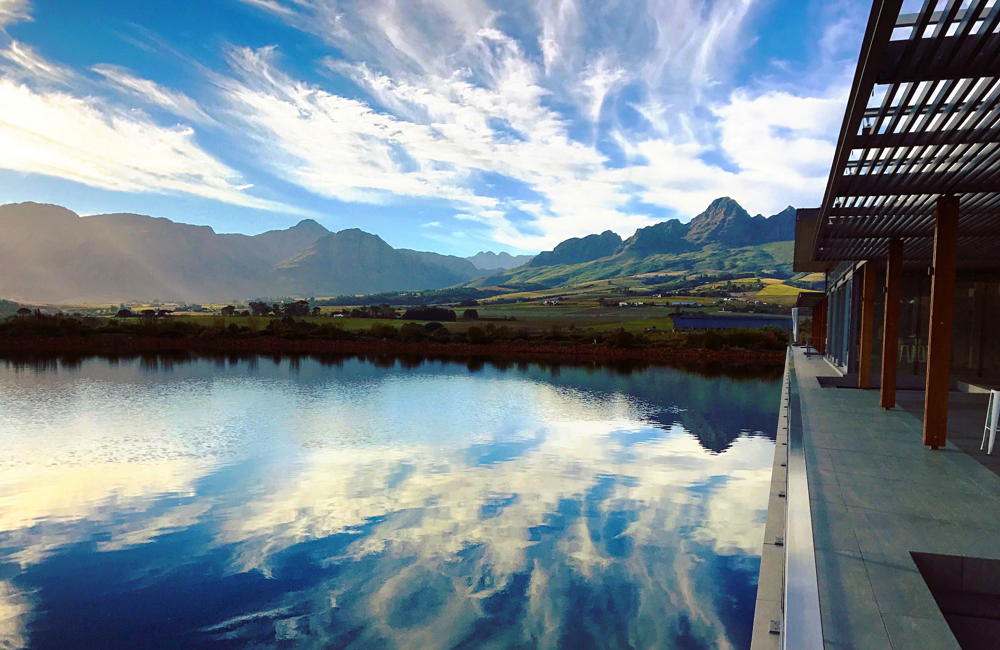
<figcaption>Stellenbosch, South Africa</figcaption>
</figure>

## 2017 Resolutions Review

Last years goal was to: **Make an Impact**. I think I did a decent job of that through publishing and speaking, but not so much with my specific goals.

1. **JavaScript**: I did a little bit of JS work, and tried out Preact and Vue outside of my day job, but didn't really get as into it as much as I would have liked. I really want to build more with it next year.
* **Be a Teacher**: I think I did a decent job of this in 2017, and heard from a lot of people who learned things from me and built on that knowledge :)
* **Stay Experimental**: With the CUBS series starting at the end of the year, I hope to continue this next year and do more things!
* **Publish a Book**: I wrote 60,000 words this year, but really dropped the ball on this when all my knee problems started. So next year I hope to review, revise, and start again.
* **Start A Daily Run Streak**: Ha.ha. Yeah. No. I physically can't even run now. Really hoping to resolve my knee issues soon.

Like I said at the start, this wasn't my year. So I'm going to just focus on the future.

<h2>2018: Collaboration</h2>

I noticed that my most enjoyable and consistent project this year was a collaboration (Toolsday). And I want to do more of that in the coming year. I loved being on a friend's Twitch stream, and I love working with other people to craft ideas and bring them to life. Having someone else work on projects with you keeps you accountable and makes it more fun. That's why I'm going to focus on **collaboration** for 2018. I love learning new things, and if you have an idea, send me an email!

### Goals for the New Year

1. **Build 3 New JS-focused Projects**: Improving my JavaScript skills is a goal I've had almost every year I've been [writing](https://una.im/2016-review/) [these](https://una.im/2015-review/) [reviews](https://una.im/2015-resolutions/). I'm going to put a number on it to make it more attainable, and hope some more collaborations will give me an excuse to write more JS too.
2. **Publish a Book**: Another one from 2017 that I hope to make happen in the new year. I really need to dig in and focus, and I hope to do just that.
3. **Writing/Videos**: I want to write more blog posts next year (my goal is at least 1 per month). I'm going to be contributing to the [Pastry Box Project](https://the-pastry-box-project.net/) next year, so that should help :). I also want to start making video content!
4. **Build Things by Hand**: I used to love crafts and painting and making things with my hands. I've lost that a little bit, but hope to do more of it next year. Maybe I'll get into electronics or learn pottery making. With less travel, I should be able to take a class or two.
5. **Get Fit**: Even though running isn't an option right now, I want to figure out other ways to get healthy and relieve stress. This is really important to me, so I'm going to focus on diet and low-impact forms of exercise.
6. **500 Contributions**: I used to put out more open source projects and contribute to other projects more. I miss that! So I resolve to contribute more next year, and one way to do that (albeit not the best way) is by comparing commits to this year.

<figure class="right" style="max-width: 450px">
    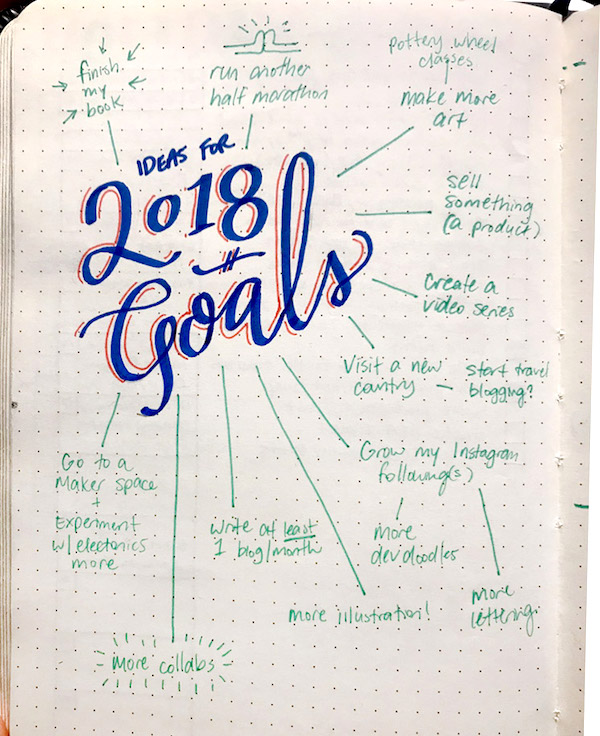
</figure>

Okay so goals are really important to have, but more important is figuring out *how* I'm going to accomplish those goals. I've been thinking about this a lot. For goal #1 and #3 (JavaScript projects and more content creation), I'll be keeping long lists of ideas in my journal to refer to. I'm also going to go back to reserving one night a week to focus on writing and going through this list, which should help with goal #6 as well. The same goes for goal #4 (building things by hand). I'll reserve at least one night per week for this. I find that making time is really the only way to get things done.

For goal #2 (publishing a book), I know what I need to do at this point, and its just make a few meetings and re-focus. In terms of goal #5 (get fit), I really need to get another opinion about my knee and make a plan of action with a doctor. Then I can also start tracking what I'm eating again. Hopefully all of this combined will make a difference. I want to say I'll run another half marathon this year, but that's really a pipe dream at this point (fingers crossed).

So that's all for this year! I'm very excited to start a new role and a new year. I'll see you all in 2018!

