

I love doing [these](/2015-resolutions) [year](/2015-review) [in](/2016-review) [reviews](/2017-in-review), as it's a great way to compile everything and realize how much you've accomplished. I think refelction is a really important part of my year, though this year I've found it a bit harder to make the time for it. 

It's been a busy holiday season, moving into a new apartment with my partner and seeing a lot of family. It's been a bit hectic, but it's nice to have been offline for a little while. So that's why my year in review is a little late this year 😛 Sorry not sorry.

This year was hard for me and my family. We lost some wonderful people in 2018, and they will be missed. I had another knee surgery in March, and my knee from an ACL tear [last year](/2017-in-review) is still an every-day challenge (but it's slowly getting better!). After a lot of time and strength training, I can squat without pain most of the time now, and I was even able to run (most of) a 5K for Thanksgiving this year!

## Dev Projects + Content Production

The [Toolsday](https://spec.fm/podcasts/toolsday) podcast turned 3 years old this year! I redesigned the branding and [Chris](https://twitter.com/chrisdhanaraj) and I recorded **[24 episodes](https://itunes.apple.com/us/podcast/toolsday/id1063765302?mt=2&ign-mpt=uo%3D4)** of  with over **160,000 downloads**. It's been really rewarding to see it grow more each year.

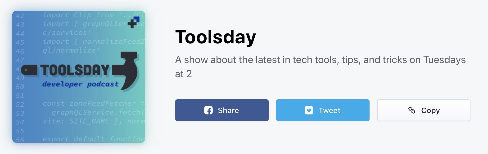

I also wrote **7 blog posts**, including a series on CSS Tricks called ["Solved with CSS"](https://css-tricks.com/solved-with-css-colorizing-svg-backgrounds/).

I started working at [Bustle Digital Group](http://bustle.company) this year. There, I worked on a lot of smaller internal projects including the ability to make shoppable Sliding Zones (__example link here__), made pages more themable, added a news ticker zone, worked on the redesign of Elite Daily, and the redesign of The Zoe Report after its acquisition. I'm working on some exciting projects now! (elaborate)

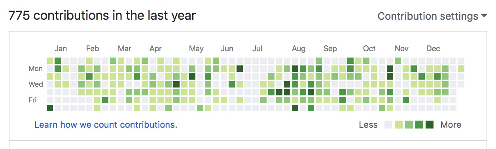

I made **775** total, and **183** public contributions, and launched the following side projects this year:

- [Gradient Folders](https://una.im/gradient-folders/): A nice set of gradient desktop folder icons.
- [Grid to Flex](https://www.gridtoflex.com/): Flexbox fallbacks for popular UI solutions that use CSS Grid.
- [Keto.nyc](https://keto.nyc/): A collection of my keto recipes, built in Gatsby.
- [LV Code Calc](https://www.lvcodecalc.com/): An authenticator for Louis Vuitton bags based on their product codes.

I'm also working on a CSS Houdini library, and have some more guides and small projects in mind for next year. Building more small web projects is definitely one of my goals for 2019. Read on to hear more.

## Speaking

<a class="clearstyle" href='/speaking'><figure>
  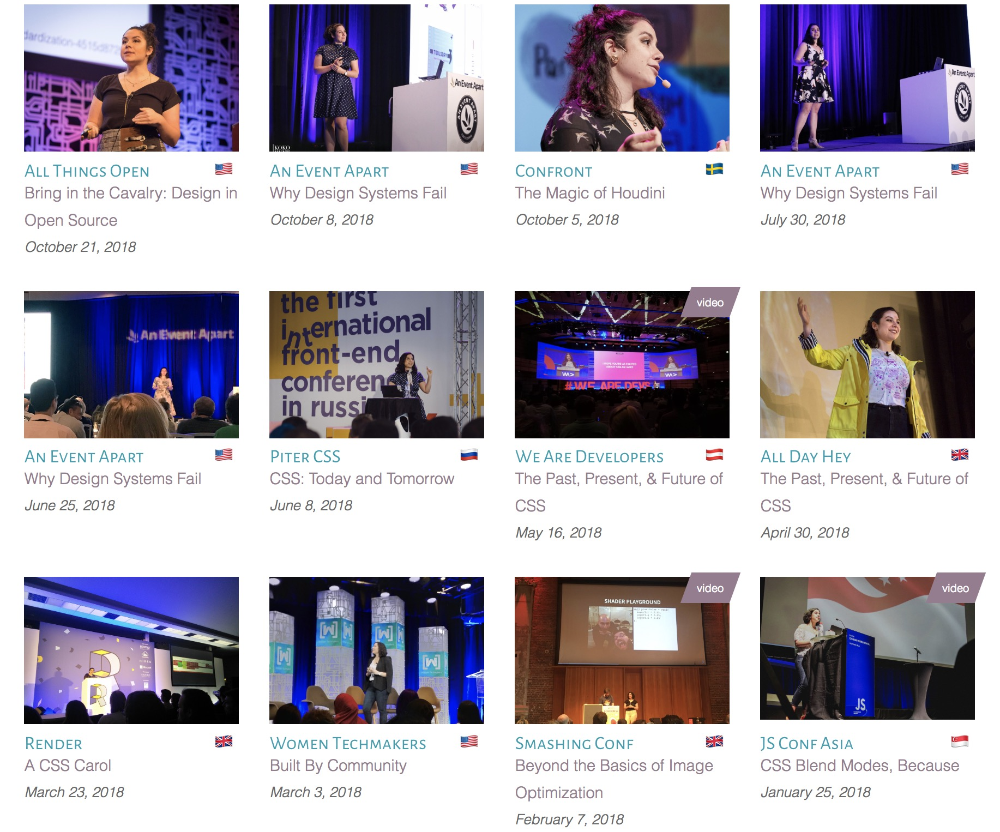
</figure>
</a>

I gave **12 talks** at conferences and meetups this year (and MC-ed a conference too). I got to speak in front of 4000 people are one of the events! And spoke in 7 different countries! My favorite talks were about Design Systems, the Past, Present, and Future of CSS, and CSS Houdini. That last one wasn't record, but I'm really hoping to talk more about Houdini and experimental CSS next year!

  

    

      <iframe width="560" height="315" src="https://www.youtube.com/embed/xlCYisIGnPE" frameborder="0" allow="accelerometer; autoplay; encrypted-media; gyroscope; picture-in-picture" allowfullscreen></iframe>
      
Speaking to a massive crowd in Austria about the power of CSS.

    

  

  

    

      <iframe width="560" height="315" src="https://www.youtube.com/embed/XZmvHVVj0Ns" frameborder="0" allow="accelerometer; autoplay; encrypted-media; gyroscope; picture-in-picture" allowfullscreen></iframe>
      
Opening up a JavaScript conference giving a talk about the power of web styling with blend modes.

    

  

## Life Things

- 🖼 I saw a lot of art this year. I visited at least 8 museums and went to 2 art shows (one in Singapore and one in Paris).
- 🕯 I got really crafty! I took a pottery class and started making candles this year too! It's been a lot of fun so far.
- 👯‍ I got to do a fun photoshoot with my coworkers for a [Bustle article](https://www.bustle.com/p/the-female-engineers-of-bustle-on-work-team-falling-in-love-with-coding-9120066).
- 🏙 I just moved into a *beautiful* new apartment with my partner last week 😁 We've been super busy this holiday season decorating and getting the place in order.
- 📚 I read (mostly listened to) **34 Books** this year! I loved SO MANY of them, but if I had to choose 5 of my favorites from a variety of genres were:
    - [American Kingpin](https://amzn.to/2LLQlL6) by Nick Bilton
    - [The Gone World](https://amzn.to/2LIbvd5) by Tom Sweterlitsch
    - [Broad Band](https://amzn.to/2VnhQ1G) by Claire L. Evans
    - [Educated: A Memoir](https://amzn.to/2SsVCJP) by Tara Westover
    - [This is How It Always Is](https://amzn.to/2BPIJT7) Laurie Frankel

  

    <figure>
      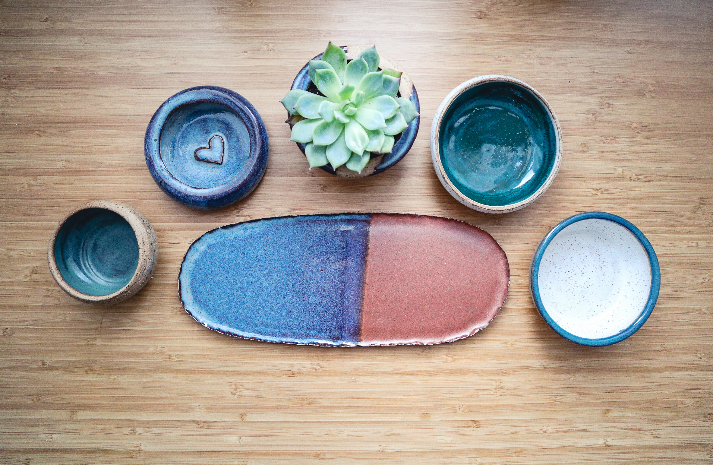
      <figcaption>The pottery I made this year.</figcaption>
    </figure>
    <figure>
      
      <figcaption>Speaking at a conference in St. Petersburg. Mama was proud.</figcaption>
  </figure>
  

  <figure class="half--right">
    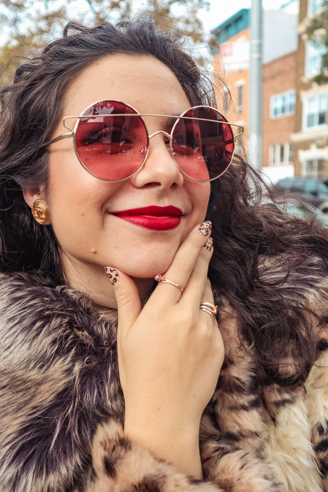
    <figcaption>Living my best Brooklyn life decked out in cheetah print.</figcaption>
  </figure>

This year I've tried to diversify my content stream by starting a [Youtube Channel](https://youtube.com/unakravets), and being much more active on Instagram. It's been a fun challenge to explore new interests on these mediums, and I like the idea of not being tethered to one content stream and exploring interests outside of tech. I even played with a new medium for tech tutorials/content: [Instagram stories](https://www.instagram.com/stories/highlights/17904689101261588/)! I've been continuing to maintain 3 Instagram accounts, here are my top 9 posts from each based on likes:

  

    <a href="https://instagram.com/unakravets">
      <figure>
        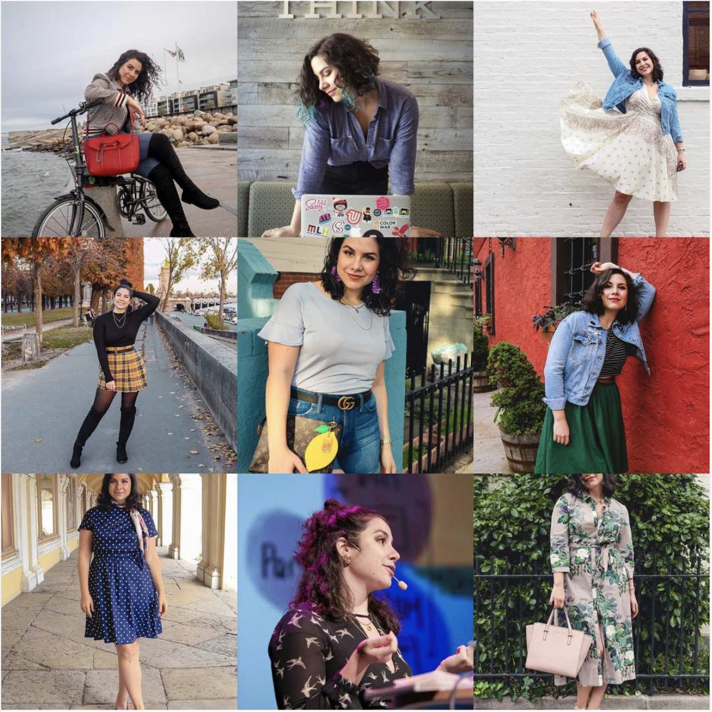
      <figcaption class="center">@unakravets (Travel/Personal) </figcaption>
      </figure>
    </a>
  

  

    <a href="https://instagram.com/themarkupartist_">
      <figure>
        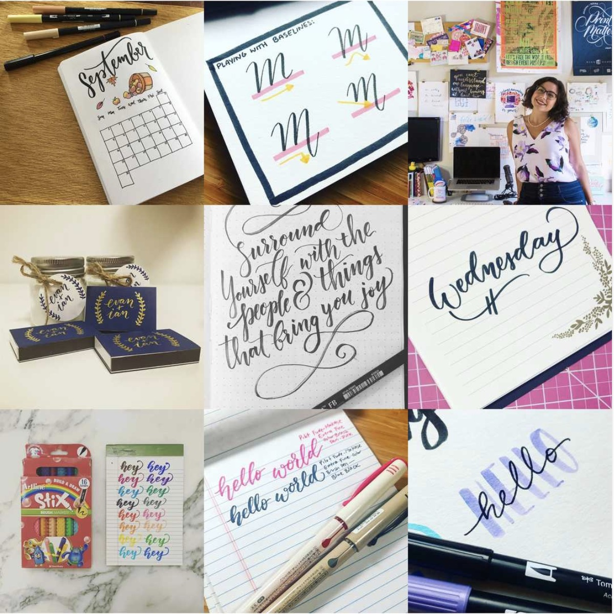
      <figcaption class="center">@themarkupartist_ (Hand Lettering)</figcaption>
      </figure>
    </a>
  

  

    <a href="https://instagram.com/dev_doodles">
      <figure>
        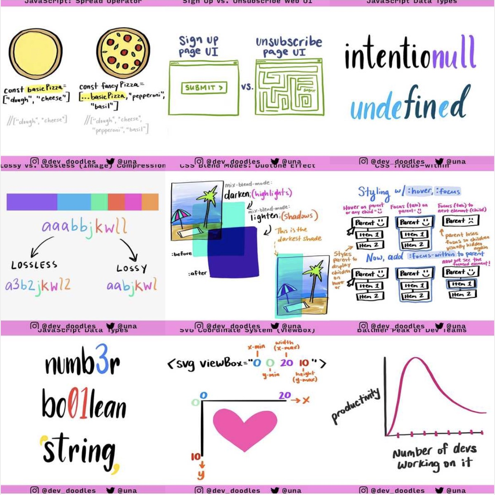
      <figcaption class="center">@dev_doodles (Web Tech Illustrations)</figcaption>
      </figure>
    </a>
  

## Travel

According to TripIt, I traveled to **32** cities in **13** countries, making a total of **86** days on the road, and **101,180** miles traveled. This sounds like a lot, but it's less travel than I've done the past few years. I'm very lucky to have been able to explore some really awesome places this year. My favorite trips were *Tokyo, Singapore, Vienna, St.Petersburg, Leeds, Napa, Malmo, Dusseldorf*, and *Los Angeles*. The people I met there or went with definitely made these trips the most memorable. 🤗 Shoutout to everyone who showed me around or gave me recs.

<figure>
  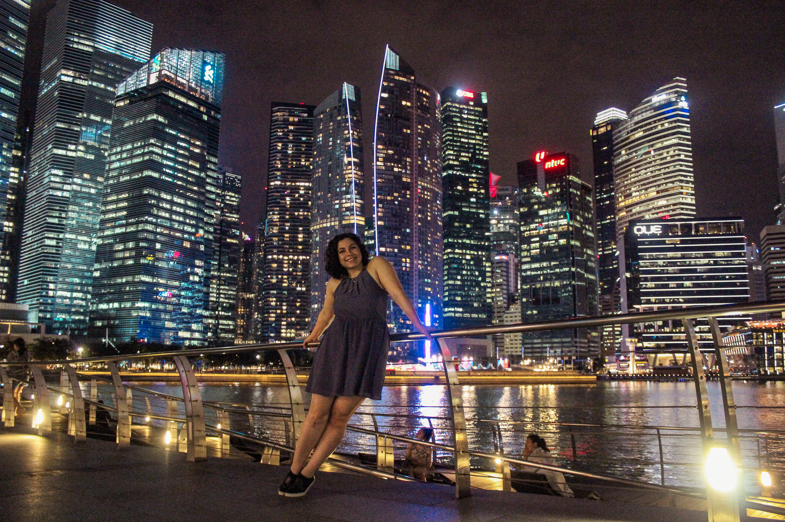
  <figcaption>Singapore</figcaption>
</figure>
<figure class="half--left">
  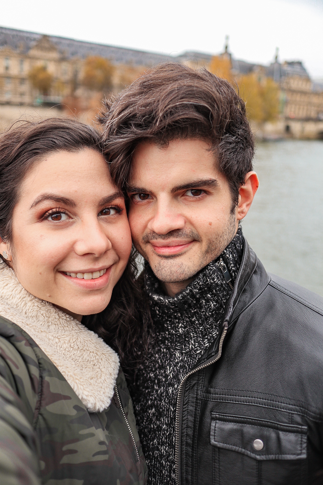
  <figcaption>Paris</figcaption>
</figure>
<figure class="half--right">
  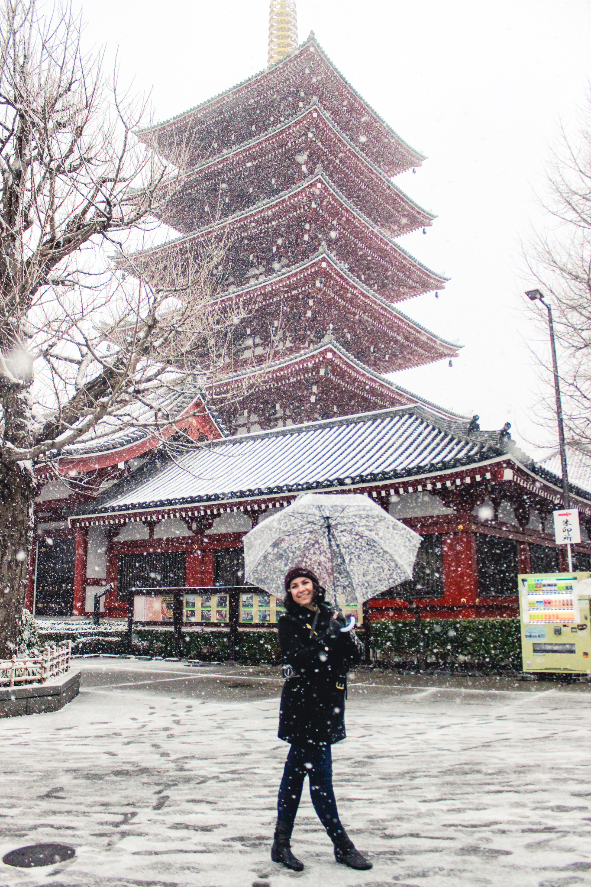
  <figcaption>Tokyo</figcaption>
</figure>

## 2018 Resolutions Review

Last years goal was: **Collaboration**. I don't think I did *that* much collaboration in the past year, but I'm hoping to do more in the coming year. Let's take a look at the goal breakdown:

1. **Build 3 New JS-focused Projects**: While I did ship 3 new project last year, only one was primarily JS-based. I also built 2 more for a podcast series (CUBS) using D3 and React Native, but I didn't end up publishing them. A goal for the future would be to just publish more small projects when the mood strikes.
2. **Publish a Book**: 3 years in the making now. I really need to get my book off the stall-wagon. I also have another idea for a children's book I've been flushing out, so we'll see what gets done in 2019.
3. **Writing/Videos**: My goal was to write a blog post a month and also start producing other types of content. I started my Youtube channel making videos, so that was a success, but I didn't write as much as I had hoped to.
4. **Build Things by Hand**: Definitely accomplished this one! I took a pottery wheel class and also started candle making. Look out for some Kravets candles next year :)
5. **Get Fit**: There were points in there year where I was more fit than others. I started going to the gym a lot (over 100 check ins, yay!), and did keto for 2 months (lost 12 lbs, yay!). But all-in-all, it was still a rough year for me health-wise because of my knee, and it really prevented me from being able to run and work out harder. I need to continue strength training (squat life), and I hope that I'll be able to make running more comfortable.
6. **500 Contributions**: I did technically have over 500 github contributions this year, but very few were to outside projects. I was excited to be able to contribute to the Google Labs Houdini repo though :) even though it was small.

<h2>2019: __INTENTION HERE __</h2>

In 2018, I had a lot of ideas and explored new interests and platforms. I really like that about myself and my past year, but what I also did was second guess a lot of what I was putting out there, and was in my own head too much about it. Next year, I want to live my best life and not appologize for it or second guess myself. Life's not that serious, so I'm ready to go into 2019 giving fewer fucks and making more things.

I've been thinking a lot about goals for next year, and how to keep them actionable + myself accountable. So for each goal, I'm going to think about a plan for success.

### Goals for 2019

1. **Ship 10 Web Projects**: 10 sounds like a lot, but I want to ship more small projects next year. The best way to improve your technical skills is via practice, so I want to build as I learn and focus on upping my JavaScript and GraphQL game.
2. **Refine Content Production Workflow**: I want to continue my existing content streams (podcast, dev doodles, blogging), but also make more video content and product more of the others as well. I'm doing a Skillshare course next year, so that'll be a good start but I want to also refine my process for continuing to put out more content. I'd love to post a blog post a month (12/year), and a video every week, but it will take discipline and thought. I still have to think about this one -- maybe a blog post to come.
3. **Make More Money**: Everyone wants to make more money don't they 😛 What I really mean by this goal is monetizing a side project and figuring out how to make passive income. I've been playing with a few things casually this year, and I'm looking forward to diving in more next year.
4. **Consume Daily Dev Content**: I want to *consume* more technical content and continue to stay on top of this ever-changing field. So I resolve to consume at least 1 blog post (like actually read it, not just skim), or podcast, or video, and share what I'm learning as I go with the hashtag *#dailydevdollop*.
5. **Support Women**: I want to support women and minorities in tech more next year. This year I donated money but next year I'd like to donate my time and resources, or make resources that can help boost others up.
6. **Physical Fitness**: I have resolutions to be more physically fit every year (relatable content,  I'm sure), and this year I want to do that with two goals: doing more healthy cooking and meal prep, and if possible, running a half marathon with my partner somewhere fun this year. That would be my dream. I really miss running!

So that's all for now. I'm going to do some more thinking about next steps with project and video ideas, and I'll catch you all in 2019!

