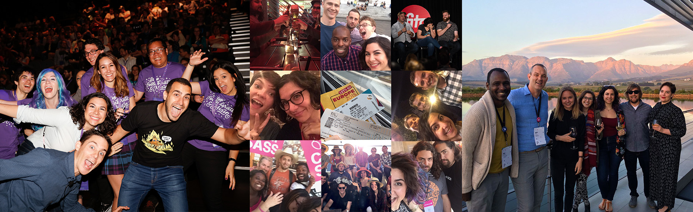

Hello friends, I have an exciting announcement! I've accepted a position at Google as a Developer Advocate for [Material Design](https://material.io/develop/web/)! I'll be doing what I've always loved doing: working in the intersection of design and development, experimenting with web technology, and sharing what I'm learning/building along the way!

This role involves so many things I've worked on over the past few years of my career: systems design, scaling product UI, accessibility, UX and interaction design, open source, etc. **And** it involves a lot of what I've been spending my personal time doing: writing blog posts about the things I was working with, teaching workshops, organizing/attending community events, building open source projects, writing and giving talks, recording podcasts, I COULD GO ON.

Some of the best times I've ever had have been at conferences, and they've taken me to *6 of the 7 continents* (someone have a conference in Antarctica!). Meeting developers around the world, nerding out about shared challenges, and seeing people get inspired by projects/posts/talks/workshops of mine have been some of the most rewarding experiences in my professional career. And I don't have to do this in my spare time anymore... **it's going to be a part of my actual DAY JOB**. Can you believe that?! What am I going to do on my weekends?

I'm really looking forward to working with the team of [Design Advocates](https://medium.com/@crafty/google-%EF%B8%8F-%EF%B8%8Fdesigners-c12b70627b2e), Engineers, and Web Developer Advocates to help make one of the world's most well-known design systems even better and easier to use. And I'd love to hear from you — if there's anything you think would help you build with Material, or what you wish a design system could do for you, let me know! I'm all ears, and I'm incredibly excited to dive in.

<small class="center">If you're wondering about my current side projects, like <a href="https://spec.fm/podcasts/toolsday">Toolsday</a> and <a href="https://instagram.com/dev_doodles/">Dev Doodles</a>, they will go on! I'll have even more time in my life now for content creation! SQUEEE!</small>

P.S. [Bustle](https://bustle.company) is hiring! They have a really great team of talented Engineers and a product built on a modern stack (Preact/GraphQL/CSS Modules). If you're interested, let me know!

