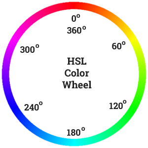
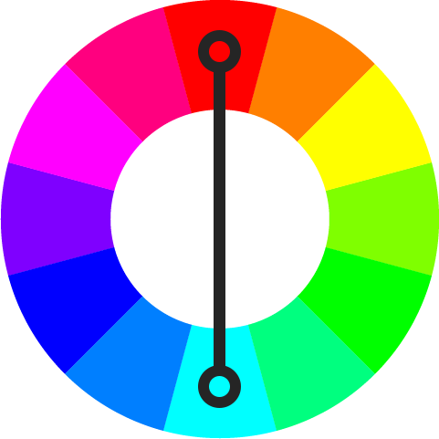
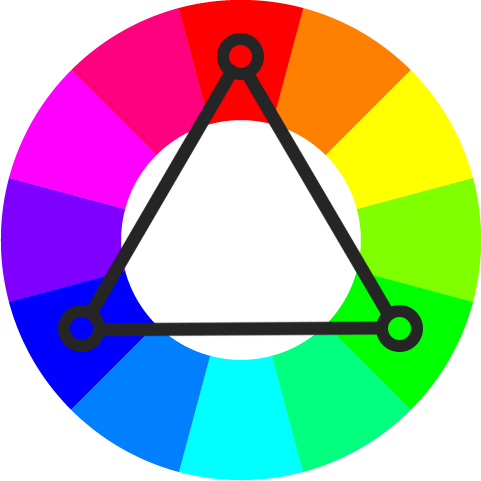

Did you know that you can build custom dynamic color themes without the use of JavaScript or a CSS preprocessor!? With the magic of CSS Custom Properties, HSL colors, and some calc() fun, you too can create custom theming with no dependencies. That means we can support any framework or web technology without adding cruft to a codebase!  Hooray for CSS!

## The Demo

  See the Pen <a href="https://codepen.io/una/pen/VJMBbx/">
  Dynamic Color Theme With CSS Vars</a> by Una Kravets (<a href="https://codepen.io/una">@una</a>)
  on <a href="https://codepen.io">CodePen</a>.

 
In the above demo, you can select a primary and secondary color and create entire color systems with vanilla CSS alone. The only JavaScript used in that demo is to change the colors dynamically.

## What CSS *-Processors Give Us

When it comes to color systems, there are several [Sass color functions](https://sass-lang.com/documentation/functions/color) that authors find useful. Jackie Balzar has a great [visual post](http://jackiebalzer.com/color) about this. Some of the most common are:

- `lighten()` and `darken()`
- `complement()`
- `hue()`
- `mix()`
- `contrast-color()`

A lot of these transformations are based on HSL, or can be re-created with CSS filters. For example, `lighten` and `darken` are essentially just the `lightness` value from HSL (the L). Similarly, `hue` is the H from HSL. Complement can be calculated by taking the inverse of the hue (i.e. adding or subtracting `180`, which would transform the hue to the other side of the 360 degree color wheel. Using `calc()` in our CSS, along with custom properties, lets us apply these transformations based on a single value.

In this blog post (like in the demo above), I'll show you how to recreate `lighten()`, `darken()`, `complement()`, and even triadic colors, all using CSS custom properties with the `calc()` function. I'll also show a hacky technique for `color-contrast()`. This will work in all modern browsers, but you still need to use a preprocessor to support older browsers like Internet Explorer 11.

## Setting it Up

To get started, we'll need to break up our colors into hue, saturation, and lightness values (and if you want to take this a step further, you can also break out the alpha value). This means that a variable for the color `red`, or `hsl(0, 100%, 50%)` would look like this:

Initial custom property declaration:

 

<pre><code>--colorPrimary: hsl(0, 100%, 50%);
</code></pre>

Custom property declaration with HSL values broken out:

 

<pre><code>--colorPrimary-h: 0;
--colorPrimary-s: 100%;
--colorPrimary-l: 50%;

--colorPrimary: var(--colorPrimary-h), var(--colorPrimary-s), --colorPrimary-l);
</code></pre>

## Adjusting Values with HSL

Awesome! So now we can use these values to make adjustments. Should we start with recreating the *lighten* and *darken* functions? Why not!

To start, we'll need to identify how much we want to lighten and darken, so let's go ahead and save those as additional custom properties.

<pre><code>--lighten-percentage: 20%;
--darken-precentage: 15%;
</code></pre>

Once we've identified our transformations, now we can write the new value. We'll want to adjust the lightness with a calculation like so: <code>calc(var(--colorPrimary-l) + var(--lighten-percentage))</code>. 

All together it looks like this:

 
  

  <pre><code>--colorPrimary--light: var(--colorPrimary-h), var(--colorPrimary-s), calc(var(--colorPrimary-l) + var(--lighten-percentage)));
  </code></pre>

 
While this seems a bit verbose, essentially all we are doing is using the base hue and saturation value, and adjusting the lightness value by adding the new lightness percentage to the original value.

For a *darken* function, we can subtract the lightness (or add it if you set the darken percentage to a negative value) in the same way:

 
  

  <pre><code>--colorPrimary--dark: var(--colorPrimary-h), var(--colorPrimary-s), calc(var(--colorPrimary-l) - var(--darken-percentage)));</code></pre>

## Getting the Complement and Triads

<figure>
<figcaption>Source: tallys.github.io/color-theory/</figcaption>
</figure>

To get the complimentary or triadic shades, we'll need to adjust the hue of the primary color instead of the lightness. We could set up individual variables, but can also take a shorcut and remember that the color wheel in HSL goes from `0` to `360`. That means adding or subtracting `180` will give us the complementary shade.

 
  

  <pre><code>--colorPrimary--complement: calc(var(--colorPrimary-h) + 180), var(--colorPrimary-s), var(--colorPrimary-l));</code></pre>

 
For triadic colors, we cut 360 into thirds, meaning we can get the first and second triad by adding or subtracting `120` and `240` respectively.

 
  

    

    

  

<pre><code>--colorPrimary--triad1: calc(var(--colorPrimary-h) + 120), var(--colorPrimary-s), var(--colorPrimary-l));

--colorPrimary--triad2: calc(var(--colorPrimary-h) + 240), var(--colorPrimary-s), var(--colorPrimary-l));</code></pre>

 

For analogous shades, we can determine the hue adjustment per shade, and get a nice analogous scheme of colors based on our preferences.

## Recreating Mix()

The `mix()` blend mode is a little bit trickier than something like `lighten()` or `darken()` but it can totally be done with HSL calculations!

  See the Pen <a href="https://codepen.io/una/pen/qzKXgr/">
  Color Mix in Vanilla CSS</a> by Una Kravets (<a href="https://codepen.io/una">@una</a>)
  on <a href="https://codepen.io">CodePen</a>.

 
In order to mix colors, we need two colors to mix, so let's break them down:

 
  

    

    

  

<pre><code>--color-1-h: 0;
--color-1-s: 100%;
--color-1-l: 50%;

--color-2-h: 50;
--color-2-s: 80%;
--color-2-l: 50%;</pre></code>

 
Then, we can get the averages between those two colors:

<pre><code>--avg-1-2-h: calc((var(--color-1-h) + var(--color-2-h)) / 2);
--avg-1-2-s: calc((var(--color-1-s) + var(--color-2-s)) / 2);
--avg-1-2-l: calc((var(--color-1-l) + var(--color-2-l)) / 2);
</code></pre>

And finally, we can write our mixed color: 

  

<pre><code>--mixed-color: hsl(var(--avg-1-2-h), var(--avg-1-2-s), var(--avg-1-2-l));</pre></code>

## Creating a Color Contrast Function

Another key functionality that CSS processors provide are logical values, which allow for us to calculate accessible colors based on their background is the `contrast-color()` function. This function takes a series of values: the base color to contrast against, a light value, and a dark value, and will return whichever of the provided values contrasts more with the base. While we can't currently model this directly in pure CSS, we can hack around it.

I'm using this technique from [Facundo Corradini](https://css-tricks.com/switch-font-color-for-different-backgrounds-with-css/), so please don't give me the credit! 😄

First, we set a contrast threshold:

<pre><code>--contrastThreshold: 60%;</code></pre>

Then, as we update the color value in each box from the demo at the top of the page, we test the lightness value to determine if it meets the contrast threshold for "light" or not. If the threshold is higher than the lightness of the base color, the color returns light because we multiply the lightness result by **-100**. For example, if our lightness was 40 and the `contrastThreshold` is 60, **40 - 60 = -20**, so when we multiply that lightness by -100, it becomes **2000**, resulting in white, since white shows when the lightness is 100 *or higher*.

The opposite happens when the lightness is higher than the `contrastThreshold`. If our lightness is **90**, and the `contrastThreshold` is 60, the result is **30**, so when we multiply this positive value by **-100**, we get a lightness of **-3000**, meaning the result is black, since the lightness is lower than 0.

We then return this lightness as the "L" in the HSL of the color value that lives on top of this background color. It looks like this:

<pre><code>.primary {
  background: var(--colorPrimary);
  
  --switch: calc((var(--colorPrimary-l) - var(--contrastThreshold)) * -100);
  color: hsl(0, 0%, var(--switch));
}</code></pre>

**If you want to see this in action, check out the demo at the top of the page**

Keep in mind, since HSL is how the *computer* [understands lightness](https://twitter.com/argyleink/status/1201908189257555968?s=20) and not how the *user* understands lightness, this technique is not perfect, and it clearly shows us where custom properties and the calc function still fall short.

## The Future of CSS Color Functions

...which is exactly why we need color modification functions on the web! Wouldn't it be nice if this stuff actually worked natively? If we didn't have to break everything up into individual HSLA values and hack around color contrast? 

So many design systems and websites rely on color modification, and the CSS Working Group is listening, working on identifying how we can bring color [adjustment](https://www.w3.org/TR/css-color-adjust-1/) and modification functions to web browsers.

## Conclusion

> I hope you enjoyed this post or learned something new! If you use color modification in your design systems or user interfaces, I would love to hear about it! *Please tweet at me [@una](https://twitter.com/una) or leave a comment below!*

