

I've been [doing](/2015-resolutions) [year](/2015-review) [in](/2016-review) [review](/2017-in-review) [posts](/2018-in-review) for 6 years now(!) and I find them really useful. Not only does it give me a chance to realize how much I've accomplished over the course of a year, but it also gives me a chance to do a little retrospective on what I could do better. While I usually write these between the Christas and New Years holiday, this year I got a bit of surprise news, so it's a few days late :P.

This year was a really exciting one for me! I traveled a lot, decorated a new apartment, started a new job at Google, and adopted a [puppy](https://instagram.com/discodoodledog)!

## Dev Projects + Content Production

2019 marked *four years* of [Toolsday](https://spec.fm/podcasts/toolsday)! [Chris](https://twitter.com/chrisdhanaraj) and I recorded **[22 episodes](https://itunes.apple.com/us/podcast/toolsday/id1063765302?mt=2&ign-mpt=uo%3D4)** of with **158,687 downloads**. That's pretty on par with last year (almost an identical download count for 2 fewer episodes), and it's nice to see our audience is sticking around. My favorite part of podcast statistics are seeing where our audience comes from, and it continues to be pretty international.

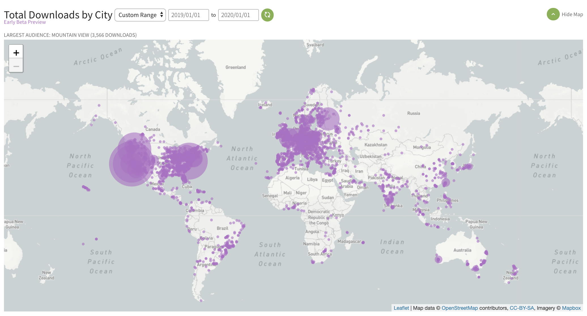

I also started a brand new web series called [Designing in the Browser](https://www.youtube.com/watch?v=YK8GZBx3hpg&list=PLNYkxOF6rcIDI0QtJvW6vKonTxn6azCsD). I'm really excited about this one because I got to work with the super talented team at Google Developer Services, and really bring a vision to life. The series has **88k views** so far, and I'm looking forward to growing it in the coming year. If you're interested in front-end development, give it a watch!

I also wrote **8 blog posts** this year, with content ranging from [color calculation methods](https://una.im/css-color-theming/) to [using Material Design](https://una.im/material-theming-intro/) to [CSS Houdini](https://una.im/houdini-horizons/). I even wrote an [Array Methods Song](https://www.youtube.com/watch?v=-_YEbB_y3Mk&feature=youtu.be).

<iframe width="600" height="338" class="center" src="https://www.youtube.com/embed/-_YEbB_y3Mk" frameborder="0" allow="accelerometer; autoplay; encrypted-media; gyroscope; picture-in-picture" allowfullscreen></iframe>

## Career Stuff

I started working at [Google](https://una.im/joining-google/) this year as a Developer Advocate for [Material Design](https://material.io). I've been working with the team to improve the product, making it easier for developers to use cross-platform, and building [demos](https://glitch.com/@material), [tools](http://material-theme-generator.glitch.me/), and content to help make building with and theming Material easier to get started with.

Through Google, I was able to join the w3c and become a member of the CSS Working Group. I'm currently working with some very smart folks on figuring out the best solution for [color modification](https://drafts.csswg.org/css-color-5/) functions on the web. 

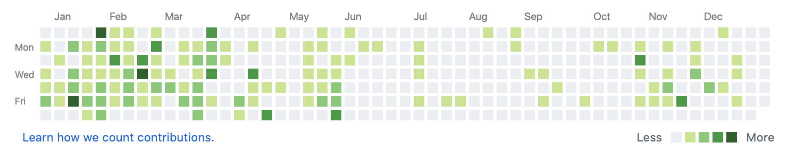

I made **404** contributions in the last year, and launched the following projects:

- [Extra.css](https://una.im/gradient-folders/): The first CSS Houdini paint library (to make your site a little more #extra)
- [Material Theme Generator](http://material-theme-generator.glitch.me/): Build a Material theme from an image, randomized, or customized, and the download the variables you need to bring it to your Material app.
- [Angled Corners](https://github.com/una/angled-corners): A Houdini paint worklet that gives you *real* individually angled corners on the web
- [Keto.nyc](https://keto.nyc): A resource of all my favorite keto recipes
- [Daily Dev Dollop](https://dailydevdollop.netlify.com/): A (defunkt) landing page for a project I did last year where I read and shared and educational dev post each day. That one only lasted a little over a month 😂

## Speaking

<a class="clearstyle" href='/speaking'><figure>
  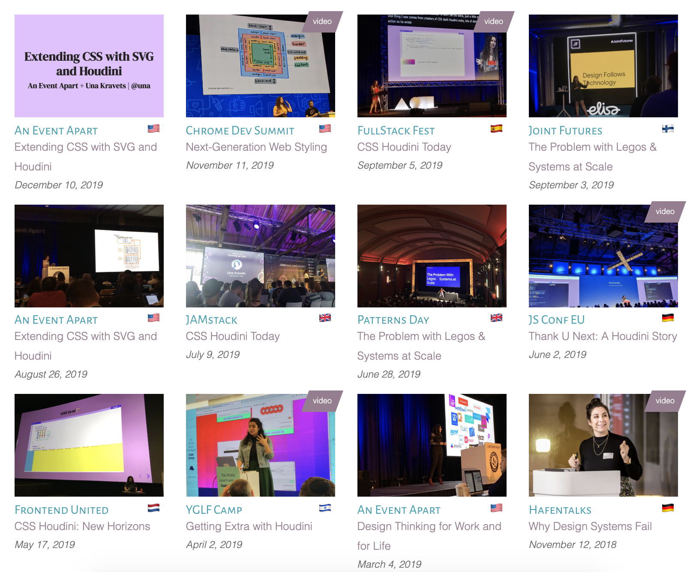
</figure>
</a>

I had a really great year of speaking at conferences! I gave **11 conference talks** this year and attended (i.e worked)  at *Google I/O* and their *SPAN* event for the first time. I was able to travel again and spoke in **7 different countries** including *Israel* and *Finland* (my first time there!). I loved speaking about Houdini and experimental web platform features, as well as using SVG within UI, and design systems! This year was all about talking about exploring and extending CSS.

One of my highlights from the year was giving a talk at JSConfEU and making this massive digital X on the ceiling come to sparkling life with a Houdini paint API demo! Oh and I also sang a rendition of "Thank U, Next" about CSS Houdini at the end of that talk 😆

<blockquote class="twitter-tweet center">
mad respect for <a href="https://twitter.com/Una?ref_src=twsrc%5Etfw">@Una</a> for singing ariana grande on stage 😍 <a href="https://twitter.com/hashtag/jsconfeu?src=hash&amp;ref_src=twsrc%5Etfw">#jsconfeu</a> <a href="https://t.co/sgsYyG3PZ5">pic.twitter.com/sgsYyG3PZ5</a>
&mdash; claudia in 🇲🇽 (@koste4) <a href="https://twitter.com/koste4/status/1135108533886824450?ref_src=twsrc%5Etfw">June 2, 2019</a></blockquote>

Another highlight was giving a talk with [Adam Argyle](https://twitter.com/argyleink) at Chrome Dev Summit on Next Generation Web Styling.

  

    

      <iframe width="560" height="315" src="https://www.youtube.com/embed/-oyeaIirVC0" frameborder="0" allow="accelerometer; autoplay; encrypted-media; gyroscope; picture-in-picture" allowfullscreen></iframe>
      
Having such a blast speaking at Chrome Dev Summit on futuristic CSS with Adam.

    

  

  

    

      <iframe width="560" height="315" src="https://www.youtube.com/embed/yZ-HpepLIY8" frameborder="0" allow="accelerometer; autoplay; encrypted-media; gyroscope; picture-in-picture" allowfullscreen></iframe>
      
A recording my talk about using CSS Houdini, TODAY!

    

  

## Personal Life

### Disco &nbsp; 🐶🐾

<figure class="fig-right" >
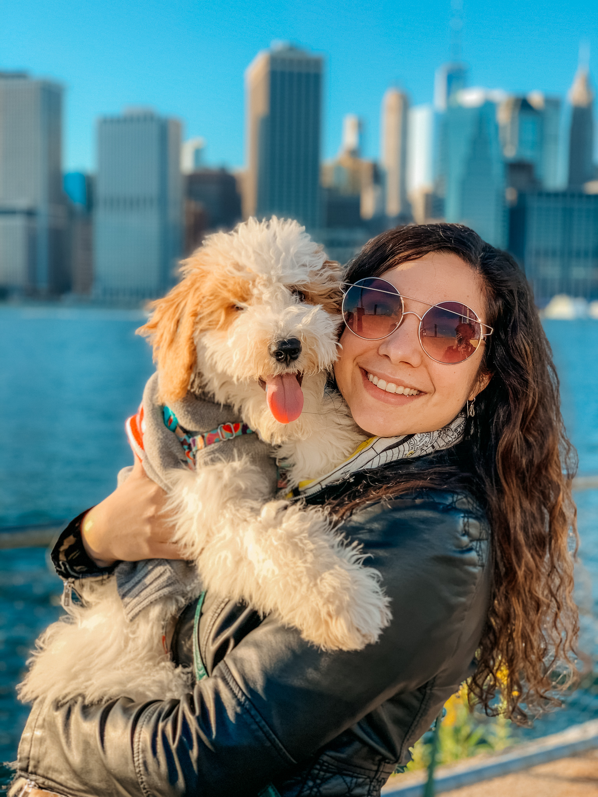
</figure>

Two major life changes happened this year: me and my boyfriend **adopted a puppy named [Disco](https://instagram.com/discodoodledog)**. 

At first, it was a real challenge to raise a puppy, but he is absolutely a joy. He brings me (and honestly everyone that gets to know him) so much happiness. He's always smiling, is super playful, and knows when to chill (like at work).

### Engagement &nbsp; 😱💍

*And* right before the New Year (literally on December 30), my boyfriend proposed to me in a very intimate, beautiful way during a spontaneous last minute roadtrip we booked 2 days in advance (it's a thing we do a lot). So I ** guess we're engaged now and he's my fiancé**. So crazy! I'm still not used to that at all! I'm still in the phase where calling him my fiancé and looking at my engagement ring give me butterflies ☺️.

  

    <figure>
        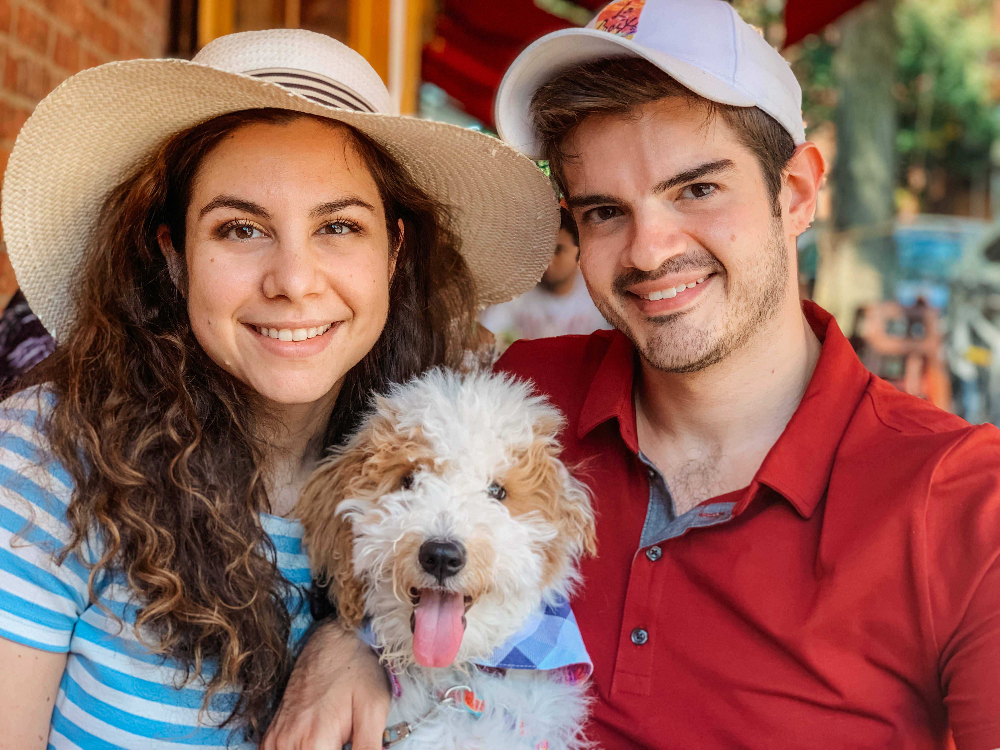
        <figcaption>Our little family ☺️</figcaption>
    </figure>
    <figure>
      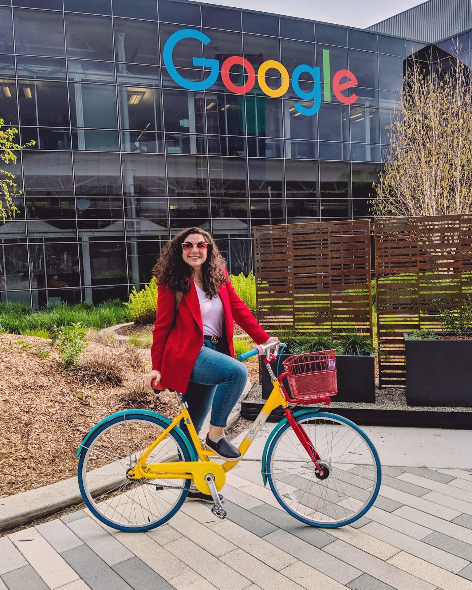
      <figcaption>My first day at Google!</figcaption>
    </figure>
  

  <figure class="half--right push-top">
    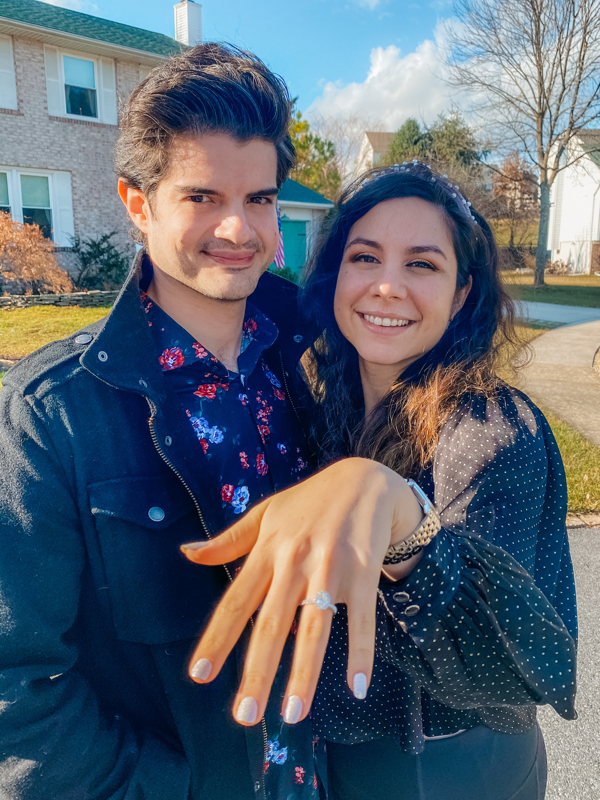
    <figcaption>Happy kids the day after a very surprise proposal.</figcaption>
  </figure>

### Books &nbsp; 📚🤓

I listen to a lot of books on audible. This year I only listened to **10 books**, which is far fewer than I usually listen to. My top 2 were:

  - [The Nightingale](https://amzn.to/2SVbyHW) by Kristin Hannah
  - [The Long Way to a Small, Angry Plant](https://amzn.to/2rXxg33) by Becky Chambers

### Photos &nbsp; 📸🤳🏻

In addition to my own travel and fashion Instagram, I became a momager for Disco. People tended to like his smaller puppy photos the most. Here are the top 9 posts from each based on likes:

  

    <a href="https://instagram.com/unakravets">
      <figure>
        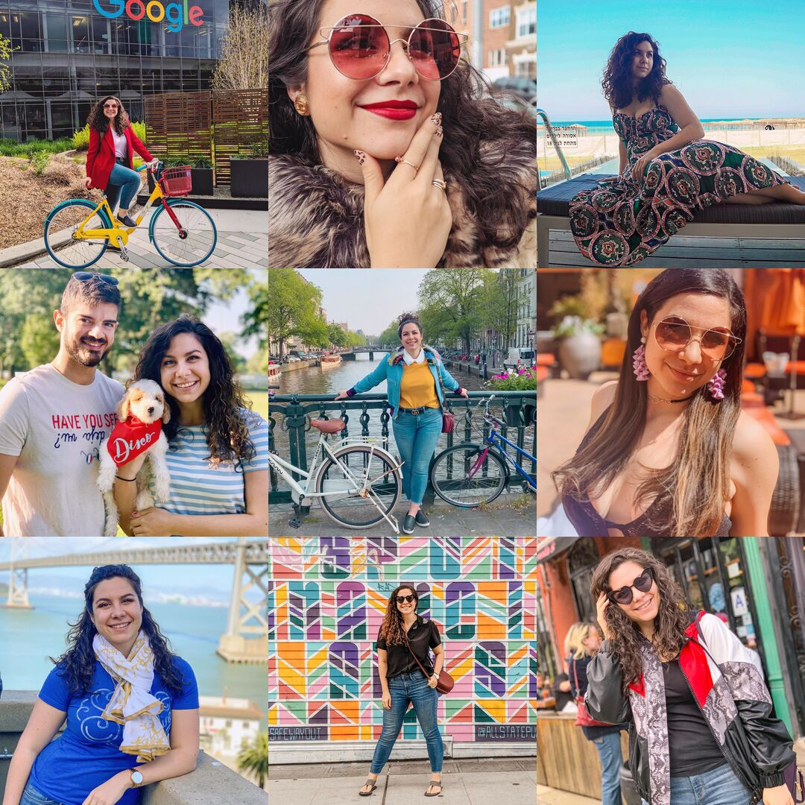
      <figcaption class="center">@unakravets (Travel/Personal) </figcaption>
      </figure>
    </a>
  

  

    <a href="https://instagram.com/discodoodledog">
      <figure>
        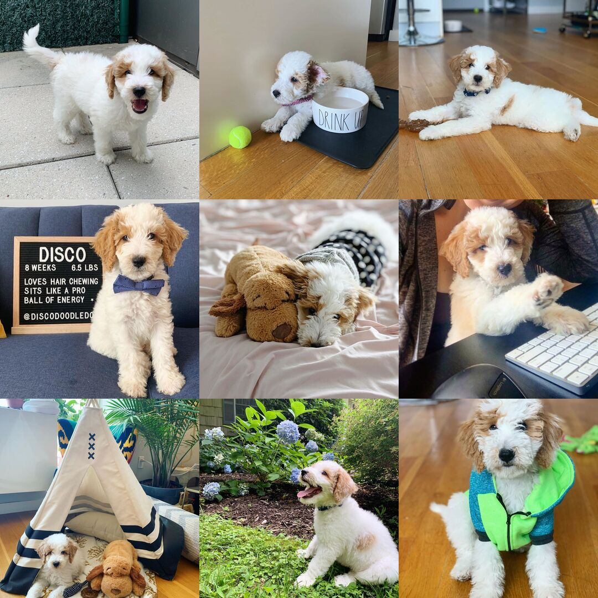
      <figcaption class="center">@discodoodledog (My pup!)</figcaption>
      </figure>
    </a>
  

## Travel

According to TripIt, I traveled to **192** cities in **9** countries, making a total of **148** days on the road, and **113,930** miles traveled (not including personal and weekend trips). I love to travel, and do so for work now, so this seems to be pretty aligned with years past.

I'm very lucky to have been able to explore some really awesome places this year. My favorite trips were *Paris, Sitges, Helsinki, Tel Aviv*, and *Amsterdam*. The people I met there or went with definitely made these trips the most memorable. 🤗 Shoutout to all my new friends and everyone who hung out with me!

<figure>
  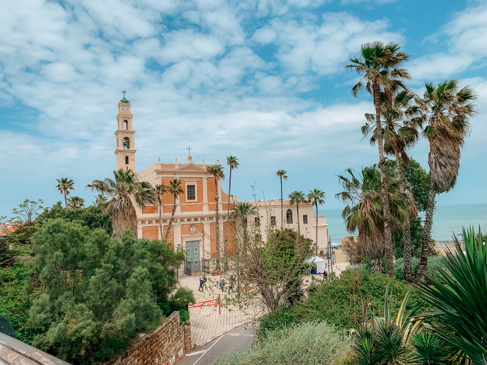
  <figcaption>I did a ton of walking around Tel Aviv.</figcaption>
</figure>
<figure class="half--left">
  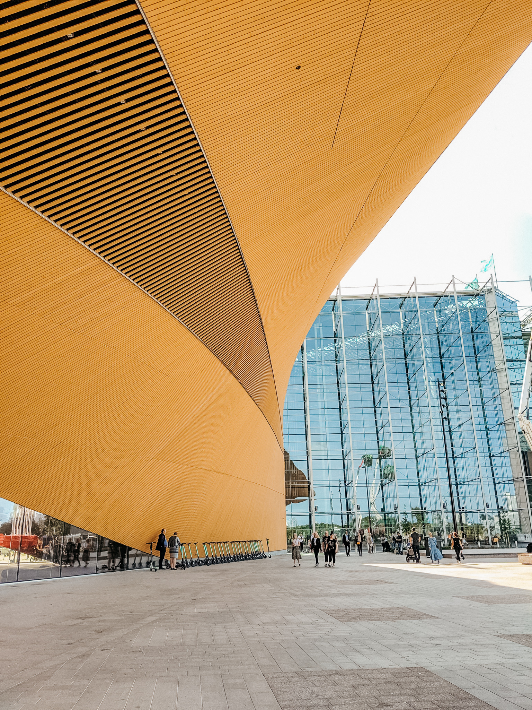
  <figcaption>I fell in *love* with the Helsinki library.</figcaption>
</figure>
<figure class="half--right">
  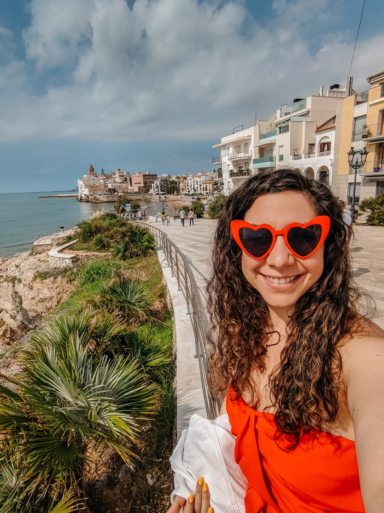
  <figcaption>Sitges was so beautiful!</figcaption>
</figure>

## 2019 Resolutions Review

Last years goal was to: **Confidently Create**. I do feel like I started creating a lot more this year, including physical crafts, but always feel theres room for to grow and improve. I had a bit of a transition period when I started my new job where I did stop creating content outside of it, but I picked it back up again toward the end of the year. I do want to continue in that: building and shipping and posting wherever it makes sense to share what I'm learning and working on.

1. **Ship 10 Web Projects**: Did I do this? No. But I do feel proud of my talks and to ship Extra.CSS in the past year. I'm hoping it picks up some more steam soon.
2. **Refine Content Production Workflow**: I definitely started creating more, but stopped editing my own videos. It helps a lot to work with a team and I feel very thankful that Google can support my new show Designing in the Browser. In terms of this goal, I'd still like to really get a more disciplined flow down for content creation.
3. **Increase Income Streams**: I did not do this in 2019, but I hope to open up a web store and do more in 2020.
4. **Consume Daily Dev Content**: The *[#dailydevdollop](https://twitter.com/search?q=%40una%20%23dailydevdollop)* project did not last more than two months unfortunately, and this is an area I still feel I could improve in.
5. **Support Women**: Apart from donating to charitable causes for women in tech, I didn't seek the opportunity to mentor other women as much as I should have this year.
6. **Physical Fitness**: I was relatively active in the begining of th year but sort of stopped midway when we got the puppy and I switched jobs. My knee is less of a problem now, so I'm hoping to pick up running again in 2020.

I think I did okay in terms of my goals. I do feel I focused more on my personal life rather than my professional life in terms of my outlined goals this year, but  also think that's okay. I'm so happy with how everything worked out in general and I'm ready to kick off another year of goals.

## 2020: Growth Via Disciple

For 2020, my primary goal/mantra is to enable **growth via discipline**. What do I mean by that? I feel the most succesful people are succesful from routines, so I hope to establish a routine that allows time to write, experiment, meditate, and excersize. I believe focusing on being more disciplined with my time (instead of getting lost in an internet hole for hours) will enable more time for creativity, career growth, and personal growth.

1. **Get My Finances in Order**: I'm going to likely be making a lot of large purchased in the next few years. I'll be paying for a wedding soon, and I'm hoping to invest in a property in the next few years. I'd like to meet with a financial advisor this year to make sure I'm set up for success, so I'm making that a goal this year!
2. **Continue to Travel**: I've always had a goal of having been to more countries than my age, and I've been lucky enough to keep that going. This year, I already have plans to go to another new one for me (Thailand) with my new fiancé (OMGOMGOMG), and I hope to get to do even more traveling and exploring throughout the year!
3. **Establish a Routine**: This is akin to my main goal for the year and also speaks to my previous goals of refining a content workflow and really creating a productive schedule.
4. **Run a 10k**: I have weight goals I want to meet and fitness goals. I used to love running and I'd love to slowly get back into it. Maybe I'll even be able to start going on jogs with my dog now that he'll be over a year old.
5. **Confidently Create**: This was last year's overall goal, but I think it's a great way to sum up what makes me happiest: creating things. Whether that means party decoration or physical crafts or websites, demos, and blog posts. I want to write and post without having things sitting in my drafts for 6 months (yes that happened this year).

So that's all for another year in review! Let me know if you find these posts interesting and if you've written your own review/goals post. 🧡 All the best in 2020!