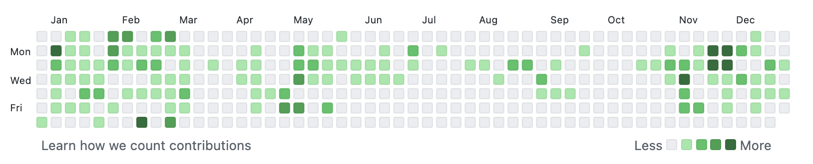
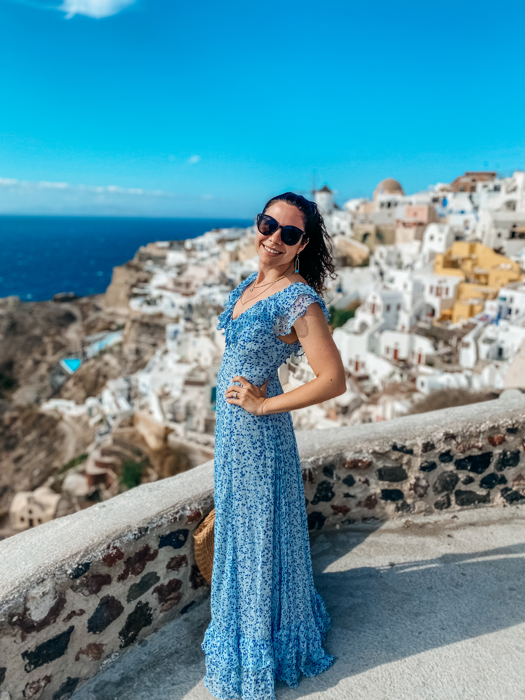

Wow, what a year. 2021 was such a mixed bag for me. From some really high highs (so many life events), to some pretty low lows (my grandma passing, debt stress, burnout). Overall it was a good year, and here I am, once again, to bring some thoughts on how everything went, and what I plan to do differently next year.

Past year-in-review posts:

<ul class="prev-posts">
  <li><a href="/2015-resolutions">2014</a></li>
  <li><a href="/2015-review">2015</a></li>
  <li><a href="/2016-review">2016</a></li>
  <li><a href="/2017-in-review">2017</a></li>
  <li><a href="/2018-in-review">2018</a></li>
  <li><a href="/2019-in-review">2019</a></li>
  <li><a href="/2020-in-review">2020</a></li>
</ul>

## Highlights

- 💍 I got married! Yay!
- 🇬🇷 We went to Greece for our honeymoon
- 🎥 My video on [1 Line Layouts](https://www.youtube.com/watch?v=qm0IfG1GyZU&t=55s) received nearly 1M views
- 💪 I stayed fit and hit my lowest weight I've been
- ✍🏼 I had a few clients for my [event calligraphy business](https://markupartiststudio.com)
- 🚁 I flew in a helicopter for the first time

  

  <figure>
      
      <figcaption>Wedding Portrait</figcaption>
    </figure>
    <figure style="width: 70%">
      
      <figcaption>Helicopter ride!</figcaption>
    </figure>
    
  

  <figure class="half--right push-top">
      
      <figcaption>Floating in Milos</figcaption>
  </figure>

## Content Production

### 🎙 Podcasts

[Chris](https://twitter.com/chrisdhanaraj) and I kind of wound-down **[Toolsday](https://pod.link/1063765302)** in May of this year after nearly 6 years of hosting the show. We released **8** episodes this year with **56,918** downloads. This is certainly fewer episodes than last year, but just as many downloads. Nice 😎

On the other hand, **[The CSS Podcast](https://pod.link/thecsspodcast)** that I host with [Adam Argyle](https://twitter.com/argyleink) really ramped up this year! We released **28** episodes, with **716,382** downloads, including a 4-episode DevTools special. There was a huge boost in podcast downloads and subscribers after we launched **[Learn CSS](https://web.dev/learn/css)** with [Andy Bell]() as a visual guide to our episodes. That's about the same number of episodes as last year, with **7x the downloads**! Yay! Thank you all for subscribing 🥰

Our most popular episodes this year were around CSS basics, as well as our layout API episodes. This year, our most popular episodes were:

1. *053: [Season 2 wrap up](https://pod.link/thecsspodcast/episode/117702a87353df0883f41b35ee219bc0)*
2. *030: [Lists](https://pod.link/thecsspodcast/episode/6cdaaee193350e6cb63f48dd6912e366)*
3. *034: [Overflow](https://pod.link/thecsspodcast/episode/a77025224542b86694379794058a2359)*
4. *036: [Text and Typography](https://pod.link/thecsspodcast/episode/a4a201726f930137610944ff86bf8378)*
5. *052: [counters and @counter-style](https://pod.link/thecsspodcast/episode/7b13d193dd78164bccbfefdf21f06e24)*

### 📺 Designing in the Browser

I released 4 new episodes of [Designing in the Browser](https://www.youtube.com/watch?v=KBQz1OSpRv8&list=PLNYkxOF6rcIDI0QtJvW6vKonTxn6azCsD) this month, all around the theme of "The New Responsive," i.e. modern responsive web design. No Disco this year, but in between COVID spikes, I was able to get into the studio to record in person again! It was such a treat 🥰. The studio team was scrappy this year but we had a lot of fun.

  <iframe width="649" height="360" src="https://www.youtube.com/embed/sdjT0K4sR4k" frameborder="0" allow="accelerometer; autoplay; clipboard-write; encrypted-media; gyroscope; picture-in-picture" allowfullscreen></iframe>

So far, the videos have over **51k views** in the first (holiday) month, so I'm excited to see this number grow as folks return to work and get back online. For now, enjoy your vacations! This season's episodes include:

- [Container Queries](https://www.youtube.com/watch?v=gCNMyYr7F6w&list=PLNYkxOF6rcIDI0QtJvW6vKonTxn6azCsD&index=4)
- [Macro and Micro Layouts](https://www.youtube.com/watch?v=sdjT0K4sR4k&list=PLNYkxOF6rcIDI0QtJvW6vKonTxn6azCsD&index=3)
- [Dark Mode](https://www.youtube.com/watch?v=xococe8wq_g&list=PLNYkxOF6rcIDI0QtJvW6vKonTxn6azCsD&index=2)
- [Responsive Images and Art Direction](https://www.youtube.com/watch?v=KBQz1OSpRv8&list=PLNYkxOF6rcIDI0QtJvW6vKonTxn6azCsD&index=1)

### ❄️ Designcember

This year I also launched [Designcember](https://designcember.com)! This was a celebration of design from the Chrome team, highlighting UI-related work, and a slew of new responsive APIs to get ready for the new year. The site [itself was a demo](https://web.dev/how-we-built-designcember/) that enabled a [new polyfill](https://www.npmjs.com/package/container-query-polyfill) to be created to support container queries in the process.

I organized this initiative from ideation to shipping, including the pitch, hiring a wonderful illustrator, [Alice Lee](https://byalicelee.com), creating a timeline and game plan, getting a team together, mentoring some community contributors, and organizing 31 days of content launches and social posts. In those 31 days, I also produced 5 videos, 4 podcasts, and 1 blog post to ship for Designcember, while organizing all the other things.

### 🗣 Speaking

While I did not travel for any events this year (thanks, COVID), I did participate in some virtual Google events! I was in the [CDS Keynote](https://www.youtube.com/watch?v=n57U2_-3NLQ&t=30s) to talk about [responsive design](https://www.youtube.com/watch?v=dhrX_biPH8c&t=474s) and upcoming CSS properties. I also gave a talk on the same subject for [Google I/O](https://www.youtube.com/watch?v=jUQ2-C5ZNRc) this year, and helped make a bunch of illustrative explainers of [RenderingNG](https://www.youtube.com/watch?v=sUbJPHYKZkU&t=416s) concepts to make them easier to understand.

<figure>

<figcaption>I recorded this the day I got back from my Greece vacation so I'm looking extra tan 😎</figcaption>
</figure>

### ✍🏼 Writing

This year, I wrote **7 blog posts**. I wrote about new CSS properties and features like [aspect-ratio](https://web.dev/aspect-ratio/), [content-visibility](https://web.dev/content-visibility/), and [@container](https://css-tricks.com/next-gen-css-container/).

I also wrote some more general articles like an end-of-year post for [CSS-Tricks](https://css-tricks.com/personalize-it/), [How we built Designcember](https://web.dev/how-we-built-designcember/), [CSS for Core Web Vitals](https://web.dev/css-web-vitals/), and an overview of [The New Responsive](https://web.dev/new-responsive/) framework.

### 💡 Learn Courses

In addition to these posts, my team launched two full courses on web.dev:

- **[Learn CSS](https://web.dev/learn/css/)** with [Andy Bell](https://twitter.com/piccalilli_)
- **[Learn Responsive Design](https://web.dev/learn/design/)** with [Jeremy Keith](https://twitter.com/adactio). 

It's been so awesome to see these [Learn Courses](https://web.dev/learn) expand on the [web.dev](https://web.dev) site! We even had a chance to onboard some community contributors to grow the module list for the Learn CSS course after the initial launch this year.

  

## Career Stuff

Somehow I've landed my absolute dream job. I lead a team called "CSS, UI, and DevTools Developer Relations", and get to help Chrome engineers understand the needs of the developer community to prioritize them. As someone who comes from a UI background, its such a dream that I get to advocate for the declarative styling APIs that make all of our lives easier. 

**I actually get to have a small part in making the things I wish existed on the web platform come to the web platform!** How did I get so lucky?

This year there's been so much movement in the CSS space. As one person perfectly phrased it:

> "I reckon 2021 was the best year for CSS since…2015? I haven’t felt this level of excitement and momentum in years." — [Robin Rendel](https://www.robinrendle.com/notes/css-and-momentum/)

And 2022 is set to be even better! Hold onto your hats y'all. My team, along with Chromium engineers and PMs, is to improve developer satisfaction by reducing frustration factors like [interoperability](https://github.com/web-platform-tests/interop-2022) issues, and aiming to satisfy top developer requests. These include:

- Container Queries for responsive component-based design
- Better form control styling and customization
- CSS primitives for better architecture and scoping
- Better color theming with wider color spaces and functions
- Improved scrolling and snapping experiences for reduced reliance on scripting

I'm also excited about subgrid hopefully landing (currently in active [development](https://bugs.chromium.org/p/chromium/issues/detail?id=618969)), and other CSS features like the recent implementation of [:has()](https://twitter.com/jensimmons/status/1474060698124697606?s=20) in Safari. There's been so much wonderful cross-browser collaboration work I'm excited to see continuing into next year.

My role this year moved from an individual contributor role into more of a lead and management role, but I still ended up making **639** contributions on Github this year.

## Life Things

In year 2 of pandemic-life, we've been trying to make the most of it. We've continued to do a lot of outdoor activities and take active hiking trips.

One big thing we did was move back to Brooklyn, near Prospect Park, which has given everyone a much-needed dopamine boost. Disco and I both love our park mornings together. During the summer we'd go to the park 3-5 times a week.

### 💒 Wedding

The biggest [highlight](https://www.idaliaphotography.com/village-club-of-sands-point-wedding/) for me has to be that we had [our wedding](https://www.youtube.com/embed/lJUqfRXVWZk) this year! This was huge! We went back and forth about moving it but ultimately we're glad we kept our date and had a "smaller" event than we originally planned (under 100 people), and only included the people closest to us (we have a lot of people close to us). We also had a pretty fun [first dance](https://youtu.be/Uw2ziws_qLI).

  

  

      
  

  

      
  

  

      
  

### 📸 Calligraphy & Other Crafts

I did a lot crafts this year. Many of them were in preparation for the wedding (it was a very DIY event). I spent the year making candles, programs, a big place card display, menus, invitations, and more. I had a blast with it, letting myself get creative and make things.

  

    <figure>
        
        <figcaption>Full invitation suite.</figcaption>
    </figure>
    <figure>
        
        <figcaption>Programs with my custom wax seal.</figcaption>
    </figure>
  

  <figure class="half--right push-top">
    <video height="800" width="450" loop autoplay muted controls>
      <source src="../../images/posts/2021-review/vid-mirror.mp4" type="video/mp4">
      </video>
    <figcaption style="margin-top: 0">The making of my place card display.</figcaption>
  </figure>

## ✈️ Travel

I did a *little* more travel in 2021 than I did in 2021. I went to **Las Vegas** with my friends and **Miami** with Ben. I did go on a *"big"* trip (and to a new country) for our honeymoon in **Greece**. We visited a few of the islands: Mykonos, Paros, Santorini, and Milos, along with a stop-in to Athens. This was an unbelievable trip! I really miss traveling the way I used to before the pandemic, and I'm really hoping to get to do some more trips next year.

  

      
  

  

      
  

  

      
  

My partner and I also spent a lot of time exploring Brooklyn and the East Coast. We did some beautiful drives and walks along the water. We explored the **Brooklyn Botanical Garden** *and* the **New York Botanical Garden**. We spent a lot of time in **Prospect Park**, **Washington, DC**, **Shenandoah National Park** (2 trips), and **Luray Caverns**.

## 📚 Books

I [read](https://www.notion.so/d977d36b03634e1a846ed4feca0bc153?v=e50c58ac1a4a4e3eae5a60944b227465) **12** books this year. That's pretty good :). My favorite were:

- *The Vanishing Half* by Brit Bennet
- *Project Hail Mary* by Andy Weir
- *The Invisible Life of Addie LaRue* by V.E. Schwab

All of these books are wonderful and I would highly recommend them!

## 👀 2021 Resolutions Review

In 2021, I focused on "**fitness**, **family**, and **making things**." I'd say I did a pretty good job doing those things. I spent a lotoftime with family, maintained by fitness journey, and made a lot of things! To break down last year's foals:

1. **🏃🏻‍♀️ Fitness**: While I didn't run a 10k this year, I did go to the park and on walks often and feel pretty good about my physical health right now :)
2. **👰🏼 Wedding**: YAY IT HAPPENED. No more stress now 😜
3. **📹 Personal Content Production**: I don't think I really met this goal. I didn't really produce any content and videos to my personal Youtube outside of work, but honestly I was way too exhausted to do this.
4. **✍🏼 Creative Income Streams**: There's definitely a lot more I could have done in this realm (running online calligraphy workshops, making code calligraphy merch, etc.) but I did get calligraphy clients *and* I made about $600 in passive income from other avenues, so that was a cool win.

I think in terms of goal achievement, I did pretty well this year!

## 🎉 2022 Goals

> I only have one goal this year: optimize for happiness.

I'm going to be asking myself: **"does this make me or the people around me happy?"** and optimize for that. I feel like I got very burnt out by the end of 2021, and I want to avoid that in 2022. 

I want to create more things, build more passive income streams, and travel more. I want to continue to serve the developer community because it makes everyone involved there happy. Keeping myself fit makes me happy. I want to work on my joy and spiritual growth, and I want to let myself take it easy if I need to. I want to own my own home, and stop living in a temporary state. I want to be a better friend, partner, manager, coworker, and human. It's been a hard year. I hope that things get easier for all of us in 2022.

This is the first year I'm not enumerating specific goals, and that's okay. It's okay if you don't have a stack ranked list for yourself either. I think we should all give ourselves some grace in 2022.

*Wishing you all a wonderful new year. Stay healthy and focus on what makes you happy.*

With love,
Una