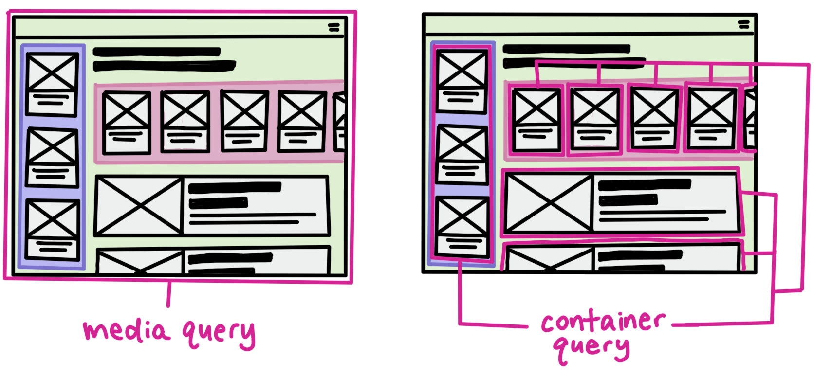

You may have heard of [container queries](https://css-tricks.com/next-gen-css-container/) and the new [contain-level-3 spec](https://www.w3.org/TR/css-contain-3/) landing in [browsers](https://caniuse.com/css-container-queries) soon, but have you heard of style queries, which are also a part of this (very exciting) spec? 

Style queries let you query the *style* of any parent element within a page and apply styles to its children based on the styles of its parent. This sounds really cool, but in practice, there are only a few key situations in which you want want to use a style query instead of something like a class name or attribute to apply the styles (both of which are much more performant than a browser query). So I wanted to investigate *why* and *when* style queries really made sense to use.

**⚠️ Note:** Style queries are not landing in the initial implementations for Chromium and Webkit. Both browsers will launch with size queries and container query units.

## Container Queries: a quick summary

TLDR; container queries let you query a parent selector for its size and styling information, and enable a child to own its intrinsic responsive logic no matter where it lives on a web page. 



Instead of relying on the viewport for styling input (a blunt hammer), users now have the ability to query in-page elements (a much finer tool) that are more relevant and specific to the target element to apply UI styles to it. This capability enables a new entry-point to query and inject responsive styles, and empowers a component to own its responsive styling logic. This makes the component much more resilient, as the styling logic is intrinsically attached to it, no matter where it appears on the page. (Did I say "styles" enough in this paragraph?)

> I recorded a [few videos](https://www.youtube.com/watch?v=gCNMyYr7F6w) on container queries if you want to learn more.

You write container queries like so:

**One.** Define a container on the parent element you want to query

```
.parent {
  container-type: inline-size;
}
```

**Two.** Write the container styles on the element you want to target

```
@container (min-width: 420px) {
  .card {
    /* styles to apply when the card container becomes >= 420px */
    /* I.e. shift from 1-column to 2-column layout: */
    grid-template-columns: 1fr 1fr;
  }
}
```

## Style Queries

Much like size-based container queries, you can query the computed style of a parent element using style queries:

```
@container (color: hotpink) {
  .card {
    /* styles to apply when the card container has a color of hotpink */
    /* I.e. change the background to white: */
    background: white;
  }
}
```

Okay, but where does this actually become useful? There are 2 situations in which you can use style queries in a way that you can't elsewhere.

<style>
  /* Article styles */
</style>